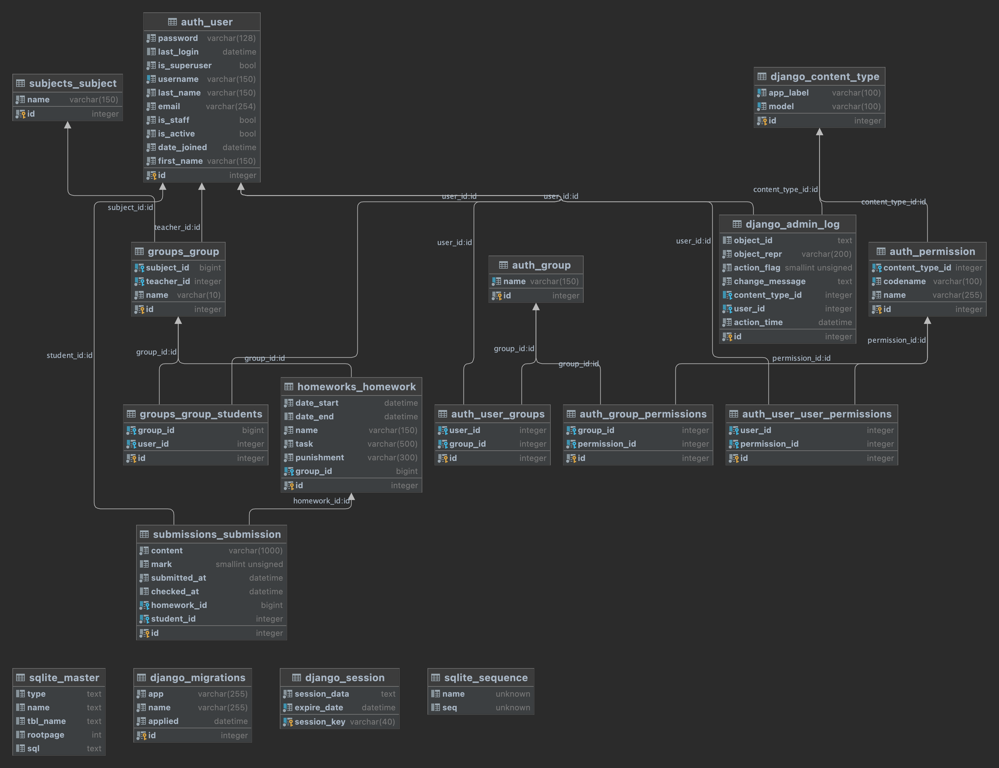

# Лабораторная работа №2 - Вариант 1

## Описание работы

### Доска домашних заданий.

О домашнем задании должна храниться следующая информация: предмет,
преподаватель, дата выдачи, период выполнения, текст задания, информация о штрафах.
Необходимо реализовать следующий функционал:
* Регистрация новых пользователей.
* Просмотр домашних заданий по всем дисциплинам (сроки выполнения,
описание задания).
* Сдача домашних заданий в текстовом виде.
* Администратор (учитель) должен иметь возможность поставить оценку за
задание средствами Django-admin.
* В клиентской части должна формироваться таблица, отображающая оценки
всех учеников класса.
-------------------------

## База данных



-------------------------

## Серверная часть

* `apps/users/views.py`

```python
from django.contrib.auth import authenticate, login, logout
from django.contrib.auth.forms import UserCreationForm
from django.shortcuts import redirect, render


def register(request):
    if request.method == 'POST':
        form = UserCreationForm(request.POST)
        if form.is_valid():
            form.save()
            username = form.cleaned_data.get('username')
            raw_password = form.cleaned_data.get('password1')
            user = authenticate(username=username, password=raw_password)
            login(request, user)
            return redirect('home')
    else:
        form = UserCreationForm()
    return render(request, 'auth/register.html', {'form': form})


def logout_view(request):
    logout(request)
    return redirect('login')


def login_view(request):
    if request.method == 'POST':
        username = request.POST['username']
        password = request.POST['password']
        user = authenticate(username=username, password=password)
        if user is not None:
            login(request, user)
            return redirect('home')
        else:
            return render(
                request,
                'auth/login.html',
                {'error_message': 'Incorrect username and / or password.'}
            )
    else:
        return render(
            request,
            'auth/login.html'
        )
```

* `apps/submissions/views.py`

```python
from django.contrib.auth.mixins import LoginRequiredMixin
from django.shortcuts import get_object_or_404, redirect, render
from django.views.generic import TemplateView

from apps.homeworks.models import Homework
from apps.submissions.forms import SubmissionCreationForm
from apps.submissions.models import Submission


class ListSubmissionsView(TemplateView, LoginRequiredMixin):
    template_name = "submissions/list.html"

    def get_context_data(self, **kwargs):
        context = super().get_context_data(**kwargs)

        is_student = self.request.user.groups_studying.exists()
        is_teacher = self.request.user.groups_teaching.exists()
        context['is_teacher'] = is_teacher
        context['is_student'] = is_student

        submissions_teacher = None
        submissions_student = None
        if is_teacher:
            groups_teaching = self.request.user.groups_teaching.all()
            submissions_teacher = Submission.objects.filter(
                homework__group__in=groups_teaching
            )
        if is_student:
            submissions_student = Submission.objects.filter(
                student=self.request.user
            )
        context['submissions_teacher'] = submissions_teacher
        context['submissions_student'] = submissions_student
        return context


def send_submission(request, hw_id, *args, **kwargs):
    homework = get_object_or_404(Homework, pk=hw_id)
    if request.method == 'POST':
        form = SubmissionCreationForm(request.POST)
        if form.is_valid():
            submission = form.save(commit=False)
            submission.homework = homework
            submission.student = request.user
            submission.save()
            return redirect('submissions')
    else:
        form = SubmissionCreationForm()
    return render(request, 'submissions/create.html', {'form': form, 'homework': homework})
```

* `apps/submissions/forms.py`

```python
from django import forms

from apps.submissions.models import Submission


class SubmissionCreationForm(forms.ModelForm):
    class Meta:
        model = Submission
        fields = ('content',)
```

* `apps/homeworks/views.py`

```python
from django.contrib.auth.mixins import LoginRequiredMixin
from django.views.generic import TemplateView

from apps.homeworks.models import Homework


class ListHomeworksView(TemplateView, LoginRequiredMixin):
    template_name = "homeworks/list.html"

    def get_context_data(self, **kwargs):
        context = super().get_context_data(**kwargs)
        groups = list(self.request.user.groups_studying.all())
        context['homeworks'] = Homework.objects.filter(group__in=groups)
        return context
```

## Шаблоны

* `templates/base.html`

```html
<!DOCTYPE html>
<html lang="en">
<head>
    <meta charset="UTF-8">
    <title>Lab2</title>
    <style>
        table, th, td {
            border: 1px solid;
        }
    </style>
</head>
<body>
<a href="">Домашние задания</a>
<a href="">Сдачи заданий</a>
<a href="">Выйти</a>


</body>
</html>
```

* `templates/submissions/create.html`

```html



  <h2>Сдать задание {{ homework.name }}</h2>
  <form method="post">
    
    {{ form.as_p }}
    <button type="submit">Submit</button>
  </form>

```

* `templates/submissions/list.html`

```html



    
    <div>
    <h1>Мои сдачи:</h1>
    <table>
        <tr>
            <td>Название ДЗ</td>
            <td>Оценка</td>
            <td>Отправлено</td>
            <td>Последняя проверка</td>
        </tr>

    
        <tr>
            <td>{{ submission.homework.name }}</td>
            <td>{{ submission.mark }}</td>
            <td>{{ submission.submitted_at }}</td>
            <td>{{ submission.checked_at }}</td>
        </tr>
    
    </table>
    </div>
    

    
    <div>
    <h1>Я должен проверить:</h1>
    <table>
        <tr>
            <td>Название ДЗ</td>
            <td>Студент</td>
            <td>Группа</td>
            <td>Оценка</td>
            <td>Отправлено</td>
            <td>Последняя проверка</td>
        </tr>

    
        <tr>
            <td>{{ submission.homework.name }}</td>
            <td>{{ submission.student }}</td>
            <td>{{ submission.homework.group }}</td>
            <td>{{ submission.mark }}</td>
            <td>{{ submission.submitted_at }}</td>
            <td>{{ submission.checked_at }}</td>
        </tr>
    
    </table>
    </div>
    

```

* `templates/homeworks/list.html`

```html



    <div>
    <h1>Домашние задания</h1>
    <table>
        <tr>
            <td>Название</td>
            <td>Дата выдачи</td>
            <td>Дедлайн</td>
            <td>Задание</td>
            <td>Наказание</td>
            <td>Ссылка на сдачу</td>
        </tr>

    
        <tr>
            <td>{{ homework.name }}</td>
            <td>{{ homework.date_start }}</td>
            <td>{{ homework.date_end }}</td>
            <td>{{ homework.task }}</td>
            <td>{{ homework.punishment }}</td>
            <td><a href="">Сдать</a></td>
        </tr>
    
    </table>
    </div>

```

* `templates/auth/register.html`

```html



  <h2>Регистрация</h2>
  <form method="post">
    
    {{ form.as_p }}
    <button type="submit">Sign up</button>
  </form>

```

* `templates/auth/login.html`

```html



    <form action="" method="post">
        
        
            <p class="bg-danger p-d ml-b">{{ error_message }}</p>
        
        <label>Username:
            <input name="username" value="" type="text"/>
        </label>
        <label>Password:
            <input name="password" value="" type="password"/>
        </label>
        <input type="submit" value="Log in"/>
        <a href="">Register</a>
    </form>

```
