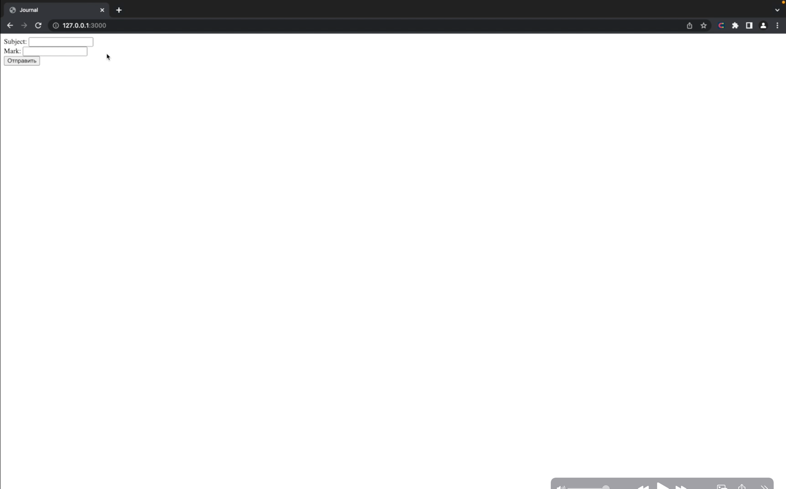
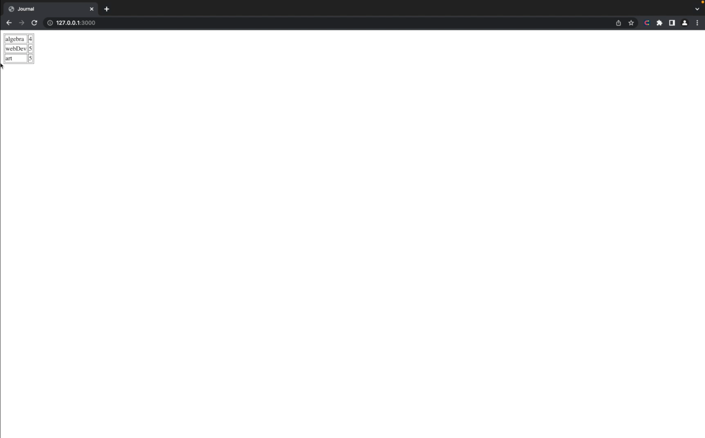

# Лабораторная работа №1

## Задание №1

* `server.py`
```python
import socket

sock = socket.socket(socket.AF_INET, socket.SOCK_STREAM)
sock.bind(("127.0.0.1", 14900))
sock.listen(2)

while True:
	try: 
		con, addr = sock.accept()
		data = con.recv(16384)
		udata = data.decode("utf-8")
		print(udata)
		con.send(b"Hello, client")
	finally:
		sock.close()
		break
```

* `client.py`
```python
import socket

sock = socket.socket(socket.AF_INET, socket.SOCK_STREAM)
sock.connect(("127.0.0.1", 14900))
sock.send(b"Hello, server \n")
text=sock.recv(16384)
udata=text.decode("utf-8")
print(udata)
```

## Задание №2
* `server.py`
```python
import socket
import math

sock = socket.socket(socket.AF_INET, socket.SOCK_STREAM)
sock.bind(("127.0.0.1", 14900))
sock.listen(2)

while True:
	try: 
		con, addr = sock.accept()
		s = con.recv(1024)
		s = s.decode("utf8")
		s = s.split()
		a = int(s[0])
		b = int(s[1])
		c = int(s[2])
		d = (pow(b, 2) - 4*a*c)
		if d == 0: 
			x = (-b/(2*a))
			con.send(b"x = " + str(x).encode("utf-8"))
		elif d < 0:
			con.send("Нет действительных корней".encode("utf-8"))
		elif d > 0:
			x1 = (- b - math.sqrt(d))/(2*a)
			x2 = (- b + math.sqrt(d))/(2*a)
			con.send(b"x1 = " + str(x1).encode("utf-8") + b" x2 = " + str(x2).encode("utf-8"))
	finally:
		sock.close()
		break
```

* `client.py`
```python
import socket

sock = socket.socket(socket.AF_INET, socket.SOCK_STREAM)
a = input("Введите аргумент x^2:")
b = input("Введите аргумент x:")
c = input("Введите третий аргумент:")
s = a + " " + b + " " + c
sock.connect(("127.0.0.1", 14900))
sock.send(s.encode("utf-8"))
text=sock.recv(16384)
udata=text.decode("utf-8")
print(udata)
```

## Задание №3
* `server.py`
```python
import socket

sock = socket.socket(socket.AF_INET, socket.SOCK_STREAM)
host = '127.0.0.1'
port = 333
sock.bind((host, port))
sock.listen(5)

while True:
	client, addr = sock.accept()
	print('Получил подключение от:', addr)
	client.recv(1024)
	resp_type = 'HTTP/1.0 200 OK\n'
	resp_headers = 'Content-Type: text/html\n\n'
	resp_body = """
		<html>
		<body>
		<h1>Hello, client! It's a nice day to die</h1>
		</body>
    </html>
    """
	response = resp_type + resp_headers + resp_body
	client.send(response.encode('utf-8'))
	client.close()
	break
```

## Задание №4
* `server.py`
```python
import socket
from threading import Thread

host = "127.0.0.1"
port = 334
clients = set()
sock = socket.socket()
sock.setsockopt(socket.SOL_SOCKET, socket.SO_REUSEADDR, 1)
sock.bind((host, port))
sock.listen(5)

def listen_for_client(cl):
    while True:
        try:
            message = cl.recv(1024).decode()
        except Exception as e:
            print(f"[!] Ошибка: {e}")
            clients.remove(cl)
        else:
            message = message.replace(" ", ": ")
        for client in clients:
            client.send(message.encode())

while True:
    client, address = sock.accept()
    print(f"{address} подключен.")
    clients.add(client)
    thread = Thread(target=listen_for_client, args=(client,))
    thread.daemon = True
    thread.start()
```

* `client.py`
```python
import socket
import random
from threading import Thread

host = "127.0.0.1"
port = 334 
separator_token = " "
sock = socket.socket()
sock.connect((host, port))
print(f"Подключен к {host}:{port}")
name = input("Введите своё имя: ")

def listen_for_messages():
    while True:
        message = sock.recv(1024).decode()
        print("\n" + message)

thread = Thread(target=listen_for_messages)
#thread.daemon = True
thread.start()

while True:
    text = input()
    if text.lower() == 'exit':
        break
    text = f"{name}{separator_token}{text}"
    sock.send(text.encode())

sock.close()
```

## Задание №5

* `server.py`
```python
import socket
import sys


class MyHTTPServer:

		def __init__(self, host, port):
				self.host = host
				self.port = port

		def serve_forever(self):
				conn = socket.socket(socket.AF_INET, socket.SOCK_STREAM)
				conn.bind((self.host, self.port))
				conn.listen(10)
				while True:
						client, address = conn.accept()
						self.serve_client(client)

		def serve_client(self, client):
				text = client.recv(16384)
				text = text.decode('utf-8') # change
				url, method, headers, body = self.parse_request(text)
				resp = self.handle_request(url, method, body)
				if resp:
						self.send_response(client, resp)

		def parse_request(self, text):
				text = text.replace('\r', '')
				lines = text.split('\n')
				method, url, protocol = lines[0].split()
				i = lines.index('')
				headers = lines[1:i]
				body = lines[-1]
				# exception
				return url, method, headers, body

		def handle_request(self, url, method, body):
						resp = "HTTP/1.1 200 OK\n\n"
						error = f" 400\n\nErorr"
						if method == 'GET' and url == '/':
								with open('index.html', 'r') as f: #change
										resp += f.read()
								return resp
						elif Exception:
							return error
						if method == "POST" and url == '/':
								newbody = body.split('&')
								for i in newbody:
										if i.split('=')[0] == 'subject':
												subjects.append(i.split('=')[1])
										if i.split('=')[0] == 'mark':
												marks.append(i.split('=')[1])
								resp += "<html><head><title>Journal</title></head><body><table border=1>"
								for s, m in zip(subjects, marks):
										resp += f"<tr><td>{s}</td><td>{m}</td></tr>"
								resp += "</table></body></html>"
								return resp
						elif Exception:
							return error


		def send_response(self, clientsocket, resp):
				clientsocket.send(resp.encode('utf-8'))


if __name__ == '__main__':
		host = '127.0.0.1'
		port = 3000
		serv = MyHTTPServer(host, port)
		subjects = []
		marks = []
		try:
				serv.serve_forever()
		except KeyboardInterrupt:
				pass
```

* `index.html`

```html
<!DOCTYPE html>
<html lang="en">
<head>
    <meta charset="UTF-8">
    <meta name="viewport" content="width=device-width, initial-scale=1.0">
    <title>Journal</title>
</head>
<body>
<form action="/" method="post">
    <div>
        <label for="name">Subject:</label>
        <input type="text" id="name" name="subject"/>
    </div>
    <div>
        <label for="mail">Mark:</label>
        <input type="number" id="mail" name="mark"/>
    </div>
    <div>
        <input type="submit">
    </div>

</body>
</html>
```

## Основные скриншоты задания №5:
* `Страница с полями для ввода и кнопкой отправки`



* `Страница с результатами ввода`

