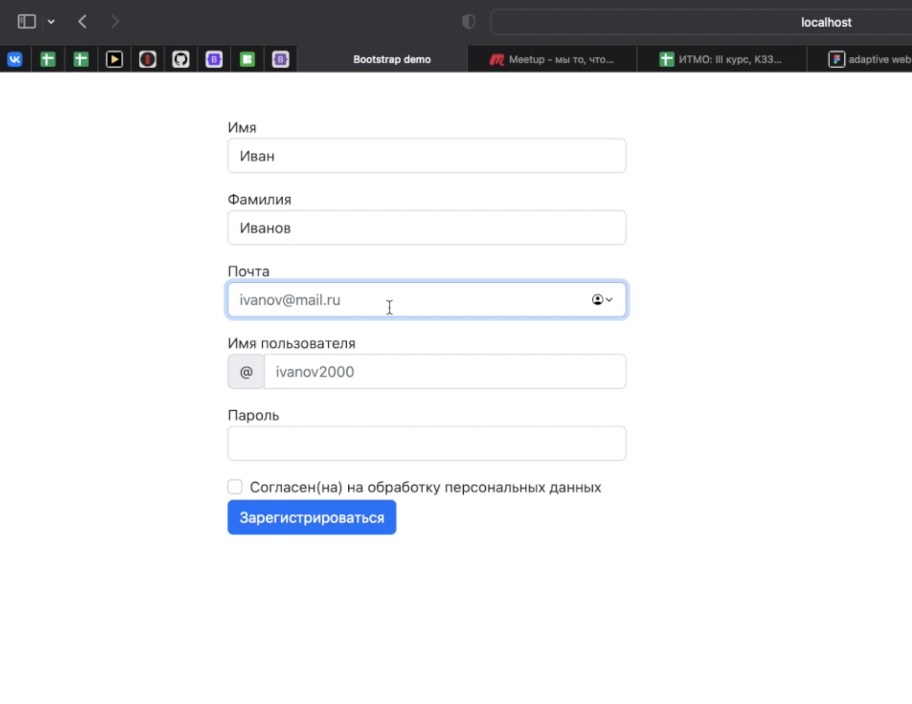
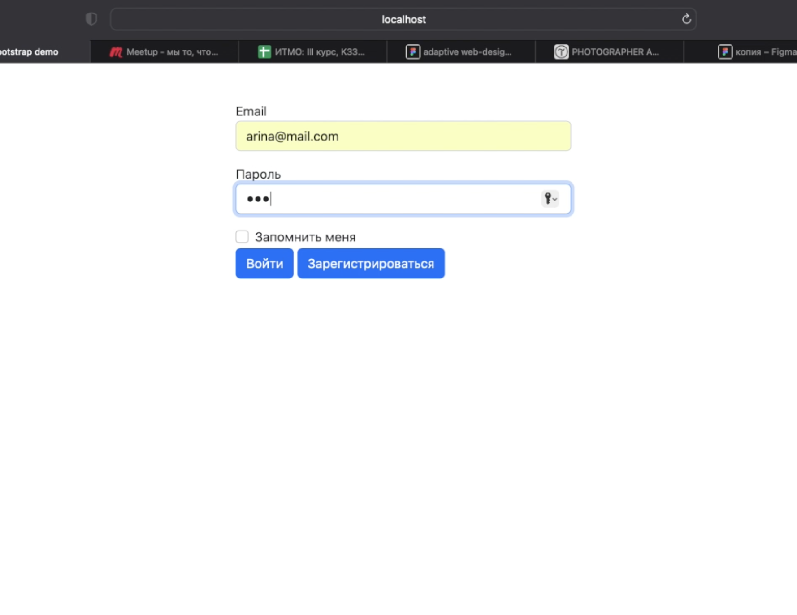
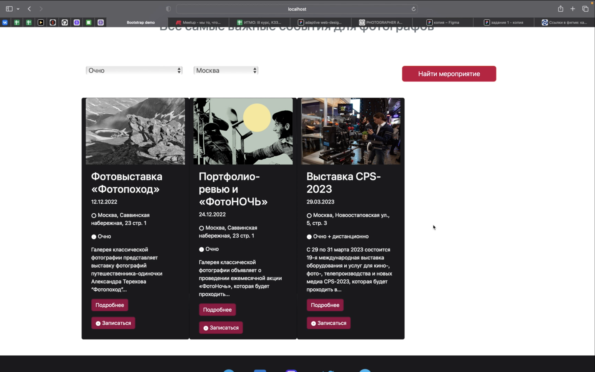
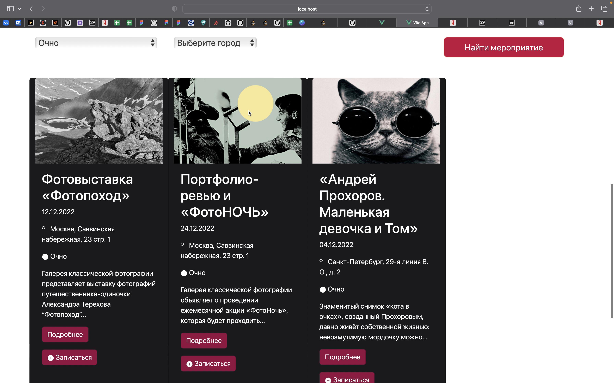
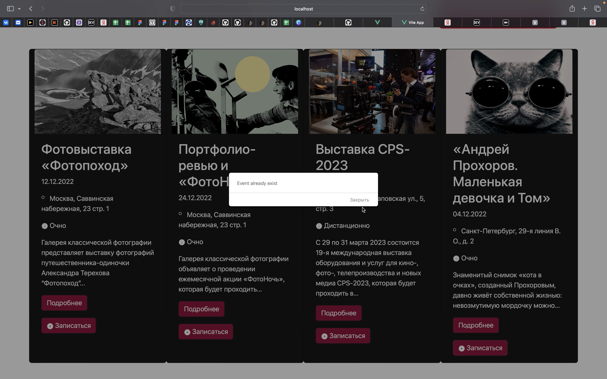
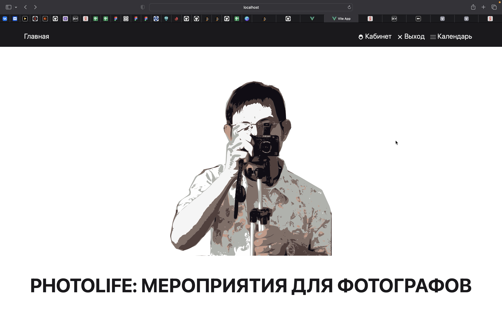
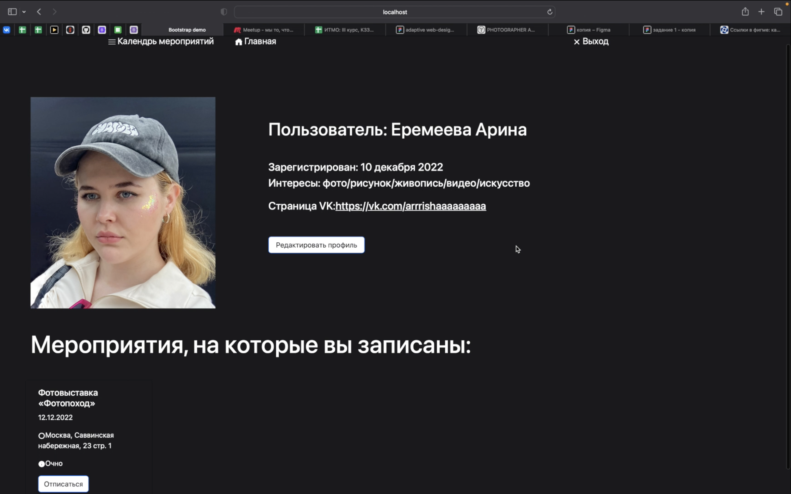
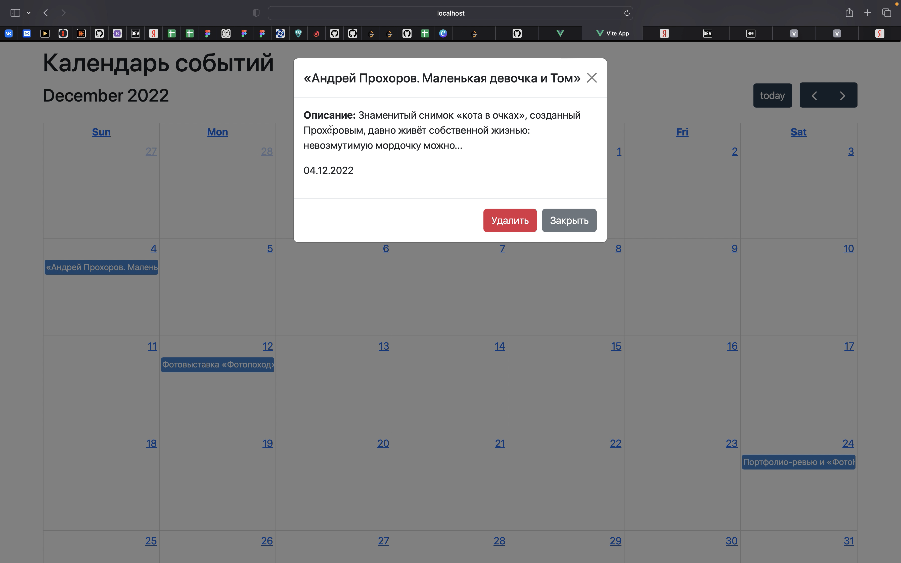

# Лабораторная работа №4

## Описание работы

Сделать сайт с личным кабинетом, регистрацией, входом, с карточками мероприятий, с календарем, где можно добавлять мероприятия в календарь и удалять, записываться на мероприятия, чтобы они отображались в календаре и в личном кабинете, а также отписываться от них

* `Reg.vue`

* Реализована аутентификация



```html 
<script>
import { mapActions, mapState } from 'pinia' 
import router from '@/router' 
 
import useRegisterStore from '../../src/stores/register'

export default {
	name: 'RegBlock', 
 
 data() { 
	 return { 
		 form: { 
			 firstname: "", 
			 lastname: "", 
			 email: "", 
			 password: "", 
			 login: "" 
		 } 
	 }; 
 }, 

 methods: { 
	 ...mapActions(useRegisterStore, ['userRegister']), 

	 async register() { 
		 const response = await this.userRegister(this.form); 

		 const { accessToken, user } = response.data 

		 localStorage.accessToken = accessToken 
		 localStorage.user = JSON.stringify(user) 

		 localStorage.accessToken ? router.push('/') : router.push('') 
	 } 
 } 
}
</script>
```

* `Enter.vue`

* Реализована авторизация и проверка наличия зарегистрированного пользователя



```html
<script>
import { mapActions, mapState } from 'pinia' 
import router from '@/router' 

import useLoginStore from '../../src/stores/login'

export default {
	name: 'EnterBlock', 

	data() { 
	return { 
		form: { 
			email: "", 
			password: "" 
		} 
	}; 
}, 

methods: { 
	...mapActions(useLoginStore, ['userLogin']), 

	async login() { 
		const response = await this.userLogin(this.form);

		const { accessToken, user } = response.data

		localStorage.accessToken = accessToken
		localStorage.user = JSON.stringify(user)

		localStorage.accessToken ? router.push('/') : router.push('/enter')
	}
}
}
</script>
```

* `Main.vue`

* Реализованы: фильтрация событий по типу мероприятия (очно/дистанционно) и городу (Москва/Санкт-Петербруг/Архангельск), функция записи на мероприятие (причем на мероприятие можно записаться только один раз), выход из учетной записи

* Фильтрация карточек событий по типу мероприятия и городу (каждый фильтр можно использовать отдельно)



* Пробуем повторно записаться на то же самое мероприятие



```html
<script>
import {mapActions, mapState} from 'pinia'

import useCardsStore from '@/stores/cards'

import NoteBlock from '@/components/note-card.vue'

export default {
	name: 'MainBlock',

	components: { NoteBlock },

	computed: {
		...mapState(useCardsStore, ['cards']),
		filteredCards() { 
			if (this.selectedCards.length) { 
				return this.selectedCards; 
			} else { 
				return this.cards 
			} 
		}
	},

	methods: {
		...mapActions(useCardsStore, ['loadCards']),
		async filter() { 
			const eventT = document.querySelector('.event-type') 
			const cityT = document.querySelector('.region-type') 
			this.selectedCards = []
			console.log(eventT.value, cityT.value) 
			this.cards.forEach((card) => { 
				if ((eventT.value === card.category && cityT.value === card.category2) || (eventT.value === "ALL" && cityT.value === card.category2) || (eventT.value === card.category && cityT.value === "ALL")) { 
					this.selectedCards.push(card); 
				}
			}) 
		}
	},
	data() {
		return {
			selectedCards: []
		}
	},
	mounted() {
		this.loadCards();
	}
}
</script>
```

* `Header.vue`

* Реализованы: функция проверки авторизации пользователя (в заисимости от того, авторизовн пользователь или нет, меняется контент в header), выход из учетной записи



```html
<script>
export default {
	name: 'HeaderBlock',

	methods: {
		check() {
			const idLogOut = document.querySelector('#logout');
			const idLogIn = document.querySelector('#enter');
			const enterLK = document.querySelector('#enterlk');

			if (localStorage.accessToken){
				idLogIn.classList.add("d-none");
				idLogOut.classList.remove("d-none");
			} else {
				idLogIn.classList.remove("d-none");
				enterLK.classList.add("d-none");
				idLogOut.classList.add("d-none");
			}
		},

		exit() {
			const idLogOut = document.querySelector('#logout');
			const idLogIn = document.querySelector('#enter');
			const enterLK = document.querySelector('#enterlk');
			localStorage.clear();
			idLogIn.classList.remove("d-none");
			enterLK.classList.add("d-none");
			idLogOut.classList.add("d-none");
		}
	},

	mounted() {
		this.check()
	}
}
</script>
```

* `note-card.vue`

* Реализованы: функция записи на мероприятия

```html
<script>
import {mapActions, mapState} from 'pinia'

import useUserEventsStore from '@/stores/userEvents'

export default {
	name: 'NoteBlock',

	props: {
    mero: {
      type: String,
      required: true
    },
    text: {
      type: String,
      required: true
    },
		type: {
			type: String,
      required: true
		},
		data: {
			type: String,
      required: true
		},
		address: {
			type: String,
      required: true
		},
		id: {
			type: Number,
      required: true
		},
		img: {
			type: String,
      required: true
		},
  },

	computed: {
		...mapState(useUserEventsStore, ['userEvents']),
		
	},

	methods: {
    ...mapActions(useUserEventsStore, ['addUserEvents', 'getUserEventsById']),
    async addNote(id) {
        const userId = JSON.parse(localStorage.user).id
        const userEvents = await this.getUserEventsById(userId)
        console.log(userEvents.data)
        const isEventExist = userEvents.data.filter(event => event.eventId == id)
        console.log(isEventExist.length)
		if (isEventExist.length) {
            alert("Event already exist")
            return
        }

        const event = {
            "userId": userId,
            "eventId": id
        }

        console.log(event)
        const response = await this.addUserEvents(event);
        console.log(response)
    }
	}
}
</script>
```


* `Lk.vue`

* Реализована: функция отображения карточек мероприятий, на которые записан пользователь




```html
<section class="container row mx-auto" id="container">
			<h3 class="text h4 custom-colored-h1 mt-5 mb-5 mx-5">Мероприятия, на которые вы записаны:</h3>
			<div class="col-12 col-xl-3 col-md-5 col-lg-5 mb-5 pt-5" v-for="card in personalCards" :key="card.id">
				<personal-cards :mero="card.mero" :data="card.data" :address="card.address" :type="card.type" :primaryId="card.primaryId"/>
			</div>
</section>

<script>
import {mapActions, mapState} from 'pinia'

import useUserEventsStore from '@/stores/userEvents'
import useCardsStore from '@/stores/cards'
import PersonalCards from '@/components/PersonalCards.vue'

export default {
	name: 'LkBlock',

	components: {PersonalCards},

	computed: {
		...mapState(useUserEventsStore, ['userEvents']),
		...mapState(useCardsStore, ['personalCards']),
		
	},

	methods: {
		...mapActions(useUserEventsStore, ['getUserEventsById']),
		...mapActions(useCardsStore, ['loadCardById', 'doClear']),

		async loadPage() {
			const response = await this.getUserEventsById(JSON.parse(localStorage.user).id); 
			const result = Array.from(response.data);

			this.doClear(); 
			result.forEach((item) => { 
				this.loadCardById(item.eventId, item.id) 
			}) 
		}
		
	},

	mounted() {
		this.loadPage()
	}
}
</script>
```

* `PersonalCards.vue`

* Реализована: функция возможности отписаться от мероприятия


```html
<script> 
import { mapActions, mapState } from "pinia"; 

import useUserEventsStore from "@/stores/userEvents.js" 

export default { 
	name: 'PersonalCards', 

	computed: { 
		...mapState(useUserEventsStore, ['userEvents']), 
	}, 

	methods: {
		...mapActions(useUserEventsStore, ['addUserEvents', 'deleteCardById']),

		async deleteCard(id) {
			console.log('vbnm')
			this.deleteCardById(id)

			location.reload()
		}
	},

	props: {
		mero: {
			type: String,
			required: true
		},
		metro: {
			type: String,
			required: true
		},
		data: {
			type: String,
			required: true
		},
		address: {
			type: String,
			required: true
		},
		primaryId: {
			type: Number,
			required: true
		}
	}
}
</script>
```

* `CalendarView.vue`

* Реализованы: функция создания мероприятий в личном календаре, а также функция отображения в календаре мероприятий, на которые записан пользователь



```html
<script> 
import { mapActions, mapState } from 'pinia' 
import { Modal } from 'bootstrap' 
 
import useCalendarEventsStore from '@/stores/calendarEvents' 
 
import BaseLayout from '@/layouts/BaseLayout.vue' 
import HeaderBlock from '@/components/Header.vue' 
import FullCalendar from '@/components/FullCalendar.vue' 
import FooterBlock from '@/components/Footer.vue'

export default { 
  name: 'CalendarPage', 
 
  components: { BaseLayout, FullCalendar, HeaderBlock, FooterBlock}, 
 
  computed: { 
    ...mapState(useCalendarEventsStore, { 
      calendarEvents: 'calendarEvents', 
      selectedEvent: (state) => { 
        return { 
          ...state.selectedEvent, 
          formattedDate: () => { 
            const date = state.selectedEvent.date 
            return new Date(date).toLocaleDateString('ru-RU') 
          } 
        } 
      } 
    }) 
  }, 
 
  data() { 
    return { 
      form: { 
        title: '', 
        description: '', 
        date: '' 
      }, 
 
      eventCreateModal: null 
    } 
  }, 
 
  methods: { 
    ...mapActions(useCalendarEventsStore, ['loadCalendarEvents', 'loadEventById', 'createEvent', 'deleteEvent']), 
 
    handleEventChange(payload) { 
      console.log('event change', payload) 
    }, 
 
    handleDateClick(payload) { 
      console.log('date clicked', payload) 
 
      const { dateStr } = payload 
      this.form.date = dateStr 
 
      this.eventCreateModal = new Modal(this.$refs.eventCreate) 
      this.eventCreateModal.show() 
    }, 
 
    async handleEventClick(payload) { 
      await this.loadEventById(payload.event._def.publicId) 
 
      const eventModal = new Modal(this.$refs.detailEvent) 
      eventModal.show() 
    }, 
 
    async submitForm() { 
      await this.createEvent(this.form) 
 
      this.$refs.eventForm.reset() 
      this.eventCreateModal.hide() 
 
      await this.loadCalendarEvents() 
    }, 
 
    async deleteMero(id) { 
      this.deleteEvent(id); 
 
      location.reload(); 
    } 
  }, 
 
  mounted() { 
    this.loadCalendarEvents() 
  } 
} 
</script>
```