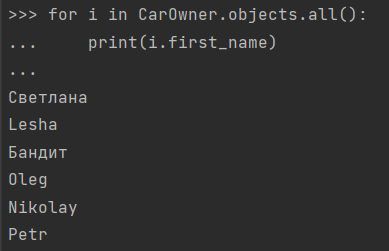

# **Практическая работа №3.1**
Django запросы и их выполнение.

-------------------------

## **Задание 3.1.1**
Описание: напишите запрос на создание 6-7 новых автовладельцев и 5-6 автомобилей, каждому автовладельцу назначьте удостоверение и от 1 до 3 автомобилей. Задание можете выполнить либо в интерактивном режиме интерпретатора, либо в отдельном python-файле. Результатом должны стать запросы и отображение созданных объектов.

* `models.py` - модель базы данных
```python
class CarOwner(AbstractUser):
    id_owner = models.IntegerField(primary_key = True)
    last_name = models.CharField(max_length = 30, null = False)
    first_name = models.CharField(max_length = 30, null = False)
    birth_day = models.DateField(null = True)
    passport = models.IntegerField(null=True)
    address = models.CharField(max_length=50, null=True, blank=True)
    nationality = models.CharField(max_length=20, null=True, blank=True)

class Car(models.Model):
    id_car = models.IntegerField(primary_key=True)
    state_number = models.CharField(max_length=15, null=False)
    mark_car = models.CharField(max_length=20, null=False)
    model_car = models.CharField(max_length=20, null=False)
    color = models.CharField(max_length=30, null=False)


class Ownership(models.Model):
    id_owner_car = models.IntegerField(primary_key=True)
    id_owner = models.ForeignKey(CarOwner, on_delete=models.CASCADE)
    id_car = models.ForeignKey(Car, on_delete=models.CASCADE)
    start_date = models.DateField()
    end_date = models.DateField(null=True)


class DriverLicense(models.Model):
    id_license = models.IntegerField(primary_key=True)
    id_owner = models.ForeignKey(CarOwner, on_delete=models.CASCADE)
    license_number = models.CharField(max_length=10, null=False)
    type = models.CharField(max_length=10, null=False)
    date_of_license = models.DateField()
```

-------------------------

### Создание сущностей 

* Создание владельцев автомобилей 




* Создание автомобилей 


* Создание прав 


* Связь между владельцем и автомобилем 


-------------------------

## **Задание 3.1.2**
Описание: По созданным в пр.1 данным написать следующие запросы на фильтрацию:


* Выведете все машины марки “Toyota” (или любой другой марки, которая у вас есть):


* Найти всех водителей с именем “Олег” (или любым другим именем на ваше усмотрение):


* Взяв любого случайного владельца, получить его id, и по этому id получить экземпляр удостоверения в виде объекта модели (можно в 2 запроса):


* Вывести всех владельцев красных машин (или любого другого цвета, который у вас присутствует):


* Найти всех владельцев, чей год владения машиной начинается с 2010 (или любой другой год, который присутствует у вас в базе):


-------------------------

## **Задание 3.1.3**

Описание: необходимо реализовать следующие запросы:

* Вывод даты выдачи самого старшего водительского удостоверения:


* Укажите самую позднюю дату владения машиной, имеющую какую-то из существующих моделей в вашей базе:


* Выведите количество машин для каждого водителя:


* Подсчитайте количество машин каждой марки:


* Отсортируйте всех автовладельцев по дате выдачи удостоверения:

 