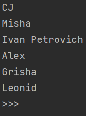
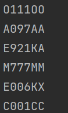
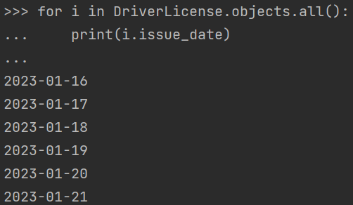

#Практическая работа №3.1 - Django Web framework. Запросы и их выполнение


##Цель 
* Получить представление о работе с запросами в Django ORM.

* `models.py` - модель базы данных
```python
class Car(models.Model):
    state_number = models.CharField(max_length=15)
    brand = models.CharField(max_length=20)
    model = models.CharField(max_length=20)
    color = models.CharField(max_length=30, null=True, blank=True)

    
class Owner(AbstractUser):
    first_name = models.CharField(max_length=30, null=True, blank=True)
    second_name = models.CharField(max_length=30, null=True, blank=True)
    birthday = models.DateField(null=True, blank=True)
    cars = models.ManyToManyField(Car, through='Ownership')
    passport = models.IntegerField(null=True, blank=True)
    address = models.CharField(max_length=50, null=True, blank=True)
    nationality = models.CharField(max_length=15, null=True, blank=True)

    
class DriverLicense(models.Model):
    license_owner = models.ForeignKey(settings.AUTH_USER_MODEL, on_delete=models.CASCADE)
    license_number = models.CharField(max_length=10)
    type = models.CharField(max_length=10)
    issue_date = models.DateField()


class Ownership(models.Model):
    ownership_owner = models.ForeignKey(settings.AUTH_USER_MODEL, on_delete=models.CASCADE)
    ownership_car = models.ForeignKey(Car, on_delete=models.CASCADE)
    date_start = models.DateField()
    date_end = models.DateField(null=True, blank=True)
```

##Задание 3.1.1
### Описание задачи:
Напишите запрос на создание 6-7 новых автовладельцев и 5-6 автомобилей, 
каждому автовладельцу назначьте удостоверение и от 1 до 3 автомобилей. 
Задание можете выполнить либо в интерактивном режиме интерпретатора, 
либо в отдельном python-файле. Результатом должны стать запросы и отображение
созданных объектов.

### Ход работы:
#### Вход в интерактивный режим
```python
python manage.py shell
from practical_work_1.models import *
```

#### Создание сущностей
* Автовладельцы
```python
owner = Owner.objects.create(first_name='CJ', second_name='Carl', username='los_santos_king', password='grove1')
owner = Owner.objects.create(first_name='Misha', second_name='Stone', username='sky_value', password='misha_beast')
owner = Owner.objects.create(first_name='Ivan Petrovich', second_name='Temshikov', username='moscow_never_sleeps', password='arbat')
owner = Owner.objects.create(first_name='Alex', second_name='Kholodov', username='Aleksandrosius', password='itmo')
owner = Owner.objects.create(first_name='Grisha', second_name='Kuprum', username='Sphinx', password='gavanna')
owner = Owner.objects.create(first_name='Leonid', second_name='Spartanec', username='SPARTA', password='This_is_300')
```
  

* Автомобили
```python
car = Car.objects.create(state_number='O111OO', brand='BMW', model='650i GranCoupe', color='gray')
car = Car.objects.create(state_number='A097AA', brand='Mercedes', model='S600', color='black')
car = Car.objects.create(state_number='E921KA', brand='Cadillac', model='Escalade', color='black')
car = Car.objects.create(state_number='M777MM', brand='BMW', model='M6', color='white')
car = Car.objects.create(state_number='E006KX', brand='Mercedes', model='SL65', color='black')
car = Car.objects.create(state_number='C001CC', brand='Ford', model='Raptor', color='gold')
```
 

* Водительские удостоверения
```python
license = DriverLicense.objects.create(license_owner=Owner.objects.get(username='los_santos_king'), license_number='0001', type='DL', issue_date='2023-01-16')
license = DriverLicense.objects.create(license_owner=Owner.objects.get(username='sky_value'), license_number='1001', type='DL', issue_date='2023-01-17')
license = DriverLicense.objects.create(license_owner=Owner.objects.get(username='moscow_never_sleeps'), license_number='1458', type='DL', issue_date='2023-01-18')
license = DriverLicense.objects.create(license_owner=Owner.objects.get(username='Aleksandrosius'), license_number='2002', type='DL', issue_date='2023-01-19')
license = DriverLicense.objects.create(license_owner=Owner.objects.get(username='sphinx'), license_number='2023', type='DL', issue_date='2023-01-20')
license = DriverLicense.objects.create(license_owner=Owner.objects.get(username='SPARTA'), license_number='2142', type='DL', issue_date='2023-01-21')
```


* Владение автомобилем
```python
ownership = Ownership.objects.create(ownership_owner=Owner.objects.get(username='los_santos_king'), ownership_car=Car.objects.get(id=11), date_start='2023-01-17')
ownership = Ownership.objects.create(ownership_owner=Owner.objects.get(username='sky_value'), ownership_car=Car.objects.get(id=12), date_start='2023-01-18')
ownership = Ownership.objects.create(ownership_owner=Owner.objects.get(username='moscow_never_sleeps'), ownership_car=Car.objects.get(id=13), date_start='2023-01-19')
ownership = Ownership.objects.create(ownership_owner=Owner.objects.get(username='Aleksandrosius'), ownership_car=Car.objects.get(id=14), date_start='2023-01-20')
ownership = Ownership.objects.create(ownership_owner=Owner.objects.get(username='sphinx'), ownership_car=Car.objects.get(id=15), date_start='2023-01-21')
ownership = Ownership.objects.create(ownership_owner=Owner.objects.get(username='SPARTA'), ownership_car=Car.objects.get(id=16), date_start='2023-01-22')
```