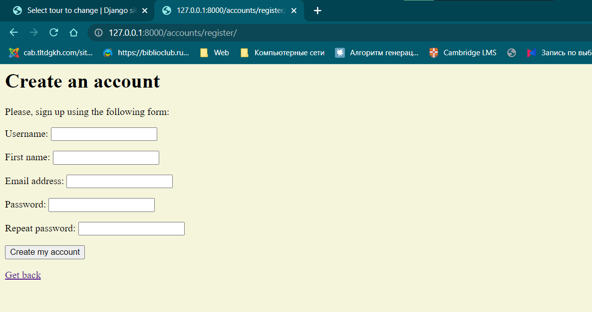
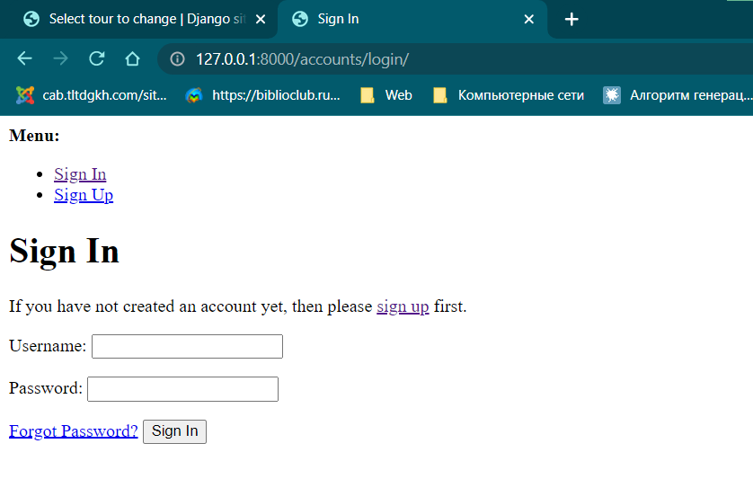
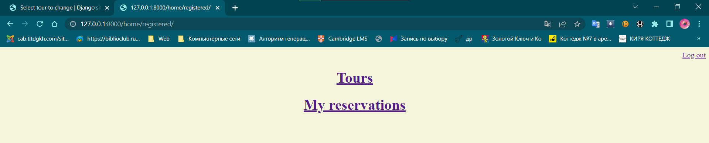
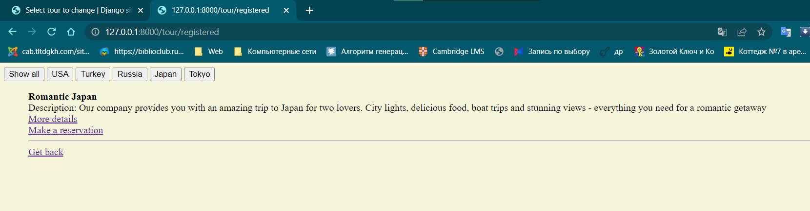

# Лабораторная работа №2

## Описание работы
Хранится информация о названии тура, турагенстве, описании тура, периоде
проведения тура, условиях оплаты.
Необходимо реализовать следующий функционал:

- Регистрация новых пользователей. 
- Просмотр и резервирование туров. Пользователь должен иметь возможность
редактирования и удаления своих резервирований. 
- Написание отзывов к турам. При добавлении комментариев, должны
сохраняться даты тура, текст комментария, рейтинг (1-10), информация о
комментаторе. 
- Администратор должен иметь возможность подтвердить резервирование
тура средствами Django-admin. 
- В клиентской части должна формироваться таблица, отображающая все
проданные туры по странам.

Далее представлена реализация основных файлов работы

## Файлы

* `models.py`
Создание классов: турист, тур, агенство, страна, резервирование, комментарий; и отношений между ними
```python
from django.db import models
from django.db.models.base import Model
from django.db.models.deletion import CASCADE
from django.contrib.auth.models import AbstractUser
from django.contrib.auth import get_user_model

class Tourist(AbstractUser):
    username = models.CharField(max_length=20, unique=True)
    first_name = models.CharField(max_length=20, null=True)
    last_name = models.CharField(max_length=20, null=True)
    password = models.CharField(max_length=100, null=True)

    def __str__(self):
        return str(self.first_name)

Tourist = get_user_model()

class Agency(models.Model):
    name = models.CharField(max_length=20)

    def __str__(self):
        return str(self.name)

class Country(models.Model):
    name = models.CharField(max_length=20)

    def __str__(self):
        return str(self.name)

class Tour(models.Model):
    name = models.CharField(max_length=20)
    description = models.TextField()
    agency_id = models.ForeignKey(Agency, on_delete=CASCADE)
    beginning_date = models.DateTimeField()
    ending_date = models.DateTimeField()
    country = models.ForeignKey(Country, on_delete=CASCADE, null=True)
    price = models.IntegerField(null=True)

    def __str__(self):
        return str(self.name)

class Reservation(models.Model):
    tourist_id = models.ForeignKey(Tourist, on_delete=CASCADE)
    tour_id = models.ForeignKey(Tour, on_delete=CASCADE)

    def __str__(self):
        return str(self.tour_id)

class Comment(models.Model):
    tourist_id = models.ForeignKey(Tourist, on_delete=CASCADE)
    tour_id = models.ForeignKey(Tour, on_delete=CASCADE)
    title = models.CharField(max_length=50, null=True)
    text = models.TextField()
    beginning_date = models.DateField(null=True)
    ending_date = models.DateField(null=True)
    rating = (('1', '1'), ('2', '2'), ('3', '3'), ('4', '4'), ('5', '5'), ('6', '6'), ('7', '7'), ('8', '8'), ('9', '9'), ('10', '10'))
    rate = models.CharField(max_length=30, choices=rating)

    def __str__(self):
        return str(self.title)
```

* `views.py`
Создание действий
```python
from typing import List
from django.shortcuts import render, redirect
from django.http import Http404, HttpResponse
from django.contrib.auth import authenticate, login, logout
from django.views.generic.list import ListView
from django.views.generic.edit import CreateView, DeleteView, UpdateView
from .models import Country, Tourist, Tour, Reservation, Comment
from .forms import LoginForm, UserRegistrationForm

def show_tour(request, tour_id):
    try:
        tour = Tour.objects.get(pk=tour_id)
        comments = Comment.objects.filter(tour_id=tour)
    except Tour.DoesNotExist:
        raise Http404
    return render(request, 'tour.html', {'tour': tour, 'comments': comments})


class All_Tours(ListView):
    model = Tour
    template_name = 'all_tour.html'

    @staticmethod
    def all_countries():
        return Country.objects.all()


class All_Tours_Registered(ListView):
    model = Tour
    template_name = 'tour_registered.html'

    @staticmethod
    def all_countries():
        return Country.objects.all()

def tours_registered(request, tour_id):
    try:
        tour = Tour.objects.get(pk=tour_id)
        comments = Comment.objects.filter(tour_id=tour)
    except Tour.DoesNotExist:
        raise Http404
    return render(request, 'all_tour_registered.html', {'tour': tour, 'comments': comments})

def tour_filter_registered(request, pk):
    tours = Tour.objects.all().filter(country_id=pk)
    return render(request, 'filter.html', {'tours': tours})

def tour_filter(request, pk):
    tours = Tour.objects.all().filter(country_id=pk)
    return render(request, 'filter_nr.html', {'tours': tours})

class Tourist_Page(ListView):
    model = Tourist
    template_name = 'tourist_page.html'

class All_Reservations(ListView):
    model = Reservation
    template_name = 'all_reservation.html'

class Make_Reservation(CreateView):
    model = Reservation
    template_name = 'reservation_create.html'
    fields = ['tourist_id', 'tour_id']
    success_url = '/home/registered'


class Edit_Reservation(UpdateView):
    model = Reservation
    template_name = 'reservation_edit.html'
    fields = ['tourist_id', 'tour_id']
    success_url = '/home/registered'

class Delete_Reservation(DeleteView):
    model = Reservation
    template_name = 'reservation_delete.html'
    success_url = '/home/registered'


class All_Comments(ListView):
    model = Comment
    template_name = 'all_comment.html'


class All_Comments_Registered(ListView):
    model = Comment
    template_name = 'all_comment_registered.html'


class Leave_Comment(CreateView):
    model = Comment
    template_name = 'comment.html'
    fields = ['tourist_id', 'tour_id', 'text', 'rate']
    success_url = '/tour/registered'


class Home(ListView):
    model = Tour
    template_name = 'home.html'


def register(request):
    if request.method == 'POST':
        user_form = UserRegistrationForm(request.POST)
        if user_form.is_valid():
            # Create a new user object but avoid saving it yet
            new_user = user_form.save(commit=False)
            # Set the chosen password
            new_user.set_password(user_form.cleaned_data['password'])
            # Save the User object
            new_user.save()
            return render(request, 'account/register_done.html', {'new_user': new_user})
    else:
        user_form = UserRegistrationForm()
    return render(request, 'account/register.html', {'user_form': user_form})


def user_login(request):
    if request.method == 'POST':
        form = LoginForm(request.POST)
        if form.is_valid():
            cd = form.cleaned_data
            user = authenticate(username=cd['username'], password=cd['password'])
            if user is not None:
                if user.is_active:
                    login(request, user)
                    return redirect('/home/registered')
                else:
                    return HttpResponse('Disabled account')
            else:
                return HttpResponse('Invalid login')
    else:
        form = LoginForm()
    return render(request, 'account/login.html', {'form': form})


def logout_user(request):
    logout(request)
    return redirect('/home/')
```

* `urls.py`
Создание ссылок
```python
from django.urls import path
from . import views

urlpatterns = [
    path('tour/<int:tour_id>', views.show_tour),
    path('tour/registered/<int:tour_id>', views.tours_registered),
    path('tour/registered', views.All_Tours_Registered.as_view()),
    path('tour/', views.All_Tours.as_view()),
    path('reservation_create/', views.Make_Reservation.as_view()),
    path('tour/<int:tour_id>/new_comment', views.Leave_Comment.as_view()),
    path('reservation/<int:pk>/edit/', views.Edit_Reservation.as_view()),
    path('tour/<int:tour_id>/comments/', views.All_Comments.as_view()),
    path('reservation/<int:pk>/delete/', views.Delete_Reservation.as_view()),
    path('accounts/register/', views.register),
    path('accounts/login/', views.user_login),
    path('home/', views.Home.as_view()),
    path('home/registered/', views.Tourist_Page.as_view()),
    path('home/<int:tourist_id>/reservation', views.All_Reservations.as_view()),
    path('accounts/logout', views.logout_user),
    path('tour/registered/<int:tour_id>/comments/', views.All_Comments_Registered.as_view()),
    path('filter/registered/<int:pk>', views.tour_filter_registered),
    path('filter/<int:pk>', views.tour_filter)
]
```

* `forms.py`
Создание основных форм: вход, регистрация и забытый пароль
```python
from django import forms
from .models import Tourist


class LoginForm(forms.Form):
    username = forms.CharField()
    password = forms.CharField(widget=forms.PasswordInput)


class UserRegistrationForm(forms.ModelForm):
    password = forms.CharField(label='Password', widget=forms.PasswordInput)
    password2 = forms.CharField(label='Repeat password', widget=forms.PasswordInput)

    class Meta:
        model = Tourist
        fields = ('username', 'first_name', 'email')

    def clean_password2(self):
        cd = self.cleaned_data
        if cd['password'] != cd['password2']:
            raise forms.ValidationError('Passwords don\'t match.')
        return cd['password2']
```

## Основные скрины работы приложения:
* `Регистрация`



* `Вход`



* `Главная зарегистрированного пользователя`



* `Туры с фильтрацией по городам`




