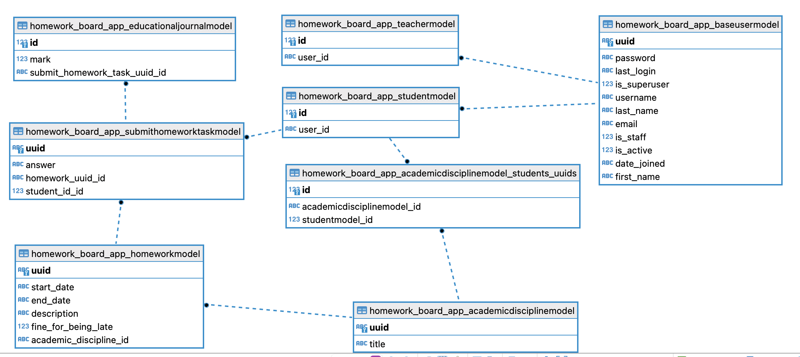

## DB Scheme:



## Django ORM:
- AcademicDisciplineModel (академическая дисциплина):
``` python
class AcademicDisciplineModel(Model):
    uuid = UUIDField(primary_key=True, default=uuid4, editable=False)
    title = CharField(max_length=100, blank=True, null=True)
    students_uuids = ManyToManyField(StudentModel)
```
- BaseUserModel (базовый пользователь):
``` python
class BaseUserModel(AbstractUser):
    uuid = UUIDField(primary_key=True, default=uuid4, editable=False)
```
- EducationalJournalModel (учебный журнал):
``` python
class EducationalJournalModel(Model):
    submit_homework_task_uuid = ForeignKey(SubmitHomeworkTaskModel, on_delete=CASCADE)
    mark = IntegerField("Mark")
```
- HomeworkModel (домашнее задание):
``` python
class HomeworkModel(Model):
    uuid = UUIDField(primary_key=True, default=uuid4, editable=False)
    academic_discipline = ForeignKey(AcademicDisciplineModel, on_delete=CASCADE)
    start_date = DateField("Start date")
    end_date = DateField("End date")
    description = CharField("Description", max_length=1000)
    fine_for_being_late = IntegerField("Fine for being late")
```
- StudentModel (студент):
``` python
class StudentModel(Model):
    user = ForeignKey(BaseUserModel, on_delete=CASCADE)
```
- SubmitHomeworkTaskModel (домашнее задание на проверку):
``` python
class SubmitHomeworkTaskModel(Model):
    uuid = UUIDField(primary_key=True, default=uuid4, editable=False)
    student_id = ForeignKey(StudentModel, on_delete=CASCADE)
    homework_uuid = ForeignKey(HomeworkModel, on_delete=CASCADE)
    answer = CharField(max_length=1000, blank=True, null=False)
```
- TeacherModel (учитель):
``` python
class TeacherModel(Model):
    user = ForeignKey(BaseUserModel, on_delete=CASCADE)
```
