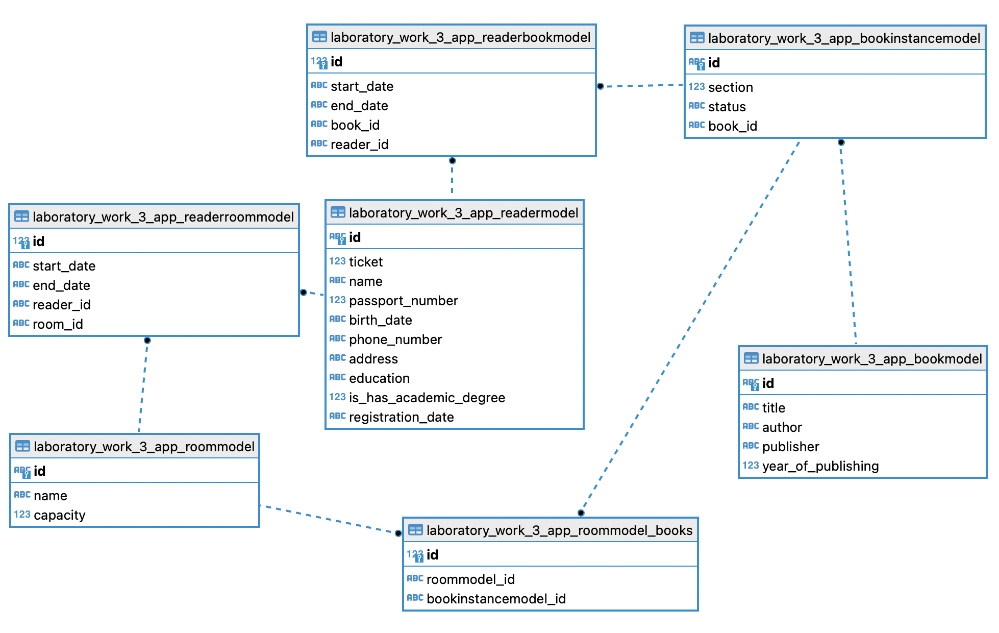

# Models


## DB Scheme:



## Django ORM:
- Book Instance Model (экземпляр книги):
``` python
class BookInstanceModel(models.Model):
    statuses = (
        ('g', 'good'),
        ('b', 'bad'),
    )

    id = models.UUIDField(primary_key=True)
    book = models.ForeignKey(BookModel, on_delete=models.CASCADE)
    section = models.IntegerField()
    status = models.CharField(max_length=1, choices=statuses)
```
- Book Model (книга):
``` python
class BookModel(models.Model):
    id = models.UUIDField(primary_key=True)
    title = models.CharField(max_length=100)
    author = models.CharField(max_length=100)
    publisher = models.CharField(max_length=100)
    year_of_publishing = models.IntegerField()
```
- Reader Book Model (бронирование книги читателем):
``` python
class ReaderBookModel(models.Model):
    reader = models.ForeignKey(ReaderModel, on_delete=models.CASCADE)
    book = models.ForeignKey(BookInstanceModel, on_delete=models.CASCADE)
    start_date = models.DateField()
    end_date = models.DateField()
```
- Reader Model (читатель):
``` python
class ReaderModel(models.Model):
    educations = (
        ('p', 'primary'),
        ('s', 'secondary'),
        ('h', 'higher'),
    )

    id = models.UUIDField(primary_key=True)
    ticket = models.IntegerField()
    name = models.CharField(max_length=100)
    passport_number = models.IntegerField()
    birth_date = models.DateField()
    phone_number = models.CharField(max_length=20)
    address = models.CharField(max_length=100)
    education = models.CharField(max_length=1, choices=educations)
    is_has_academic_degree = models.BooleanField()
    registration_date = models.DateField()
    books_instances = models.ManyToManyField(
        'BookInstanceModel',
        through='ReaderBookModel',
        related_name='reader_book_instance'
    )
```
- Reader Room Model (закрепление читателя за читальным залом):
``` python
class ReaderRoomModel(models.Model):
    reader = models.ForeignKey(ReaderModel, on_delete=models.CASCADE)
    room = models.ForeignKey(RoomModel, on_delete=models.CASCADE)
    start_date = models.DateField()
    end_date = models.DateField()
```
- Room Model (читальный зал):
``` python
class RoomModel(models.Model):
    id = models.UUIDField(primary_key=True)
    name = models.CharField(max_length=100)
    capacity = models.IntegerField()
    books = models.ManyToManyField(BookInstanceModel)
```
