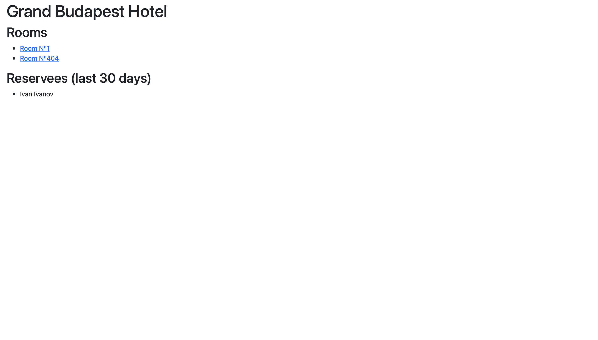

# Laboratory 2

## Task
Список отелей.

Учитывается название отеля, владелец отеля, адрес, описание, типы
номеров, стоимость, вместимость, удобства.

Функционал:

* Регистрация новых пользователей.
* Просмотр и резервирование номеров. Пользователь имеет
возможность редактирования и удаления своих резервирований.
* Написание отзывов к номерам. При добавлении комментариев,
сохраняется период проживания, текст комментария, рейтинг (1-10),
информация о комментаторе.
* Администратор имеет возможность заселить пользователя в отель и
выселить из отеля средствами Django-admin.
* В клиентской части формируется список
постояльцев отеля за последний месяц.

## Models
`models.py` содержит все модели приложения. 

**Модель отеля**
``` python
class Hotel(models.Model):
    name = models.CharField(max_length=63)
    owner = models.CharField(max_length=255)
    address = models.CharField(max_length=255)
    description = models.CharField(max_length=255)
```
Все поля являются обязательным, отражают:

* Название отеля;
* Его владельца;
* Адрес;
* Описание.

**Модель комнаты**
``` python
class Room(models.Model):
    number = models.IntegerField()
    hotel = models.ForeignKey(Hotel, on_delete=models.CASCADE)
    type = models.CharField(max_length=127)
    cost = models.PositiveIntegerField()
    beds = models.PositiveSmallIntegerField()
    amenities = models.CharField(max_length=255, blank=True, null=True)
```
Поля:

* Номер комнаты;
* Отель, в котором комната (вн. ключ на отель);
* Тип комнаты;
* Цена за ночь;
* Кол-во мест;
* Удобства (необязательное поле).

**Модель брони**
``` python
class Booking(models.Model):
    reservee = models.ForeignKey(User, on_delete=models.CASCADE)
    reservation = models.ForeignKey(Room, on_delete=models.CASCADE)
    date_start = models.DateField()
    date_end = models.DateField()
    approved = models.BooleanField(default=False)
```
Поля:

* Гость (вн. ключ на пользователя);
* Номер (вн. ключ на комнату);
* Начало и конец бронирования;
* Согласовано или нет (решает администратор в панели).

**Модель комменты**
``` python
class Review(models.Model):
    booking = models.ForeignKey(Booking, on_delete=models.CASCADE)
    text = models.TextField()
    rating = models.PositiveSmallIntegerField(
        validators=[
            MaxValueValidator(10),
            MinValueValidator(1)
        ]
    )
```
Поля:

* Бронь (вн. ключ на бронь);
* Текст комментария;
* Рейтинг (от 1 до 10 через валидаторы.).

_NB:_ через внешний ключ брони можно получить всю необходимую дополнительную информацию:

* Автора;
* Время брони.

## Views
`views.py` содержит все представления.

**Представления отеля**

* Все отели:

``` python
class HotelListView(ListView):
    model = Hotel
```

* Конкретный отель:

``` python
class HotelDetailView(DetailView):
    model = Hotel

    def get_context_data(self, **kwargs):
        context = super().get_context_data(**kwargs)
        context["rooms"] = Room.objects.filter(hotel=self.object.id)
        room_ids = [room["id"] for room in context["rooms"].values()]
        delta = timedelta(days=30)
        context["bookings"] = Booking.objects.filter(reservation__in=room_ids, date_end__gte=(datetime.today()-delta))
        context["reservees"] = User.objects.filter(id__in=set(
            [booking["reservee_id"] for booking in context["bookings"].values()]))
        return context
```

Функция ```get_context_data``` получает дополнительные данные для контекста:

* Все комнаты, у которых ключ на выбранный отель;
* Списком гостей за последние 30 дней.

Список гостей формируется с помощью нескольких последовательный запросов, которые изначально ищут все бронирования за последние 30 дней, а в них уникальных гостей.

**Представления комнаты**

* Конкретная комната:

``` python
class RoomDetailView(DetailView):
    model = Room

    def get_context_data(self, **kwargs):
        context = super().get_context_data(**kwargs)
        user = self.request.user
        bookings = Booking.objects.filter(reservation=self.object.id)
        booking_ids = [booking['id'] for booking in bookings.values()]
        reviews = Review.objects.filter(booking__in=booking_ids)

        reviews_by_user = 0
        for review in reviews:
            if review.booking.reservee == user:
                reviews_by_user += 1

        for booking in bookings:
            if booking.reservee == user:
                reviews_by_user -= 1

        review_form = ReviewForm()
        if reviews_by_user == 0:
            review_form = None
        booking_form = BookingForm()

        context["reviews"] = reviews
        context["review_form"] = review_form
        context["booking_form"] = booking_form

        return context

    def post(self, request, *args, **kwargs):
        user = request.user
        room = self.get_object()
        if 'review_post' in self.request.POST:
            review_form = ReviewForm(self.request.POST)
            if review_form.is_valid():
                review_form = review_form.save(commit=False)
                review_form.booking = Booking.objects.filter(reservation=room.id, reservee=user).last()
                review_form.save()
        elif 'booking_post' in self.request.POST:
            booking_form = BookingForm(self.request.POST)
            if booking_form.is_valid():
                booking_form = booking_form.save(commit=False)
                booking_form.reservee = user
                booking_form.reservation = room
                booking_form.save()
                return HttpResponseRedirect(reverse('bookings'))
        return HttpResponseRedirect(reverse('get_room',
                                            args=(self.kwargs['hotel_id'], room.id,)))
```

Функция ```get_context_data``` дополнительно получает в контекст:

* Все обзоры, которые оставлялись на бронь данной комнаты;
* Форма бронирования;
* Форма отзыва, если пользователь бронировал большее число раз, чем уже оставил отзывов.

Функция ```post``` обрабатывает формы, если пользователь сделал бронь, то перенаправляет его к своим броням.

**Представления брони**

* Все брони гостя:

``` python
class BookingListView(ListView):
    model = Booking

    def get_queryset(self):
        return self.model.objects.filter(reservee=self.request.user)
```

* Форма удаления брони:

``` python
class BookingDeleteView(DeleteView):
    model = Booking
    success_url = '/bookings/'

    def get_context_data(self, **kwargs):
        context = super().get_context_data(**kwargs)
        user = self.request.user
        context["valid_user"] = True if self.object.reservee == user else False

        return context
```

* Форма изменения брони:

``` python
class BookingUpdateView(UpdateView):
    model = Booking
    fields = ['date_start', 'date_end']
    success_url = '/bookings/'

    def get_context_data(self, **kwargs):
        context = super().get_context_data(**kwargs)
        user = self.request.user
        context["valid_user"] = True if self.object.reservee == user else False

        return context
```

_NB:_ у обеих форм есть проверка на то, что никто кроме гостя (и администратора) не может получить к ней доступ. 

## Templates

В `hotels_app/templates` содержатся шаблоны под каждое представление.

## Forms
`forms.py` содержит все формы.

**Форма обзора**

``` python
class ReviewForm(ModelForm):
    class Meta:
        model = Review
        fields = ['text', 'rating']
```

**Форма брони**

``` python
class BookingForm(ModelForm):
    class Meta:
        model = Booking
        fields = ['date_start', 'date_end']

    def clean(self):
        cleaned_data = super().clean()
        start_date = cleaned_data.get("date_start")
        end_date = cleaned_data.get("date_end")
        if end_date < start_date:
            raise ValidationError("End date should be greater than start date.")
```

Есть проверка на то, что дата начала брони должна быть до конца.

## URLs

### Project

``` python
path("admin/", admin.site.urls),
path('accounts/', include('allauth.urls')),
path("", include("hotels_app.urls")),
```

Есть три возможных маршрута:
1. Админка;
2. Аккаунты (`django-allauth`);
3. Приложение (`hotels_app`).

### Apps

**Пути до отеля и комнат:**

``` python
path('hotel/list/', HotelListView.as_view()),
path('hotel/<int:pk>/', HotelDetailView.as_view()),
path('hotel/<hotel_id>/<int:pk>/', RoomDetailView.as_view(), name="get_room"),
```

**Пути до бронь:**

``` python
path('bookings/', login_required(BookingListView.as_view()), name="bookings"),
path('bookings/<int:pk>/delete/', login_required(BookingDeleteView.as_view())),
path('bookings/<int:pk>/update/', login_required(BookingUpdateView.as_view())),
```

* Все представления являются _class based_, поэтому используется метод `as_view()`;
* У представлений, которые доступны только авторизованным пользователям есть проверка на логин `login_required()`.

## Examples

