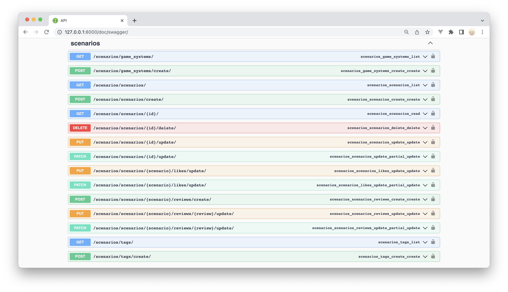

# API
## Schema

## Endpoints:
1. `[GET]` получить все игровые системы;
2. `[POST]` создать новую игровую систему;
3. `[GET]` получить все сценарии (возвращается краткая информация);
4. `[POST]` создать новый сценарий;
5. `[GET]` получить полную информацию о сценарии по id;
6. `[DELETE]` удалить сценарий по id;
7. `[PATCH]` обновить сценарий по id;
8. `[PATCH]` обновить лайки сценария по id, то есть поставить новый или убрать старый;
9. `[POST]` создать новый комментарий к сценарию с id;
10. `[PATCH]` обновить указанный комментарий у сценария с id;
11. `[GET]` получить все тэги;
12. `[POST]` создать новый тэг.