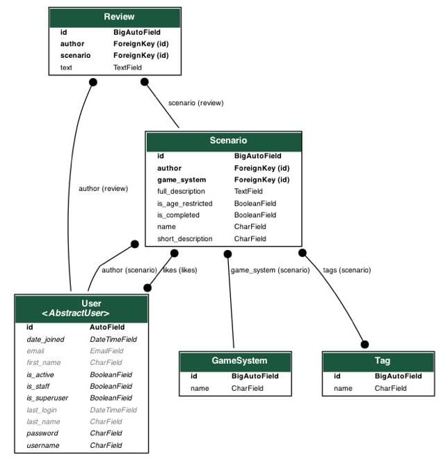

# Models
## Schema:

## Django ORM:
- Game System (игровая система, например, GURPS или D&D):
``` python
class GameSystem(models.Model):
    name = models.CharField(max_length=31, unique=True)

    def __str__(self):
        return self.name
```
- Tag (тэг, который дает характеристику сценария, например, короткий и смешной):
``` python
class Tag(models.Model):
    name = models.CharField(max_length=31, unique=True)

    def __str__(self):
        return self.name
```
- Scenario (сценарий непосредственно):
``` python
class Scenario(models.Model):
    name = models.CharField(max_length=31)
    short_description = models.CharField(max_length=127)
    full_description = models.TextField()
    game_system = models.ForeignKey(GameSystem, on_delete=models.SET_NULL, null=True)
    is_completed = models.BooleanField()
    is_age_restricted = models.BooleanField()
    author = models.ForeignKey(User, on_delete=models.CASCADE)
    tags = models.ManyToManyField(Tag)
    likes = models.ManyToManyField(User, related_name="likes", blank=True)
    publish_date = models.DateField(default=datetime.date.today)

    def __str__(self):
        return self.name
```
- Review (обзор на сценарий):
``` python
class Review(models.Model):
    scenario = models.ForeignKey(Scenario, on_delete=models.CASCADE, related_name='scenario')
    author = models.ForeignKey(User, on_delete=models.CASCADE, related_name='author')
    text = models.TextField()
    publish_date = models.DateField(default=datetime.date.today)
    is_edited = models.BooleanField(default=False)
```