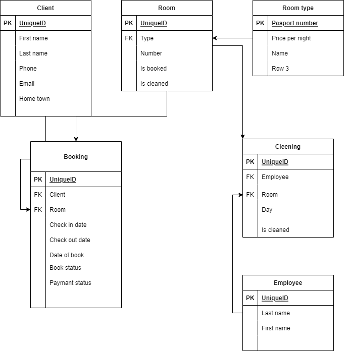

# Lab 3

Реализация серверной части приложения средствами django и djangorestframework в соответствии с заданием из [текста работы](https://drive.google.com/file/d/1QxQo5jln6soFUj6EmOVEo1yauCo375PP/view?usp=sharing).<br>

Порядок выполнения работы:<br>

1. Выполнить Практические работы [3.1](https://docs.google.com/document/d/1jB8EYOWk-bbjB6sLr1s7dOmLYRC9Z5jIV6xIpnigdvY/edit?usp=sharing) и [3.2](https://docs.google.com/document/d/1PkpwxCUYQ2_Pi8Fpcgno6te3oCQHZfkh03Zxt6DhHSw/edit)<br><br>
2. Выбрать вариант или предложить свой, есть 3 способа:<br>
   2.1. Предложить свой вариант.<br>
   2.3. Выбрать вариант из [вариантов](https://drive.google.com/file/d/174gPjJ7AOHfzteYcobPY0x7sFBTkN1Xx/view?usp=sharing) по курсу «Основы баз данных» .<br>
   2.3. Использовать вариант из курса Давида по фронтент-разработке.
   2.4. Если хочется сделать что-то полнофункциональное для порфтолио и задеплоить, можно поговорить с Антоном Игореувичем и он предложит несколько важных для него тем (при этом варианте шаги по работе чаще нужно будет согласовывать с преподавателями).
   По любому из способов функционал нужно согласовать с преподавателем или ментором. В лабораторной работе №4 необходимо будет реализовать клиентскую часть(фронтенд) по этому же варианту.<br><br>
3. Реализовать модель базы данных средствами DjangoORM (согласовать с преподавателем на консультации).<br>
   При необходимости, студент может согласовать модель базы данных с преподавателем и только потом приступить к описанию модели средствами Django ORM<br>
   Полезные материалы:<br> - [Создание модели данных в Django ORM](https://www.youtube.com/watch?v=LZyk9p0tKXc) (Видео)<br><br> - [3.1](https://docs.google.com/document/d/1jB8EYOWk-bbjB6sLr1s7dOmLYRC9Z5jIV6xIpnigdvY/edit?usp=sharing)
4. Реализовать логику работу API средствами Django REST Framework (используя методы сериализации).<br>
   Полезные материалы:<br> - Пункты 4, 5, 6 в [Практической работе 3.1](https://docs.google.com/document/d/1PkpwxCUYQ2_Pi8Fpcgno6te3oCQHZfkh03Zxt6DhHSw/edit)<br> - [DJANGO API VIEWS, GENERICS, FILTER](https://youtu.be/AHnBL9x6-rs) (Видео)<br> - [JSON. Сериализация данных. Пишем свой сериализатор. Разбираем Django REST Framework Serializers](https://youtu.be/sxdPf3z6Uw8) (Видео)<br> - [Работа с Django ORM](https://youtu.be/HhrPbmHbDPU) (Видео)<br><br>
5. Подключить регистрацию / авторизацию по токенам / вывод информации о текущем пользователе средствами Djoser.<br>
   Полезные материалы:<br> - Djoser ([DRF + Djoser часть 1. Регистрация, авторизация по токенам, получение и изменение данных пользователя](https://youtu.be/NT-cI6rJl5Q)) (Видео)<br><br>
6. Выполнить практическую работу 3.2 по оформлению документации (в процессе разработки)<br><br>
7. Реализовать документацию, описывающую работу всех используемых endpoint-ов из пункта 3 и 4 средствами Read the Docs или MkDocs.<br><br>
   Полезные материалы: - Пункт 3 [из практической работы №3.2](https://docs.google.com/document/d/1rIfREFvCB4pp8uF990Tz3PLXRJ5u_w-Y3vLxfXWKoxg/edit?usp=sharing)

Работа выполняется индивидуально.<br>
Код практический и лабораторной части должен быть загружен в репозиторий курса, в соответствии с инструкциями тут.<br>
Работу необходимо защитить на консультации или прислать видео с описанием проделанной работы.<br>)

<hr>

# Схема базы данных



- models.py

```python
from django.db import models


class RoomType(models.Model):
    id = models.AutoField("id", primary_key=True)
    pricePerNight = models.FloatField()
    name = models.TextField()


class Room(models.Model):
    id = models.AutoField("id", primary_key=True)
    roomType = models.ForeignKey(RoomType, on_delete=models.CASCADE)
    number = models.IntegerField()
    isBooked = models.BooleanField()
    isCleaned = models.BooleanField()

class Client(models.Model):
    passport = models.CharField(max_length=20, primary_key=True)
    firstName = models.TextField()
    lastName = models.TextField()
    phone = models.TextField()
    email = models.TextField()
    homeTown = models.TextField()

class Employee(models.Model):
    id = models.AutoField("id", primary_key=True)
    firstName = models.TextField()
    lastName = models.TextField()

class Cleening(models.Model):
    id = models.AutoField("id", primary_key=True)
    room = models.ForeignKey(Room, on_delete=models.CASCADE)
    employee = models.ForeignKey(Employee, on_delete=models.CASCADE)
    day = models.DateField()

class Booking(models.Model):
    bookStatusType = (
            ("F", "free"),
            ("B", "booked"),
        )

    paymentStatusType= (
        ("P", "payed"),
        ("N", "not payed"),
    )
    id = models.AutoField("id", primary_key=True)
    room = models.ForeignKey(Room, on_delete=models.CASCADE)
    client = models.ForeignKey(Client, on_delete=models.CASCADE)
    checkInDate = models.DateField()
    checkOutDate = models.DateField()
    bookStatus = models.CharField(choices=bookStatusType,max_length=20)
    paymentStatus = models.CharField(choices=paymentStatusType, max_length=20)
```

- views.py

```python

from django.shortcuts import render
# from rest_framework.generics import ListAPIView

from .models import *
from rest_framework import generics
from rest_framework.response import Response
from .serializers import *
from datetime import datetime
from rest_framework.permissions import IsAdminUser
from django.shortcuts import render
from rest_framework.views import APIView
from django.db.models import Q, Count


class CountObj:
    def __init__(self, count):
        self.count = count


class ClientsLivingPeriod(generics.ListAPIView):
    queryset = Booking.objects.all()
    serializer_class = BookingFieldRoomSerializer

    def get_queryset(self):
        return self.queryset.filter(
            Q(checkInDate__gte=self.kwargs["checkInDate"], checkOutDate__lte=self.kwargs["checkOutDate"]) |
            Q(checkInDate__lte=self.kwargs["checkInDate"], checkOutDate__gte=self.kwargs["checkOutDate"]),

            room=self.kwargs["room"]
        )


class ClientsCountByCity(generics.RetrieveAPIView):
    queryset = Client.objects.all()
    serializer_class = CountSerializer

    def retrieve(self, request, *args, **kwargs):
        serializer = self.serializer_class(
            CountObj(self.queryset.filter(homeTown=self.kwargs["homeTown"]).count())
        )
        return Response(serializer.data)


class FreeRoomsCount(generics.RetrieveAPIView):
    serializer_class = CountSerializer
    queryset = Room.objects.all()

    def fitration(self, *args, **kwargs):
        return self.queryset.filter(Q(booking__checkInDate__lte=self.kwargs["date"]) &
                                    Q(booking__checkOutDate__gt=self.kwargs["date"])).distinct()

    def retrieve(self, request, *args, **kwargs):
        serializer = self.serializer_class(
            CountObj(self.queryset.count() - self.fitration().count())
        )
        return Response(serializer.data)


class ClientsSamePeriods(generics.RetrieveAPIView):
    serializer_class = CountSerializer

    def fitration(self, *args, **kwargs):
        result = []
        client = Client.objects.filter(passport=self.kwargs["client"]).first()
        for booking in Booking.objects.filter(client=client).all():
            result += Booking.objects.filter(Q(checkOutDate__gte=booking.checkOutDate) &
                                             Q(checkInDate__lte=booking.checkInDate) &
                                             Q(client__homeTown__isnull=False)).exclude(
                client__passport=self.kwargs["client"])
        return result

    def retrieve(self, request, *args, **kwargs):
        serializer = self.serializer_class(
            CountObj(len(self.fitration()))
        )
        return Response(serializer.data)


class EmployeesCleaning(APIView):
    # queryset = Room.objects.all()
    def get(self, *args, **kwargs):
        bookings = Booking.objects.filter(client__passport=kwargs["client"]).all()
        result = Employee.objects.none()
        for booking in bookings:
            result |= Cleening.objects.filter(Q(day__lte=booking.checkOutDate) &
                                              Q(day__gte=booking.checkInDate) &
                                              Q(day=kwargs["day"]) &
                                              Q(room=booking.room)).all()
        serializer = CleaningSerializer(result, many=True)
        return Response(serializer.data)


class Report(APIView):
    def get(self, *args, **kwargs):

        if kwargs["quarter"] == 1:
            quarterFilter = Q(checkInDate__gte=datetime(datetime.today().year, 1, 1),
                              checkInDate__lt=datetime(datetime.today().year, 3, 31))
        elif kwargs["quarter"] == 2:
            quarterFilter = Q(checkInDate__gte=datetime(datetime.today().year, 4, 1),
                              checkInDate__lt=datetime(datetime.today().year, 6, 30))
        elif kwargs["quarter"] == 3:
            quarterFilter = Q(checkInDate__gte=datetime(datetime.today().year, 7, 1),
                              checkInDate__lt=datetime(datetime.today().year, 9, 30))
        elif kwargs["quarter"] == 4:
            quarterFilter = Q(ccheckInDate__gte=datetime(datetime.today().year, 10, 1),
                              checkInDate__lt=datetime(datetime.today().year, 12, 31))

        floors = []
        for f in Room.objects.values("number").annotate(Count("id")):
            floors.append({"floor": int(f["number"] / 10), "count": f["id__count"]})

        rooms = []
        for room in Room.objects.all():
            days = 0
            counter = 0
            for booking in room.booking_set.filter(quarterFilter):
                days += (booking.checkOutDate - booking.checkInDate).days
                counter += 1
            rooms.append(
                {
                    "name": room.number,
                    "count": counter,
                    "profit": room.roomType.pricePerNight * days
                }
            )

        return render(
            self.request,
            "report.html",
            {"floors": floors, "rooms": rooms, "profit": sum(r["profit"] for r in rooms)}
        )


# admin views
class CreateEmployee(generics.CreateAPIView):
    serializer_class = EmployeeSerializer
    permission_classes = [IsAdminUser]
    queryset = Employee.objects.all()


class DeleteEmployee(generics.DestroyAPIView):
    serializer_class = EmployeeSerializer
    permission_classes = [IsAdminUser]
    queryset = Employee.objects.all()


class UpdateEmployee(generics.UpdateAPIView):
    serializer_class = EmployeeSerializer
    permission_classes = [IsAdminUser]
    queryset = Employee.objects.all()


class CreateBooking(generics.CreateAPIView):
    serializer_class = BookingSerializer
    permission_classes = [IsAdminUser]
    queryset = Booking.objects.all()


class DeleteBooking(generics.DestroyAPIView):
    permission_classes = [IsAdminUser]
    serializer_class = BookingSerializer
    queryset = Booking.objects.all()


class UpdateBooking(generics.UpdateAPIView):
    permission_classes = [IsAdminUser]
    serializer_class = BookingSerializer
    queryset = Booking.objects.all()

```

- serializers.py

```python

from rest_framework import serializers
from .models import *


class EmployeeSerializer(serializers.ModelSerializer):
    class Meta:
        model = Employee
        fields = ("id", "firstName", "lastName")


class EmployeeCreateSerializer(serializers.ModelSerializer):
    class Meta:
        model = Employee
        fields = "__all__"


class CleaningSerializer(serializers.ModelSerializer):
    employee = EmployeeSerializer()

    class Meta:
        model = Cleening
        fields = "__all__"


class RoomTypeSerializer(serializers.ModelSerializer):
    class Meta:
        model = RoomType
        fields = "__all__"


class RoomSerializer(serializers.ModelSerializer):
    type = RoomTypeSerializer()

    class Meta:
        model = Room
        fields = "__all__"


class ClientSerializer(serializers.ModelSerializer):
    class Meta:
        model = Client
        fields = "__all__"


class ClientCreateSerializer(serializers.ModelSerializer):
    class Meta:
        model = Client
        fields = "__all__"


class BookingSerializer(serializers.ModelSerializer):
    class Meta:
        model = Booking
        fields = "__all__"


class BookingFieldRoomSerializer(serializers.ModelSerializer):
    client = ClientSerializer()

    class Meta:
        model = Booking
        fields = "__all__"


class BookingRoomSerializer(serializers.ModelSerializer):
    room = RoomSerializer()

    class Meta:
        model = Booking
        fields = "__all__"


class CountSerializer(serializers.Serializer):
    count = serializers.IntegerField()
```

- urls.py

````python
from django.urls import path, include, re_path
from .views import *

app_name = "hotel_app"

urlpatterns = [
    path("living_clients/<int:room>/<str:checkInDate>/<str:checkOutDate>", ClientsLivingPeriod.as_view()),
    path("client/<str:homeTown>", ClientsCountByCity.as_view()),
    path("free_rooms/<str:date>", FreeRoomsCount.as_view()),
    path("clients_same/<str:client>", ClientsSamePeriods.as_view()),
    path("employees/<str:day>/<int:client>", EmployeesCleaning.as_view()),
    path("report/<int:quarter>", Report.as_view()),
    path("admin_/create_booking", CreateBooking.as_view()),
    path("admin_/delete_booking", DeleteBooking.as_view()),
    path("admin_/update_booking", UpdateBooking.as_view()),
    path("admin_/create_employee", CreateEmployee.as_view()),
    path("admin_/delete_employee", DeleteEmployee.as_view()),
    path("admin_/update_employee", UpdateEmployee.as_view()),
]
```

**URL** : `/client/<str:city>/`

**Method** : `GET`

**Auth required** : NO

**Permissions required** : None

## Success Responses

**Code** : `200 OK`


```json
{
  {
    "count": 1
  }
}
````

**URL** : `/living_clients/<int:room>/<str:checkInDate>/<str:checkOutDate>`

**Method** : `GET`

**Auth required** : NO

**Permissions required** : None

## Success Responses

**Code** : `200 OK`

```json
{
    {
        "id": 1,
        "client": {
            "passport": "1",
            "firstName": "Danil",
            "lastName": "Kostennikov",
            "phone": "+7775",
            "email": "kost@gmail.com",
            "homeTown": "SPB"
        },
        "checkInDate": "2023-01-10",
        "checkOutDate": "2023-01-15",
        "bookStatus": "B",
        "paymentStatus": "P",
        "room": 1
    },
    {
        "id": 2,
        "client": {
            "passport": "2",
            "firstName": "Test2",
            "lastName": "TestLast2",
            "phone": "+7894",
            "email": "test2@gmail.com",
            "homeTown": "MSC"
        },
        "checkInDate": "2023-01-05",
        "checkOutDate": "2023-01-09",
        "bookStatus": "B",
        "paymentStatus": "P",
        "room": 1
    }
}
```

**URL** : `/free_rooms/<str:date>`

**Method** : `GET`

**Auth required** : NO

**Permissions required** : None

## Success Responses

**Code** : `200 OK`

```json
{
  {
    "count": 1
  }
}
```

**URL** : `/clients_same/<str:client>`

**Method** : `GET`

**Auth required** : NO

**Permissions required** : None

## Success Responses

**Code** : `200 OK`

```json
{
  {
    "count": 1
  }
}
```

**URL** : `/employees/<str:day>/<str:client>`

**Method** : `GET`

**Auth required** : NO

**Permissions required** : None

## Success Responses

**Code** : `200 OK`

```json
{
    {
        "id": 1,
        "employee": {
            "id": 1,
            "firstName": "CleanerFirst",
            "lastName": "CleanerLast"
        },
        "day": "2023-01-14",
        "room": 1
    }
}
```

**URL** : `/report/<int:quarter>`

**Method** : `GET`

**Auth required** : NO

**Permissions required** : None

## Success Responses

**Code** : `200 OK`

```html
<p>Room number: 11. Booking count: 2. Profit: 900.0</p>

<p>Room number: 21. Booking count: 0. Profit: 0.0</p>

<p>Floor: 1. Rooms count: 1</p>

<p>Floor: 2. Rooms count: 1</p>

<p>Quarter profit: 900.0</p>
```
