## Описание 3.1 практической работы

Django заапросы и их выполнение.

<hr>

## Задание 3.1.1

`Описание:` напишите запрос на создание 6-7 новых автовладельцев и 5-6 автомобилей,
каждому автовладельцу назначьте удостоверение и от 1 до 3 автомобилей.
Задание можете выполнить либо в интерактивном режиме интерпретатора, либо в отдельном python-файле.
Результатом должны стать запросы и отображение созданных объектов.

- models.py

```python
from django.db import models

# Create your models here.
class CarOwner(models.Model):
    id = models.AutoField(primary_key=True)
    last_name = models.CharField(max_length=30)
    first_name = models.CharField(max_length=30)
    birthdate = models.DateField(blank=True, null=True)


class Car(models.Model):
    car_number = models.CharField(max_length=15, unique=True)
    brand = models.CharField(max_length=20)
    model = models.CharField(max_length=20)
    color = models.CharField(max_length=30, blank=True, null=True)


class Ownership(models.Model):
    start_own_date = models.DateField()
    end_own_date = models.DateField(blank=True, null=True)
    car_owner = models.ForeignKey(CarOwner, on_delete=models.CASCADE)
    car = models.ForeignKey(Car, on_delete=models.CASCADE)


class License(models.Model):
    car_owner = models.ForeignKey(CarOwner, on_delete=models.CASCADE)
    license_number = models.CharField(max_length=10, unique=True)
    type = models.CharField(max_length=10)
    reg_date = models.DateField()
```

> Создание автомобилей

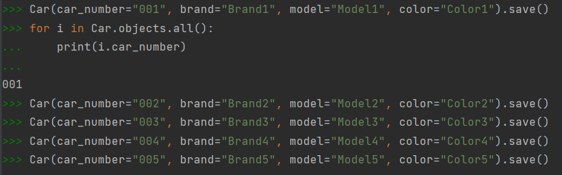

> Создание автовладельцев

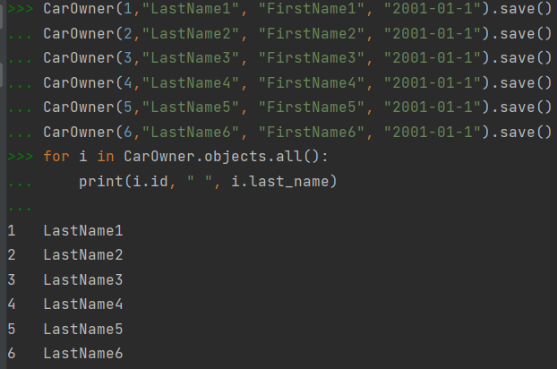

> Создание водительских прав

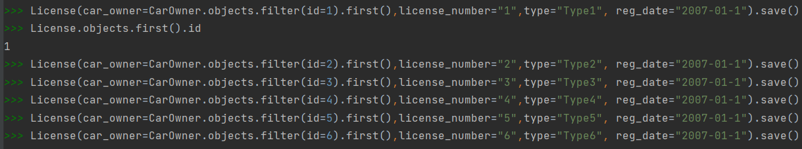

> Присвоение автовладельцам автомобили

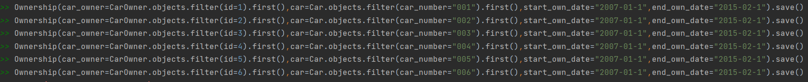

> Выведете все машины марки “Toyota” (или любой другой марки, которая у вас есть):

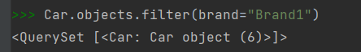

> Найти всех водителей с именем “Олег” (или любым другим именем на ваше усмотрение):

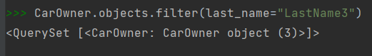

> Взяв любого случайного владельца получить его id, и по этому id получить экземпляр удостоверения в виде объекта модели (можно в 2 запроса).
> Вывести всех владельцев красных машин (или любого другого цвета, который у вас присутствует):

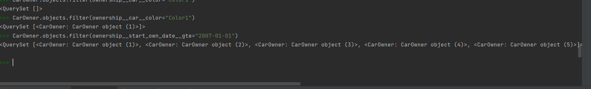

> Найти всех владельцев, чей год владения машиной начинается с 2010 (или любой другой год, который присутствует у вас в базе):

```python
>>> Ownership.objects.filter(start_own_date__gte="2007-01-01")
<QuerySet [<Ownership: Ownership object (1)>, <Ownership: Ownership object (2)>, <Ownership: Ownership object (3)>,
<Ownership: Ownership object (4)>, <Ownership: Ownership object (5)>,
<Ownership: Ownership object (6)>]>
```

> Вывод даты выдачи самого старшего водительского удостоверения:

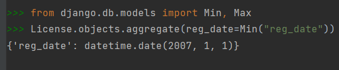

> Укажите самую позднюю дату владения машиной, имеющую какую-то из существующих моделей в вашей базе:

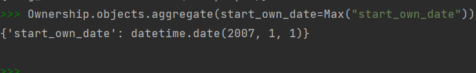

> Выведите количество машин для каждого водителя
> Подсчитайте количество машин каждой марки:

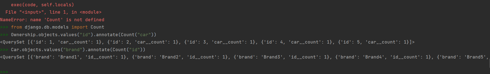

> Отсортируйте всех автовладельцев по дате выдачи удостоверения:

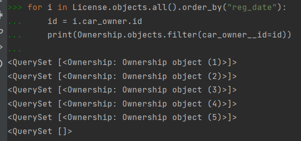
