## Описание 2 лабораторной работы
Реализовать сайт используя фреймворк Django 3 и СУБД PostgreSQL, в
соответствии с вариантом задания лабораторной работы.

`Вариант:` Табло отображения информации об авиаперелетах

Необходимо реализовать следующий функционал:

- Регистрация новых пользователей.

- Просмотр и резервирование мест на рейсах. Пользователь должен иметь
возможность редактирования и удаления своих резервирований.

- Администратор должен иметь возможность зарегистрировать на рейс
пассажира и вписать в систему номер его билета средствами Django-admin.

- В клиентской части должна формироваться таблица, отображающая всех
пассажиров рейса.

- Написание отзывов к рейсам. При добавлении комментариев, должны
сохраняться дата рейса, текст комментария, рейтинг (1-10), информация о
комментаторе.

<hr>

## Models

> **Скриншот базы данных**

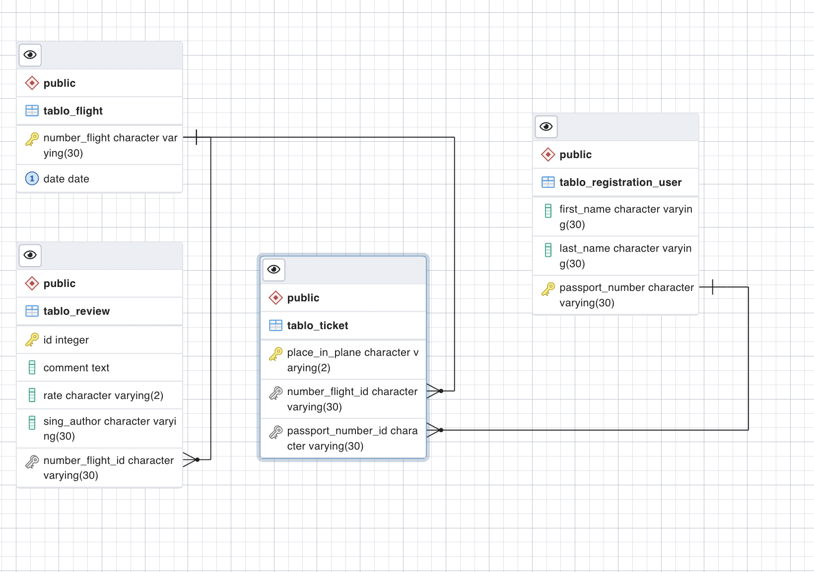

- `model.py`

```python
from django.db import models

r = () # пустой картеж


class Registration_user(models.Model):
    first_name = models.CharField("Имя", max_length=30, null=False)
    last_name = models.CharField("Фамилия", max_length=30, null=False)
    passport_number = models.CharField("Номер паспорта", primary_key=True, max_length=30)

    def __str__(self):
        return self.passport_number


class Flight(models.Model):
    number_flight = models.CharField("Номер рейса", primary_key=True, max_length=30)
    date = models.DateField("Дата вылета", null=False, unique=True)

    def __str__(self) -> str:
        return self.number_flight


class Ticket(models.Model):
    LIST_OF_PLASEC_IN_PLANE = [r + (f"{i}", f"{i}") for i in range(1, 31)]
    place_in_plane = models.CharField(
        "Место", primary_key=True, max_length=2, choices=LIST_OF_PLASEC_IN_PLANE, default="-1"
    )
    passport_number = models.ForeignKey(Registration_user, on_delete=models.CASCADE)
    number_flight = models.ForeignKey(Flight, on_delete=models.CASCADE)


class Review(models.Model):
    id = models.AutoField(primary_key=True)
    number_flight = models.ForeignKey(
        Flight, on_delete=models.CASCADE, to_field="number_flight", related_name="number_flight_2"
    )
    comment = models.TextField("Комментарий", null=False)
    RATE_NUMBER = [
        ("1", "1"),
        ("2", "2"),
        ("3", "3"),
        ("4", "4"),
        ("5", "5"),
        ("6", "6"),
        ("7", "7"),
        ("8", "8"),
        ("9", "9"),
        ("10", "10"),
    ]
    rate = models.CharField("Оценка", max_length=2, choices=RATE_NUMBER)
    sing_author = models.CharField("Укажите ваш ник", max_length=30)
```
<hr>

## Views

Использую различные представления, как на основе классов, так и на основае функций

- `views.py`

```python
from django.shortcuts import redirect, render
from django.views.generic.edit import CreateView, DeleteView, UpdateView
from django.views.generic.list import ListView

from .models import Flight, Registration_user, Review, Ticket


def get_main_title(request):
    return render(request, "templates/index.html")


class Reg_user(CreateView):
    model = Registration_user
    fields = [
        "first_name",
        "last_name",
        "passport_number",
    ]
    template_name = "reg_users.html"
    success_url = "/"


class Book(CreateView):
    model = Ticket
    fields = [
        "place_in_plane",
        "passport_number",
        "number_flight",
    ]
    template_name = "book.html"
    success_url = "/trip/"


class Trip(ListView):
    model = Flight
    template_name = "trip.html"


def get_current_book(request, passport_user):
    current_book = Ticket.objects.filter(passport_number=passport_user)
    current_book = {"object_list": current_book}
    return render(request, "templates/current_book.html", current_book)


def my_book(request):
    if "id_passport" in request.POST:
        passport = int(request.POST["id_passport"])
        return redirect(f"/current_book/{passport}/")
    else:
        return render(request, "templates/choose_passport_for_book.html")


class Update_ticket(UpdateView):
    model = Ticket
    fields = [
        "place_in_plane",
        "passport_number",
        "number_flight",
    ]
    template_name = "up_ticket.html"
    success_url = "/choose_passport_for_book/"


def all_passengers(request, flight_num):
    needed_passports = Ticket.objects.filter(number_flight=flight_num).values_list(
        "passport_number"
    )
    passengers = Registration_user.objects.filter(passport_number__in=needed_passports)

    context = {
        "object_list": passengers,
        "object_list_flight": flight_num,
    }
    return render(request, "all_passengers.html", context)


class Delete_ticket(DeleteView):
    model = Ticket
    fields = [
        "place_in_plane",
        "passport_number",
        "number_flight",
    ]
    template_name = "del_ticket.html"
    success_url = "/choose_passport_for_book/"


class Create_review(CreateView):
    model = Review
    fields = [
        "number_flight",
        "comment",
        "rate",
        "sing_author",
    ]
    template_name = "create_review.html"
    success_url = "/review/"


class All_reviews(ListView):
    model = Review
    template_name = "all_reviews.html"

```
<hr>

## URLs

- `urls.py`

```python
from django.contrib import admin
from django.urls import path

from . import views

urlpatterns = [
    path("registration/", views.Reg_user.as_view(), name="reg_users"),
    path("", views.get_main_title, name="index"),
    path("admin/", admin.site.urls),
    path("book/", views.Book.as_view(), name="book"),
    path("trip/", views.Trip.as_view(), name="trip"),
    path("current_book/<int:passport_user>/", views.get_current_book, name="current_book"),
    path("choose_passport_for_book/", views.my_book, name="choose_passport_for_book"),
    path("up_ticket/<int:pk>", views.Update_ticket.as_view(), name="update_ticket"),
    path("del_ticket/<int:pk>", views.Delete_ticket.as_view(), name="delete_ticket"),
    path("all_passangers/<int:flight_num>", views.all_passengers, name="all_passangers"),
    path("create_review/", views.Create_review.as_view(), name="create_review"),
    path("review/", views.All_reviews.as_view(), name="reviews"),
]

```

<hr>

## Регистрация новых пользователей

- `registration/` - URL

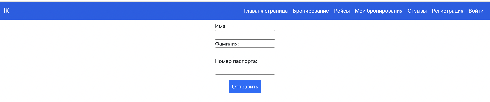

<hr>

## Просмотр и резервирование мест на рейсах

> Вкладка `бронирование` в панели навигации

- `choose_passport_for_book/` - URL

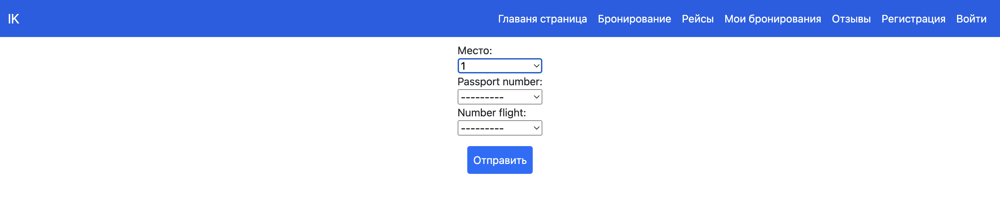

> Вкладка `мои бронирования` в панели навигации. Пользователь вводит свой паспорт, после чего попадает в список его текущих бронирований


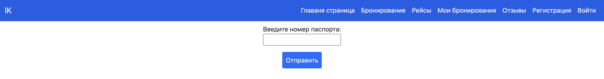

> **↓**

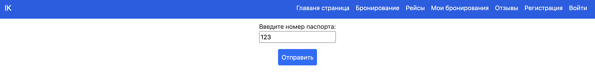

> **↓**

- `current_book/123/` - URL, где `123` параметр - паспорт пользователя

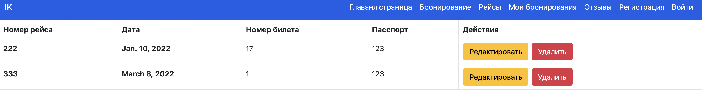

> При переходе в `редактировать` переходим сюда:

- `up_ticket/17` - URL, где `17` параметр - номер билета 

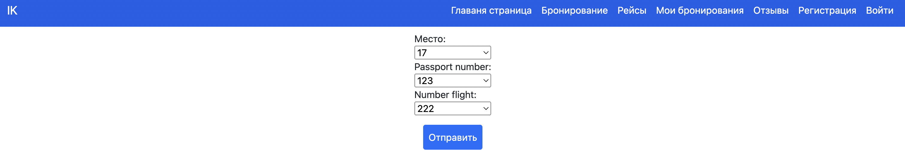

> При переходе в `удалить` переходим сюда:

- `del_ticket/17` - URL, где `17` параметр - номер билета 

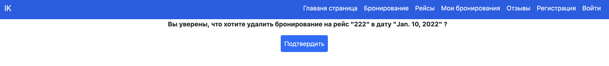


<hr>

## Администратор регестрирует через Django-admin

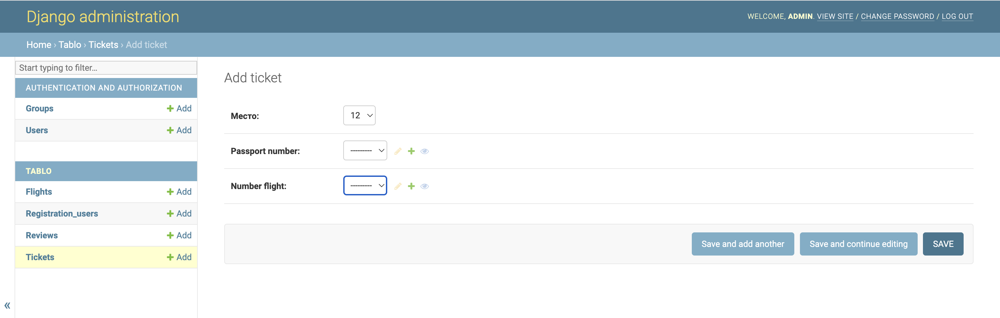

<hr>

## Таблица, отображающая всех пассажиров рейса

> Вкладка `Рейсы` в панели навигации, где можно выбрать отображение всех пассажиров, опеределенного рейса

- `trip/` - URL

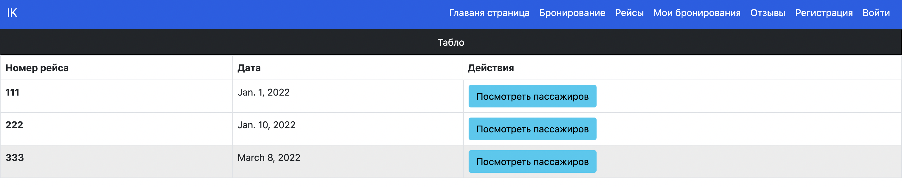

> **↓**

- `all_passangers/333` - URL, где `333` параметр - номер рейса

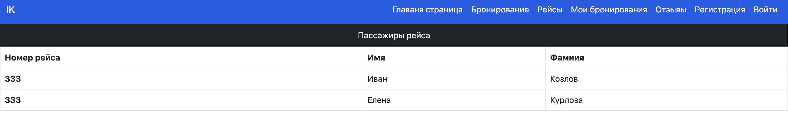


<hr>

## Отзывы к рейсам

> Вкладка `Отзывы` в панели навигации, где можно увидеть все отзывы пользователей

- `review/` - URL

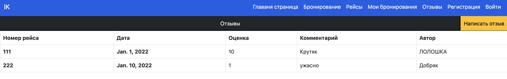

> Если нажать на кнопку `Написать отзыв`, то получим:

- `create_review/` - URL


<hr>