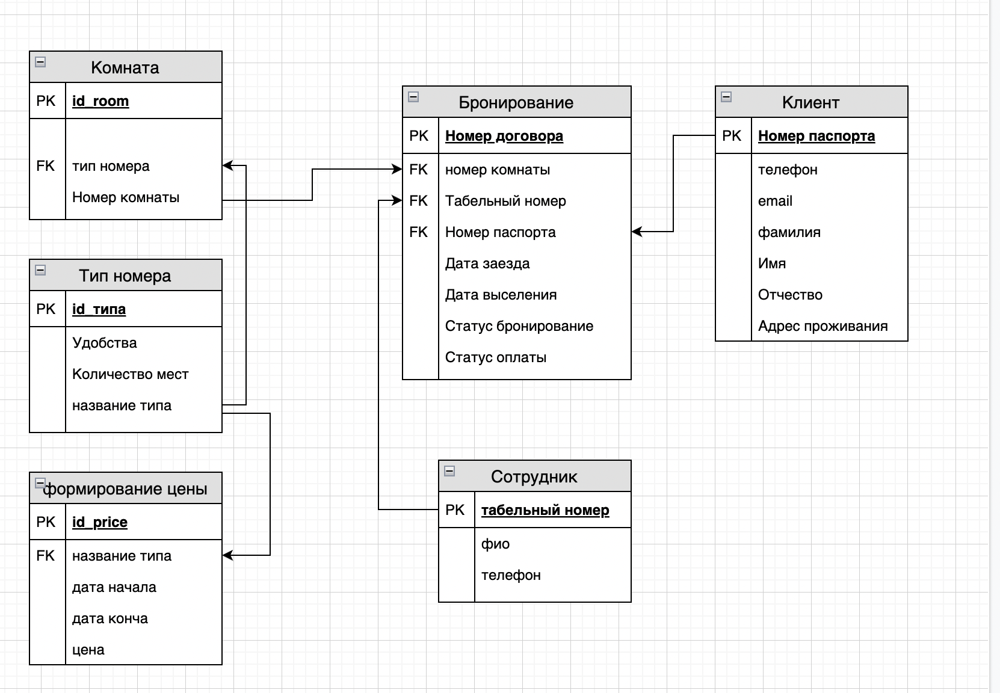
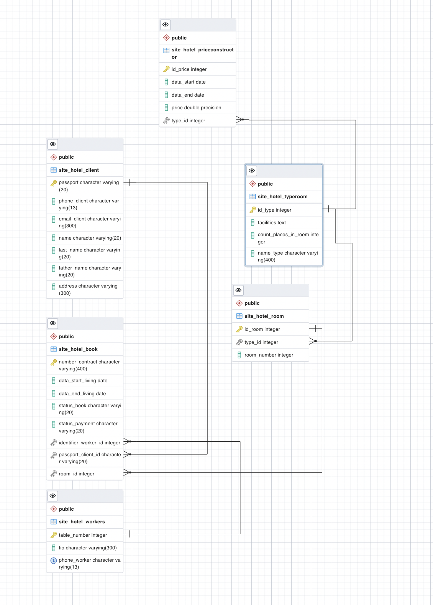

# Описание 3 лабораторной работы
Реализация серверной части приложения средствами django и djangorestframework в соответствии с заданием из [текста работы](
https://drive.google.com/file/d/1QxQo5jln6soFUj6EmOVEo1yauCo375PP/view?usp=sharing).<br>

Порядок выполнения работы:<br>
1.	Выполнить Практические работы [3.1](https://docs.google.com/document/d/1jB8EYOWk-bbjB6sLr1s7dOmLYRC9Z5jIV6xIpnigdvY/edit?usp=sharing) и [3.2](https://docs.google.com/document/d/1PkpwxCUYQ2_Pi8Fpcgno6te3oCQHZfkh03Zxt6DhHSw/edit)<br><br>
2.	Выбрать вариант или предложить свой, есть 3 способа:<br>
2.1.	Предложить свой вариант.<br>
2.3.	Выбрать вариант из вариантов по курсу «Основы баз данных» (https://drive.google.com/file/d/174gPjJ7AOHfzteYcobPY0x7sFBTkN1Xx/view?usp=sharing).<br>
2.3.    Использовать вариант из курса Давида по фронтент-разработке.
2.4.    Если хочется сделать что-то полнофункциональное для порфтолио и задеплоить, можно поговорить с Антоном Игореувичем и он предложит несколько важных для него тем (при этом варианте шаги по работе чаще нужно будет согласовывать с преподавателями).
По любому из способов функционал нужно согласовать с преподавателем или ментором. В лабораторной работе №4 необходимо будет реализовать клиентскую часть(фронтенд) по этому же варианту.<br><br>
3.	Реализовать модель базы данных средствами DjangoORM (согласовать с преподавателем на консультации).<br>
При необходимости, студент может согласовать модель базы данных с преподавателем и только потом приступить к описанию модели средствами Django ORM<br>
Полезные материалы:<br>
    - [Создание модели данных в Django ORM](https://www.youtube.com/watch?v=LZyk9p0tKXc) (Видео)<br><br>
    - [3.1](https://docs.google.com/document/d/1jB8EYOWk-bbjB6sLr1s7dOmLYRC9Z5jIV6xIpnigdvY/edit?usp=sharing)
4.	Реализовать логику работу API средствами Django REST Framework (используя методы сериализации).<br>
Полезные материалы:<br>
    - Пункты 4, 5, 6 в [Практической работе 3.1](https://docs.google.com/document/d/1PkpwxCUYQ2_Pi8Fpcgno6te3oCQHZfkh03Zxt6DhHSw/edit)<br>
    - [DJANGO API VIEWS, GENERICS, FILTER](https://youtu.be/AHnBL9x6-rs) (Видео)<br>
    - [JSON. Сериализация данных. Пишем свой сериализатор. Разбираем Django REST Framework Serializers](https://youtu.be/sxdPf3z6Uw8) (Видео)<br>
    - [Работа с Django ORM](https://youtu.be/HhrPbmHbDPU) (Видео)<br><br>
5.	Подключить регистрацию / авторизацию по токенам / вывод информации о текущем пользователе средствами Djoser.<br>
Полезные материалы:<br>
    - Djoser ([DRF + Djoser часть 1. Регистрация, авторизация по токенам, получение и изменение данных пользователя](https://youtu.be/NT-cI6rJl5Q)) (Видео)<br><br>
6.	Выполнить практическую работу 3.2 по оформлению документации (в процессе разработки)<br><br>
7.	Реализовать документацию, описывающую работу всех используемых endpoint-ов из пункта 3 и 4 средствами Read the Docs или MkDocs.<br><br>
Полезные материалы:
    - Пункт 3 [из практической работы №3.2](https://docs.google.com/document/d/1rIfREFvCB4pp8uF990Tz3PLXRJ5u_w-Y3vLxfXWKoxg/edit?usp=sharing)

Работа выполняется индивидуально.<br>
Код практический и лабораторной части должен быть загружен в репозиторий курса, в соответствии с инструкциями тут.<br>
Работу необходимо защитить на консультации или прислать видео с описанием проделанной работы.<br>)
<hr>

# Схема базы данных



`в pgAdmin - postgreSQL:`


<hr>

# Models

- `model.py`

```python
from django.db import models


class TypeRoom(models.Model):
    id_type = models.AutoField("id",primary_key=True)
    facilities = models.TextField("удобства")
    count_places_in_room = models.IntegerField("количество мест в номере",null=False)
    name_type = models.CharField("название типа",max_length=400, null=False)


class Room(models.Model):
    id_room = models.AutoField(primary_key=True)
    type = models.ForeignKey("TypeRoom",on_delete=models.CASCADE, verbose_name="тип комнаты")
    room_number = models.IntegerField("номер комнаты", null=False)


class PriceConstructor(models.Model):
    id_price = models.AutoField(primary_key=True)
    type = models.ForeignKey("TypeRoom",on_delete=models.CASCADE, verbose_name="тип комнаты")
    data_start = models.DateField("Дата начала", null=False)
    data_end = models.DateField("Дата конца", null=False)
    price = models.FloatField("цена", null=False)


class Workers(models.Model):
    table_number = models.IntegerField("табельный номер", primary_key=True, null=False)
    fio = models.CharField("ФИО", null=False, max_length=300)
    phone_worker = models.CharField("телефон сотрудника", max_length=13, null=False, unique=True)


class Client(models.Model):
    passport = models.CharField("паспорт", max_length=20, primary_key=True)
    phone_client = models.CharField("телефон клиента", max_length=13, null=False)
    email_client = models.CharField("почта клиента", max_length=300, null=False)
    name = models.CharField("имя", max_length=20, null=False)
    last_name = models.CharField("фамилия", max_length=20, null=False)
    father_name = models.CharField("отчество", max_length=20, null=True)
    address = models.CharField("адрес проживания", max_length=300, null=True)


class Book(models.Model):
    status_type = (
            ("C", "Свободно"),
            ("З", "Занято"),
        )

    status_payment= (
        ("О", "Оплачено"),
        ("Н", "Не оплачено"),
    )

    number_contract = models.CharField("номер договора", max_length=400, primary_key=True)
    room = models.ForeignKey("Room", on_delete=models.CASCADE, verbose_name="номер комнаты")
    identifier_worker = models.ForeignKey("Workers", on_delete=models.CASCADE, verbose_name="табельный номер сотрудника")
    passport_client = models.ForeignKey("Client", on_delete=models.CASCADE, verbose_name="пасспорт клиента")
    data_start_living = models.DateField("дата заезда", null=False)
    data_end_living = models.DateField("дата выезда", null=False)
    status_book = models.CharField("статус бронирования", choices=status_type, null=False, max_length=20)
    status_payment = models.CharField("статус оплаты", choices=status_payment, null=False, max_length=20)
```
<hr>

# Views

- `views.py`

```python
from django.shortcuts import render
from rest_framework.views import APIView
from .models import TypeRoom, Client, PriceConstructor, Room, Workers, Book
from rest_framework import serializers, generics, status
from rest_framework.response import Response
from .serializers import *
from datetime import datetime
from rest_framework.permissions import IsAuthenticated
from rest_framework.authentication import TokenAuthentication


class AllClients(generics.ListAPIView):
    queryset = Client.objects.all()
    serializer_class = ClientSerializer
    authentication_classes = (TokenAuthentication,)


class AllBook(generics.ListAPIView):
    queryset = Book.objects.all()
    serializer_class = BookSerializer
    authentication_classes = (TokenAuthentication,)


class AllWorkers(generics.ListAPIView):
    queryset = Workers.objects.all()
    serializer_class = WorkersSerializer
    authentication_classes = (TokenAuthentication,)

class AllBookWithInfoAboutRoomAndTypeRoom(generics.ListAPIView):
    queryset = Book.objects.all()
    serializer_class = BookSerializerWithInfoAboutRoomAndTypeRoom

class CreateClient(generics.CreateAPIView, generics.ListAPIView):
    queryset = Client.objects.all()
    serializer_class = ClientCreateSerializer

class GetCurrentWorker(APIView):
    def get(self, request, pk):
        worker = Workers.objects.filter(pk=pk)
        serializer = WorkersSerializer(worker, many=True)
        return Response({"Workers": serializer.data})


class CreateBook(generics.CreateAPIView):
    serializer_class = BookSerializer
    authentication_classes = (TokenAuthentication,)
    def get(self, request):
        today = datetime.date(datetime.now())
        book = Book.objects.filter(data_end_living__lte=today)
        serializer = BookSerializerOnlyRoom(book, many=True)
        return Response({"Свободные номера на сегодня": serializer.data})

    def post(self, request):
        serializer = BookSerializer(data=request.data)
        needed_books = Book.objects.filter(data_end_living__lte=self.request.data["data_start_living"])
        all_rooms = Room.objects.all()
        current_room = request.data["room"]
        if len(needed_books) == 0:
            return Response("нет свободных мест на текущую дату", status=status.HTTP_400_BAD_REQUEST)

        serializer.is_valid(raise_exception=True)
        serializer.save()
        return Response("Бронирование создано", status=status.HTTP_201_CREATED)


class CreateWorker(generics.CreateAPIView, generics.ListAPIView):
    queryset = Workers.objects.all()
    serializer_class = WorkerCreateSerializer
```
<hr>

# Urls

- `urls.py`

```python
from django.urls import path, include, re_path
from .views import *

app_name = "site_hotel"

urlpatterns = [
    path('all_clients/', AllClients.as_view()),
    path('all_book/', AllBook.as_view()),
    path('all_workers/', AllWorkers.as_view()),
    path('all_books_with_room/', AllBookWithInfoAboutRoomAndTypeRoom.as_view()),
    path('create_client/', CreateClient.as_view()),
    path('get_worker/<int:pk>', GetCurrentWorker.as_view()),
    path('create_book/', CreateBook.as_view()),
    path('create_worker/', CreateWorker.as_view()),
    path('auth/', include('djoser.urls')),
]
```
<hr>

# Serializers

- `serializers.py`

```python
from rest_framework import serializers

from .models import TypeRoom, Client, PriceConstructor, Room, Workers, Book


class ClientSerializer(serializers.ModelSerializer):
    class Meta:
        model = Client
        fields = "__all__"

class BookSerializer(serializers.ModelSerializer):
    class Meta:
        model = Book
        fields = "__all__"

class BookSerializerOnlyRoom(serializers.ModelSerializer):
    class Meta:
        model = Book
        fields = ["room"]

class WorkersSerializer(serializers.ModelSerializer):
    class Meta:
        model = Workers
        fields = "__all__"

class TypeRoomSerializer(serializers.ModelSerializer):
    class Meta:
        model = TypeRoom
        fields = "__all__"

class RoomSerializer(serializers.ModelSerializer):
    type = TypeRoomSerializer()
    class Meta:
        model = Room
        fields = "__all__"

class BookSerializerWithInfoAboutRoomAndTypeRoom(serializers.ModelSerializer):
    room = RoomSerializer()
    class Meta:
        model = Book
        fields = "__all__"


class ClientCreateSerializer(serializers.ModelSerializer):
    class Meta:
        model = Client
        fields = "__all__"

class WorkerCreateSerializer(serializers.ModelSerializer):
    class Meta:
        model = Workers
        fields = "__all__"
```

<hr>

## API


### `/api/all_book/`

#### GET
##### Description:


##### Parameters

| Name | Located in | Description | Required | Schema |
| ---- | ---------- | ----------- | -------- | ---- |
| limit | query | Number of results to return per page. | No | integer |
| offset | query | The initial index from which to return the results. | No | integer |

##### Responses

| Code | Description | Schema |
| ---- | ----------- | ------ |
| 200 |  | object |

### `/api/all_books_with_room/`

#### GET
##### Description:


##### Parameters

| Name | Located in | Description | Required | Schema |
| ---- | ---------- | ----------- | -------- | ---- |
| limit | query | Number of results to return per page. | No | integer |
| offset | query | The initial index from which to return the results. | No | integer |

##### Responses

| Code | Description | Schema |
| ---- | ----------- | ------ |
| 200 |  | object |

### `/api/all_clients/`

#### GET
##### Description:


##### Parameters

| Name | Located in | Description | Required | Schema |
| ---- | ---------- | ----------- | -------- | ---- |
| limit | query | Number of results to return per page. | No | integer |
| offset | query | The initial index from which to return the results. | No | integer |

##### Responses

| Code | Description | Schema |
| ---- | ----------- | ------ |
| 200 |  | object |

### `/api/all_workers/`

#### GET
##### Description:


##### Parameters

| Name | Located in | Description | Required | Schema |
| ---- | ---------- | ----------- | -------- | ---- |
| limit | query | Number of results to return per page. | No | integer |
| offset | query | The initial index from which to return the results. | No | integer |

##### Responses

| Code | Description | Schema |
| ---- | ----------- | ------ |
| 200 |  | object |

### `/api/auth/users/`

#### GET
##### Description:


##### Parameters

| Name | Located in | Description | Required | Schema |
| ---- | ---------- | ----------- | -------- | ---- |
| limit | query | Number of results to return per page. | No | integer |
| offset | query | The initial index from which to return the results. | No | integer |

##### Responses

| Code | Description | Schema |
| ---- | ----------- | ------ |
| 200 |  | object |

#### POST
##### Description:


##### Parameters

| Name | Located in | Description | Required | Schema |
| ---- | ---------- | ----------- | -------- | ---- |
| data | body |  | Yes | [UserCreate](#UserCreate) |

##### Responses

| Code | Description | Schema |
| ---- | ----------- | ------ |
| 201 |  | [UserCreate](#UserCreate) |

### `/api/auth/users/activation/`

#### POST
##### Description:


##### Parameters

| Name | Located in | Description | Required | Schema |
| ---- | ---------- | ----------- | -------- | ---- |
| data | body |  | Yes | [Activation](#Activation) |

##### Responses

| Code | Description | Schema |
| ---- | ----------- | ------ |
| 201 |  | [Activation](#Activation) |

### `/api/auth/users/me/`

#### GET
##### Description:


##### Parameters

| Name | Located in | Description | Required | Schema |
| ---- | ---------- | ----------- | -------- | ---- |
| limit | query | Number of results to return per page. | No | integer |
| offset | query | The initial index from which to return the results. | No | integer |

##### Responses

| Code | Description | Schema |
| ---- | ----------- | ------ |
| 200 |  | object |

#### PUT
##### Description:


##### Parameters

| Name | Located in | Description | Required | Schema |
| ---- | ---------- | ----------- | -------- | ---- |
| data | body |  | Yes | [User](#User) |

##### Responses

| Code | Description | Schema |
| ---- | ----------- | ------ |
| 200 |  | [User](#User) |

#### PATCH
##### Description:


##### Parameters

| Name | Located in | Description | Required | Schema |
| ---- | ---------- | ----------- | -------- | ---- |
| data | body |  | Yes | [User](#User) |

##### Responses

| Code | Description | Schema |
| ---- | ----------- | ------ |
| 200 |  | [User](#User) |

#### DELETE
##### Description:


##### Parameters

| Name | Located in | Description | Required | Schema |
| ---- | ---------- | ----------- | -------- | ---- |

##### Responses

| Code | Description |
| ---- | ----------- |
| 204 |  |

### `/api/auth/users/resend_activation/`

#### POST
##### Description:


##### Parameters

| Name | Located in | Description | Required | Schema |
| ---- | ---------- | ----------- | -------- | ---- |
| data | body |  | Yes | [SendEmailReset](#SendEmailReset) |

##### Responses

| Code | Description | Schema |
| ---- | ----------- | ------ |
| 201 |  | [SendEmailReset](#SendEmailReset) |

### `/api/auth/users/reset_password/`

#### POST
##### Description:


##### Parameters

| Name | Located in | Description | Required | Schema |
| ---- | ---------- | ----------- | -------- | ---- |
| data | body |  | Yes | [SendEmailReset](#SendEmailReset) |

##### Responses

| Code | Description | Schema |
| ---- | ----------- | ------ |
| 201 |  | [SendEmailReset](#SendEmailReset) |

### `/api/auth/users/reset_password_confirm/`

#### POST
##### Description:


##### Parameters

| Name | Located in | Description | Required | Schema |
| ---- | ---------- | ----------- | -------- | ---- |
| data | body |  | Yes | [PasswordResetConfirm](#PasswordResetConfirm) |

##### Responses

| Code | Description | Schema |
| ---- | ----------- | ------ |
| 201 |  | [PasswordResetConfirm](#PasswordResetConfirm) |

### `/api/auth/users/reset_username/`

#### POST
##### Description:


##### Parameters

| Name | Located in | Description | Required | Schema |
| ---- | ---------- | ----------- | -------- | ---- |
| data | body |  | Yes | [SendEmailReset](#SendEmailReset) |

##### Responses

| Code | Description | Schema |
| ---- | ----------- | ------ |
| 201 |  | [SendEmailReset](#SendEmailReset) |

### `/api/auth/users/reset_username_confirm/`

#### POST
##### Description:


##### Parameters

| Name | Located in | Description | Required | Schema |
| ---- | ---------- | ----------- | -------- | ---- |
| data | body |  | Yes | [UsernameResetConfirm](#UsernameResetConfirm) |

##### Responses

| Code | Description | Schema |
| ---- | ----------- | ------ |
| 201 |  | [UsernameResetConfirm](#UsernameResetConfirm) |

### `/api/auth/users/set_password/`

#### POST
##### Description:


##### Parameters

| Name | Located in | Description | Required | Schema |
| ---- | ---------- | ----------- | -------- | ---- |
| data | body |  | Yes | [SetPassword](#SetPassword) |

##### Responses

| Code | Description | Schema |
| ---- | ----------- | ------ |
| 201 |  | [SetPassword](#SetPassword) |

### `/api/auth/users/set_username/`

#### POST
##### Description:


##### Parameters

| Name | Located in | Description | Required | Schema |
| ---- | ---------- | ----------- | -------- | ---- |
| data | body |  | Yes | [SetUsername](#SetUsername) |

##### Responses

| Code | Description | Schema |
| ---- | ----------- | ------ |
| 201 |  | [SetUsername](#SetUsername) |

### `/api/auth/users/{id}/`

#### GET
##### Description:


##### Parameters

| Name | Located in | Description | Required | Schema |
| ---- | ---------- | ----------- | -------- | ---- |
| id | path | A unique integer value identifying this user. | Yes | integer |

##### Responses

| Code | Description | Schema |
| ---- | ----------- | ------ |
| 200 |  | [User](#User) |

#### PUT
##### Description:


##### Parameters

| Name | Located in | Description | Required | Schema |
| ---- | ---------- | ----------- | -------- | ---- |
| id | path | A unique integer value identifying this user. | Yes | integer |
| data | body |  | Yes | [User](#User) |

##### Responses

| Code | Description | Schema |
| ---- | ----------- | ------ |
| 200 |  | [User](#User) |

#### PATCH
##### Description:


##### Parameters

| Name | Located in | Description | Required | Schema |
| ---- | ---------- | ----------- | -------- | ---- |
| id | path | A unique integer value identifying this user. | Yes | integer |
| data | body |  | Yes | [User](#User) |

##### Responses

| Code | Description | Schema |
| ---- | ----------- | ------ |
| 200 |  | [User](#User) |

#### DELETE
##### Description:


##### Parameters

| Name | Located in | Description | Required | Schema |
| ---- | ---------- | ----------- | -------- | ---- |
| id | path | A unique integer value identifying this user. | Yes | integer |

##### Responses

| Code | Description |
| ---- | ----------- |
| 204 |  |

### `/api/create_book/`

#### GET
##### Description:


##### Parameters

| Name | Located in | Description | Required | Schema |
| ---- | ---------- | ----------- | -------- | ---- |
| limit | query | Number of results to return per page. | No | integer |
| offset | query | The initial index from which to return the results. | No | integer |

##### Responses

| Code | Description | Schema |
| ---- | ----------- | ------ |
| 200 |  | object |

#### POST
##### Description:


##### Parameters

| Name | Located in | Description | Required | Schema |
| ---- | ---------- | ----------- | -------- | ---- |
| data | body |  | Yes | [Book](#Book) |

##### Responses

| Code | Description | Schema |
| ---- | ----------- | ------ |
| 201 |  | [Book](#Book) |

### `/api/create_client/`

#### GET
##### Description:


##### Parameters

| Name | Located in | Description | Required | Schema |
| ---- | ---------- | ----------- | -------- | ---- |
| limit | query | Number of results to return per page. | No | integer |
| offset | query | The initial index from which to return the results. | No | integer |

##### Responses

| Code | Description | Schema |
| ---- | ----------- | ------ |
| 200 |  | object |

#### POST
##### Description:


##### Parameters

| Name | Located in | Description | Required | Schema |
| ---- | ---------- | ----------- | -------- | ---- |
| data | body |  | Yes | [ClientCreate](#ClientCreate) |

##### Responses

| Code | Description | Schema |
| ---- | ----------- | ------ |
| 201 |  | [ClientCreate](#ClientCreate) |

### `/api/create_worker/`

#### GET
##### Description:


##### Parameters

| Name | Located in | Description | Required | Schema |
| ---- | ---------- | ----------- | -------- | ---- |
| limit | query | Number of results to return per page. | No | integer |
| offset | query | The initial index from which to return the results. | No | integer |

##### Responses

| Code | Description | Schema |
| ---- | ----------- | ------ |
| 200 |  | object |

#### POST
##### Description:


##### Parameters

| Name | Located in | Description | Required | Schema |
| ---- | ---------- | ----------- | -------- | ---- |
| data | body |  | Yes | [WorkerCreate](#WorkerCreate) |

##### Responses

| Code | Description | Schema |
| ---- | ----------- | ------ |
| 201 |  | [WorkerCreate](#WorkerCreate) |

### `/api/get_worker/{id}`

#### GET
##### Description:


##### Parameters

| Name | Located in | Description | Required | Schema |
| ---- | ---------- | ----------- | -------- | ---- |
| id | path |  | Yes | string |

##### Responses

| Code | Description |
| ---- | ----------- |
| 200 |  |

### /auth/token/login/

#### POST
##### Description:

Use this endpoint to obtain user authentication token.

##### Parameters

| Name | Located in | Description | Required | Schema |
| ---- | ---------- | ----------- | -------- | ---- |
| data | body |  | Yes | [TokenCreate](#TokenCreate) |

##### Responses

| Code | Description | Schema |
| ---- | ----------- | ------ |
| 201 |  | [TokenCreate](#TokenCreate) |

### /auth/token/logout/

#### POST
##### Description:

Use this endpoint to logout user (remove user authentication token).

##### Parameters

| Name | Located in | Description | Required | Schema |
| ---- | ---------- | ----------- | -------- | ---- |

##### Responses

| Code | Description |
| ---- | ----------- |
| 201 |  |
