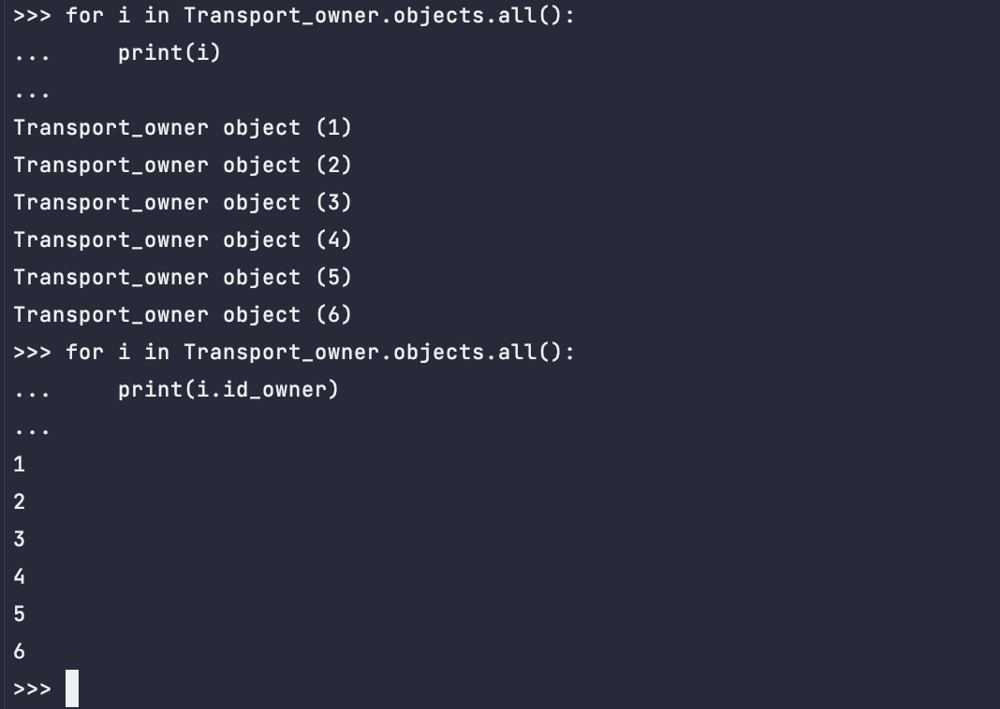

## Описание 3.1 практической работы
Django заапросы и их выполнение.

<hr>

## Задание 3.1.1
`Описание:` напишите запрос на создание 6-7 новых автовладельцев и 5-6 автомобилей, 
каждому автовладельцу назначьте удостоверение и от 1 до 3 автомобилей. 
Задание можете выполнить либо в интерактивном режиме интерпретатора, либо в отдельном python-файле. 
Результатом должны стать запросы и отображение созданных объектов. 

- `model.py`

```python
from django.db import models

class Transport_owner(models.Model):
    id_owner = models.IntegerField(primary_key=True)
    last_name = models.CharField(max_length=30, null=False)
    first_name = models.CharField(max_length=30, null=False)
    date_birthday = models.DateField()


class Transport(models.Model):
    id_car = models.IntegerField(primary_key=True)
    gov_number = models.CharField(max_length=15, null=False)
    marka = models.CharField(max_length=20, null=False)
    model_car = models.CharField(max_length=20, null=False)
    color = models.CharField(max_length=30, null=True)


class Ownership(models.Model):
    id_owner_car = models.IntegerField(primary_key=True)
    id_owner = models.ForeignKey(Transport_owner, on_delete=models.CASCADE)
    id_car = models.ForeignKey(Transport, on_delete=models.CASCADE)
    date_start = models.DateField()
    sate_end = models.DateField(null=True)


class Driver_doc(models.Model):
    id_doc = models.IntegerField(primary_key=True)
    id_owner = models.ForeignKey(Transport_owner, on_delete=models.CASCADE)
    number_doc = models.CharField(max_length=10, null=False)
    type_doc = models.CharField(max_length=10, null=False)
    date_start_doc = models.DateField()
```

> Создание автовладельцев

```python
Transport_owner(1, 'Fam1', 'Name1', '1902-01-1').save()
Transport_owner(2, 'Fam2', 'Name2', '1902-01-2').save()
Transport_owner(3, 'Fam3', 'Name3', '1902-01-3').save()
Transport_owner(4, 'Fam4', 'Name4', '1902-01-4').save()
Transport_owner(5, 'Fam5', 'Name5', '1902-01-5').save()
Transport_owner(6, 'Fam6', 'Name6', '1902-01-6').save()
```


> Создание автомобилей

```python
Transport(0, 'AAA0', 'Mark0', 'Model0', 'color5').save()
Transport(1, 'AAA1', 'Mark1', 'Model1', 'color5').save()
Transport(2, 'AAA2', 'Mark2', 'Model2', 'color5').save()
Transport(3, 'AAA3', 'Mark3', 'Model3', 'color5').save()
Transport(4, 'AAA4', 'Mark4', 'Model4', 'color5').save()
Transport(5, 'AAA5', 'Mark5', 'Model5', 'color5').save()
Transport(6, 'AAA6', 'Mark6', 'Model6', 'color5').save()
```

> Создание водительских прав

```python
Driver_doc('1', '1', 'num1', 'type1', '1933-05-1').save()
Driver_doc('2', '2', 'num2', 'type2', '1933-05-2').save()
Driver_doc('3', '3', 'num3', 'type3', '1933-05-3').save()
Driver_doc('4', '4', 'num4', 'type4', '1933-05-4').save()
Driver_doc('5', '5', 'num5', 'type5', '1933-05-5').save()
Driver_doc('6', '6', 'num6', 'type6', '1933-05-6').save()
```

> Присваивания автовладельцам автомобили

```python
Ownership('1', '1', '1', '1936-09-11', '1940-09-11').save()
Ownership('2', '2', '2', '1936-09-12', '1940-09-12').save()
Ownership('3', '3', '3', '1936-09-13', '1940-09-13').save()
Ownership('4', '4', '4', '1936-09-14', '1940-09-14').save()
Ownership('5', '5', '5', '1936-09-15', '1940-09-15').save()
Ownership('6', '6', '6', '1936-09-16', '1940-09-16').save()
```
<hr>

## Задание 3.1.2
`Описание:`По созданным в пр.1 данным написать следующие запросы на фильтрацию:

- Выведете все машины марки “Toyota” (или любой другой марки, которая у вас есть):
```python
>>> Transport.objects.filter(marka="Mark3")
<QuerySet [<Transport: Transport object (3)>]>
```

- Найти всех водителей с именем “Олег” (или любым другим именем на ваше усмотрение):
```python
>>> Transport_owner.objects.filter(first_name="Name5")
<QuerySet [<Transport_owner: Transport_owner object (5)>]>
```

- Взяв любого случайного владельца получить его id, и по этому id получить экземпляр удостоверения в виде объекта модели (можно в 2 запроса):
```python
>>> needed_id = Transport_owner.objects.all()[2].id_owner
>>> Driver_doc.objects.get(id_owner=needed_id)
<Driver_doc: Driver_doc object (3)>
```

- Вывести всех владельцев красных машин (или любого другого цвета, который у вас присутствует):
```python
>>> for i in range(len(Transport.objects.filter(color="green"))):
...     print(Transport.objects.filter(color="green")[i])
... 
Transport object (3)
Transport object (4)
Transport object (6)
```

- Найти всех владельцев, чей год владения машиной начинается с 2010 (или любой другой год, который присутствует у вас в базе):
```python
>>> Ownership.objects.filter(date_start__gte="1936-01-01")
<QuerySet [<Ownership: Ownership object (1)>, <Ownership: Ownership object (2)>, <Ownership: Ownership object (3)>, 
<Ownership: Ownership object (4)>, <Ownership: Ownership object (5)>, 
<Ownership: Ownership object (6)>]>
```
<hr>

## Задание 3.1.3
`Описание:` необходимо реализовать следующие запросы:

- Вывод даты выдачи самого старшего водительского удостоверения:
```python
>>> Driver_doc.objects.aggregate(date_start_doc=Min("date_start_doc"))
{'date_start_doc': datetime.date(1933, 5, 1)}
```

- Укажите самую позднюю дату владения машиной, имеющую какую-то из существующих моделей в вашей базе:
```python
>>> Ownership.objects.aggregate(date_start=Max("date_start"))
{'date_start': datetime.date(1936, 9, 16)}
```

- Выведите количество машин для каждого водителя:
```python
>>> Ownership.objects.values("id_owner").annotate(Count("id_car"))
<QuerySet 
[{'id_owner': 1, 'id_car__count': 1}, {'id_owner': 2, 'id_car__count': 1}, 
{'id_owner': 3, 'id_car__count': 1}, {'id_owner': 4, 'id_car__count': 1}, 
{'id_owner': 5, 'id_car__count': 1}, {'id_owner': 6, 'id_car__count': 1}]
>
```

- Подсчитайте количество машин каждой марки:
```python
>>> Transport.objects.values("marka").annotate(Count("id_car"))
<QuerySet 
[{'marka': 'Mark3', 'id_car__count': 1}, {'marka': 'Mark4', 'id_car__count': 3}, 
{'marka': 'Mark5', 'id_car__count': 1}, {'marka': 'Mark6', 'id_car__count': 1}]
>
```

- Отсортируйте всех автовладельцев по дате выдачи удостоверения:
```python
>>> Transport_owner.objects.order_by("docs__date_start_doc")
<QuerySet [<Transport_owner: Transport_owner object (4)>, 
<Transport_owner: Transport_owner object (1)>, 
<Transport_owner: Transport_owner object (2)>, 
<Transport_owner: Transport_owner object (3)>, 
<Transport_owner: Transport_owner object (5)>, 
<Transport_owner: Transport_owner object (6)>]>
```
<hr>


