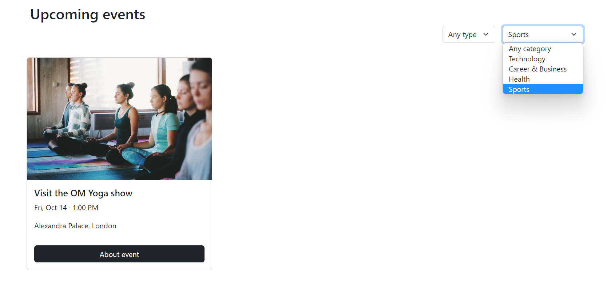
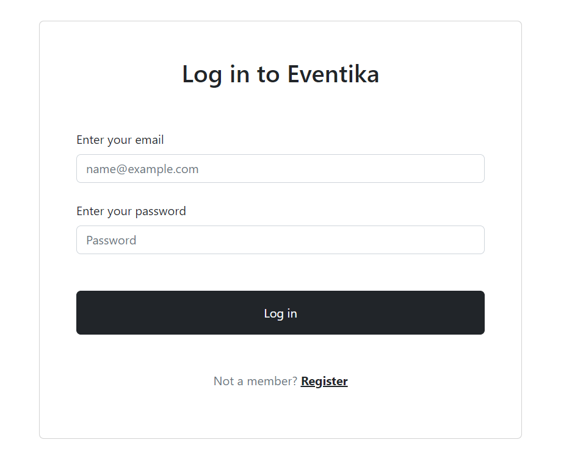
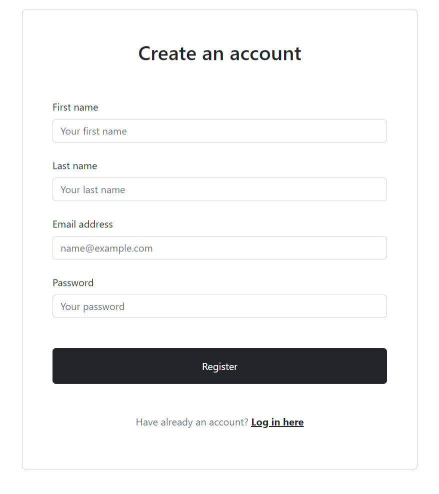
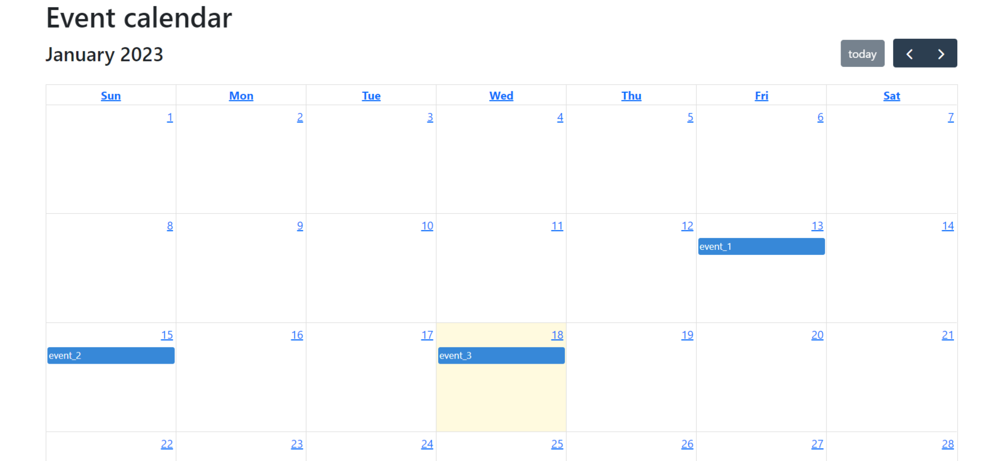
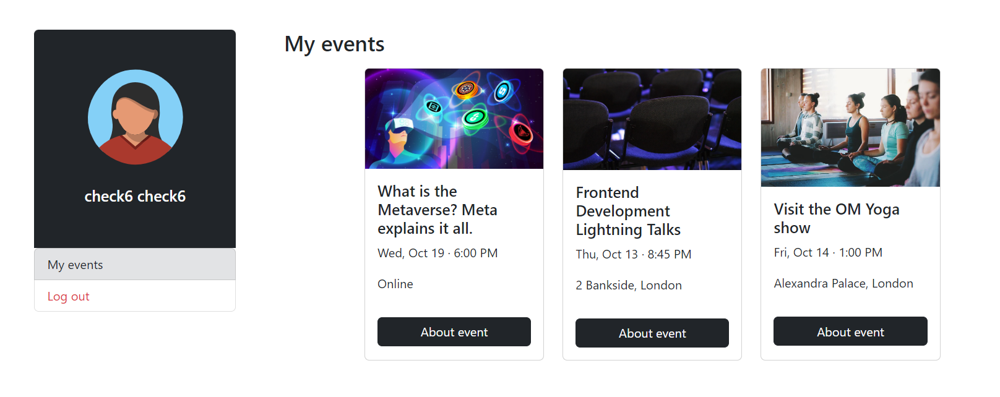

# Лабораторная работа №4

## Описание

>Мигрировать ранее написанный сайт на фреймворк Vue.JS.

Минимальные требования:

- Должен быть подключён роутер
- Должна быть реализована работа с внешним API
- Разумное деление на компоненты


##Основные файлы проекта

* `router/index.js`
```javascript
import { createRouter, createWebHistory } from "vue-router";
import Main from "../views/Main.vue";
import Login from "../views/Login.vue";
import Register from "../views/Register.vue";
import description from "../views/card_description.vue";
import calender from "../views/CalendarPage.vue";
import Profile from "../views/Profile.vue";
import Not_Found from "../views/404.vue";


const routes = [
    {
       path: "/",
       name: "Main",
       component: Main,
       meta: {
           title: 'Home'
       }
    },
    {
        path: "/Login",
        name: "login",
        component: Login,
        meta: {
            title: 'Login'
        }
    },
    {
        path: "/Register",
        name: "register",
        component: Register,
        meta: {
            title: 'Register'
        }
    },
    {
        path: "/Description/:id",
        name: "description",
        component: description,
        meta: {
            title: 'description'
        }
    },
    {
        path: "/Calendar",
        name: "calendar",
        component: calender,
        meta: {
            title: 'calender'
        }
    },
    {
        path: "/Profile",
        name: "profile",
        component: Profile,
        meta: {
            title: 'Profile'
        }
    },
    {
        path: '/:pathMatch(.*)*',
        name: "Not_Found",
        component: Not_Found,
        meta:{
          title: '404'
        }
    
      }
];

const router = createRouter({
    history: createWebHistory(process.env.BASE_URL),
    routes,
});
router.beforeEach((to, from, next) =>
{
    document.title = `${to.meta.title} | Event`;
    next();
})

export default router;
```

* `Main.vue` - Реализованa фильтрация по типу и категории мероприятия



```javascript
<template>
  <section>
    <section style="margin-top: 50px;">
      <div class="container-xxl pt-5">
        <div class="row">
          <div class="col-6 pt-4">
            <h1>Find your event</h1>
            <p class="w-75 pt-3">With Eventika people organize events, make friends, find support, grow a business, and explore their interests. Hundreds of events are happening every day—join the fun.</p>
          </div>
          <div class="col-6">
            
          </div>
        </div>
      </div>
    </section>
  
    <section id="eventsection">
      <div class="container-xxl" style="margin-top: 160px;">
        <h2>Upcoming events</h2>
        <div class="d-flex justify-content-end" style="margin-right: 80px" @change="checkfilter">
          <div class="dropdown  ms-3">
            <select class="form-select" aria-label=".form-select-lg example" id="event-type">
              <option>Any type</option>
              <option value="online">Online</option>
              <option value="inperson">In person</option>
            </select>
          </div>
          <div class="dropdown  ms-3">
            <select class="form-select" aria-label=".form-select-lg example" id="category">
              <option>Any category</option>
              <option value="technology">Technology</option>
              <option value="career">Career & Business</option>
              <option value="health">Health</option>
              <option value="sports">Sports</option>
            </select>
          </div>
        </div>
  
        <div class="row mt-4" id="event_cards">
        </div>
  
      </div>
    </section>
  
    <Card :cardInfo=filteredArray></Card>
  </section>
  </template>
  
  <script>
  import axios from "axios";
  import Card from "../components/Card.vue"
  export default {
    name: "Main",
    data: function (){
      return{
        APIResponse: [],
        filteredArray: [],
  
      }
    },
    components:{
      Card
    },
  
    methods:{
      async APIData(){
        try{
          const res = await axios.get(`http://localhost:3000/events`);
          this.APIResponse = res.data;
          
          // console.log(this.APIResponse)
  
  
        }catch (error){
          console.log("error", error)
        }
      },
      checkfilter(){
        const eventTypeValue = document.getElementById("event-type").value;
        const categoryValue = document.getElementById("category").value;
      
      for (let i = 0; i < this.APIResponse.length; i++) {
          if ((this.APIResponse[i].eventtype == (eventTypeValue) || eventTypeValue==="Any type") &&
              (this.APIResponse[i].category==(categoryValue) || categoryValue==="Any category")) {
                this.filteredArray.push(this.APIResponse[i])
          } else {
            console.log("API data error")
          }
          
      }console.log(this.filteredArray)
      }
    },
     mounted() {
      this.APIData()
      // this.checkfilter()
      // console.log(this.APIResponse)
    },
  
  }
  </script>
  
  <style scoped>
  
  </style>
```


* `Login.vue` - Авторизация пользователя



```javascript
<template>
  <section style="margin-top: 50px;">
    <div class="card container-xxl col-5 p-5">
      <h2 class="text-center">Log in to Eventika</h2>

      <form class="mt-5">

        <div class="mb-4">
          <label for="email" class="form-label">Enter your email</label>
          <input type="email" class="form-control" id="email" name="email" v-model="email" placeholder="name@example.com">
        </div>

        <div class="mb-4">
          <label for="password" class="form-label">Enter your password</label>
          <input type="password" class="form-control" id="password" name="password" v-model="password" placeholder="Password">
        </div>

        <button type="submit" class="btn btn-dark w-100 py-3 mt-4" @click.prevent="LogIn">Log in</button>

        <p class="text-center text-muted mt-5">Not a member?  <a href="sign_up.html" class="fw-bold text-body"><u>Register</u></a></p>

      </form>

    </div>
  </section>
</template>

<script>
import axios from "axios";
import { useStateStore } from '../store/UserStatus.js'
export default {
  name: "Login",
  data: function (){
    return{
      email: '',
      password: '',
      
    }
  },
  methods:{
    async LogIn(){
      if(this.email !== "" && this.password !== ""){
        const res = await axios.get(`http://localhost:3000/users?email=${this.email}&password=${this.password}`)
        if(res.status==200 && res.data.length>0){
          localStorage.setItem('userInfo', JSON.stringify(res.data));
          await this.$router.push({name: "Main"})
          const { StateChecker } = useStateStore()
          StateChecker(true);
        }else{
          alert("No user found")
        }
      }else{
        alert("Please fill all the input blocks")
      }


    }
  }
}
</script>

<style scoped>

</style>
```


* `Register.vue` - Регистрация нового пользователя



```javascript
<template>
  <section style="margin-top: 50px;">
    <div class="card container-xxl col-5 p-5">
      <h2 class="text-center">Create an account</h2>

      <form class="mt-5">

        <div class="mb-4">
          <label for="firstname" class="form-label" >First name</label>
          <input type="text" class="form-control"  v-model="firstname" id="firstname" placeholder="Your first name">
        </div>

        <div class="mb-4">
          <label for="lastname" class="form-label">Last name</label>
          <input type="text" class="form-control" v-model="lastname" id="lastname"  placeholder="Your last name">
        </div>

        <div class="mb-4">
          <label for="email" class="form-label">Email address</label>
          <input type="email" class="form-control" v-model="email" id="email" placeholder="name@example.com">
        </div>

        <div class="mb-4">
          <label for="password" class="form-label">Password</label>
          <input type="password" class="form-control"  v-model="password" id="password"  placeholder="Your password">
        </div>

        <button type="submit" class="btn btn-dark w-100 py-3 mt-4" @click.prevent="Reg">Register</button>

        <p class="text-center text-muted mt-5">Have already an account? <router-link :to="{name: 'login'}" class="fw-bold text-body"><u>Log in here</u></router-link></p>

      </form>

    </div>
  </section>
</template>

<script>
import axios from "axios";
// import router from "@/router";
import { useStateStore } from '../store/UserStatus.js'
export default {
  name: "Register",
  data: function (){
    return{
        email: '',
        password: '',
        lastname: '',
        firstname: ''
    }
  },
  methods:{

    async Reg(){
      if(this.email === '' && this.password === '' && this.lastname === '' && this.firstname === ''){
        alert('Please fill all the input fields')
      }else{
      const result = await axios.post(`http://localhost:3000/users`, {
        email: this.email,
        password: this.password,
        lastname: this.lastname,
        firstname: this.firstname
      });
      console.log(result);
      if(result.status == 201){
        console.log(result.status)
        // await this.$router.push({name: "Main"});
        localStorage.setItem('userInfo', JSON.stringify(result.data));
         await this.$router.push({name: "Main"})
         const { StateChecker } = useStateStore()
          StateChecker(true);
      }
    }
      },
  }


}
</script>

<style scoped>

</style>
```


* `Card_description.vue` - Страница с мероприятием с возможностью зарегистрироваться на 
мероприятие


```javascript
<template>
  <section id="about_event">
    <section>
      <div class="container-xxl col-9 d-flex bg-white border py-4
        px-5" style="margin-top: 50px;">
        <h2 class="col-10">{{this.dataToUsed.title}}</h2>
        <a href="#" class="btn btn-dark col-2" @click.prevent="joinEvent(this.dataToUsed.id)">Join the event</a>
      </div>
    </section>

    <section class="container-xxl col-9 mt-4">
      <div class="row justify-content-center">
        <div class="col-9" style="padding-right: 50px">
          
          <h5 class="mt-5">About this Event</h5>
          <p >{{this.dataToUsed.description}}</p>
          <a href="#" class="btn btn-dark w-100 py-3" @click.prevent="joinEvent(this.dataToUsed.id)">Join the event</a>
          <h5 class="mt-5">Events you may like</h5>
          <Card :card-info="generalCardData"></Card>
        </div>
        <div class="col bg-white border h-100 pb-2 right-block-sticky">
          <div class="p-3">
            <h5>Date & Time</h5>
            <p>{{this.dataToUsed.date}}</p>
            <h5 class="mt-4">Location</h5>
            <p>{{this.dataToUsed.location}}</p>
          </div>
<!--          <iframe src="https://www.google.com/maps/embed?pb=!1m18!1m12!1m3!1d2482.527039981535!2d-0.08138018428164229!3d51.52189247963755!2m3!1f0!2f0!3f0!3m2!1i1024!2i768!4f13.1!3m3!1m2!1s0x48761cb10a2721e7%3A0x6a92d93fc7b70414!2sPrincipal%20Place!5e0!3m2!1sru!2sru!4v1665956949308!5m2!1sru!2sru" style="border:0;" class="w-100" allowfullscreen="" loading="lazy" referrerpolicy="no-referrer-when-downgrade"></iframe>-->
        </div>
      </div>
    </section>

  </section>
</template>

<script>
import axios from "axios";
import Card from "../components/Card.vue"
import { storeToRefs } from 'pinia'
import { useStateStore } from '../store/UserStatus.js'
export default {
  name: "card_description",
  components:{
      Card
  },
  data: function (){
    return{
        dataToUsed: [],
        URLParam: this.$route.params.id,
        generalCardData:[],
        CheckUserState: null

    }
  },
  methods:{
    async fetMethod(){
      const res = await axios.get(`http://localhost:3000/events/${this.URLParam}`);
      this.dataToUsed = res.data;
      console.log(this.dataToUsed)
      console.log(localStorage.getItem('userInfo.'))
    },
    async Gennral (){
      const test = await axios.get(`http://localhost:3000/events`);
      this.generalCardData = test.data;

    }
    ,
    async joinEvent(sth){
      if (this.CheckUserState === false){
        alert ("Register Or log in first please")
      }else{
        let uidFromLocalStorage = JSON.parse(localStorage.getItem('userInfo'));
        const sender = await axios.post(`http://localhost:3000/user_joined_events`,{
          user_id: uidFromLocalStorage[0].id ,
          event_id: sth,
        });
        alert('Event Has added to your Profile')
        console.log(sender)
      }
    },
    checkState(){
      const  { userState } = storeToRefs(useStateStore())
      this.CheckUserState= userState;
    }
  },
  mounted() {
    this.fetMethod()
    this.Gennral()
    this.checkState()

  }

}
</script>

<style scoped>

</style>
```


* `CalendarPage.vue` - Календарь с возможностью создания мероприятий



```javascript
<template>
    <base-layout>
      <h1>Event calendar</h1>
  
      <full-calendar
        :options="{
          events: calendarEvents,
          eventChange: handleEventChange,
          dateClick: handleDateClick,
          eventClick: handleEventClick
        }"
      />
  
      <!-- Modal -->
      <div class="modal fade" ref="detailEvent" tabindex="-1" aria-labelledby="detailEventLabel" aria-hidden="true">
        <div class="modal-dialog">
          <div class="modal-content">
            <div class="modal-header">
              <h1 class="modal-title fs-5" id="detailEventLabel">{{ selectedEvent.title }}</h1>
              <button type="button" class="btn-close" data-bs-dismiss="modal" aria-label="Close"></button>
            </div>
            <div class="modal-body">
              <p><strong>Описание:</strong> {{ selectedEvent.description }}</p>
  
              <p>{{ selectedEvent.formattedDate() }}</p>
            </div>
            <div class="modal-footer">
              <button type="button" class="btn btn-secondary" data-bs-dismiss="modal">Close</button>
            </div>
          </div>
        </div>
      </div>
  
      <div class="modal fade" ref="eventCreate" tabindex="-1" aria-labelledby="eventCreateLabel" aria-hidden="true">
        <div class="modal-dialog">
          <div class="modal-content">
            <div class="modal-header">
              <h1 class="modal-title fs-5" id="eventCreateLabel">Добавить событие</h1>
              <button type="button" class="btn-close" data-bs-dismiss="modal" aria-label="Close"></button>
            </div>
            <div class="modal-body">
              <form @submit.prevent="submitForm" class="d-flex flex-column" ref="eventForm">
                <input type="text" v-model="form.title" class="my-1">
                <input type="date" v-model="form.date" class="my-1">
                <textarea cols="30" rows="10" v-model="form.description" class="my-1" />
  
                <button type="submit" class="btn btn-primary">Отправить</button>
              </form>
            </div>
          </div>
        </div>
      </div>
    </base-layout>
  </template>
  
  <script>
  import { mapActions, mapState } from 'pinia'
  import { Modal } from 'bootstrap'
  import useCalendarEventsStore from '../store/calendarEvents'
  import BaseLayout from '../layouts/BaseLayout.vue'
  import FullCalendar from '../components/FullCalendar.vue'
  export default {
    name: 'CalendarPage',
    components: { BaseLayout, FullCalendar },
    computed: {
      ...mapState(useCalendarEventsStore, {
        calendarEvents: 'calendarEvents',
        selectedEvent: (state) => {
          return {
            ...state.selectedEvent,
            formattedDate: () => {
              const date = state.selectedEvent.date
              return new Date(date).toLocaleDateString('ru-RU')
            }
          }
        }
      })
    },
    data() {
      return {
        form: {
          title: '',
          description: '',
          date: ''
        },
        eventCreateModal: null
      }
    },
    methods: {
      ...mapActions(useCalendarEventsStore, ['loadCalendarEvents', 'loadEventById', 'createEvent']),
      handleEventChange(payload) {
        console.log('event change', payload)
      },
      handleDateClick(payload) {
        console.log('date clicked', payload)
        const { dateStr } = payload
        this.form.date = dateStr
        this.eventCreateModal = new Modal(this.$refs.eventCreate)
        this.eventCreateModal.show()
      },
      async handleEventClick(payload) {
        await this.loadEventById(payload.event._def.publicId)
        const eventModal = new Modal(this.$refs.detailEvent)
        eventModal.show()
      },
      async submitForm() {
        await this.createEvent(this.form)
        this.$refs.eventForm.reset()
        this.eventCreateModal.hide()
        await this.loadCalendarEvents()
      }
    },
    mounted() {
      this.loadCalendarEvents()
    }
  }
  </script>
```


* `Profile.vue` - Личный кабинет со списком мероприятий, на 
которые пользователь записался



```javascript
<template>
<section>
  <div class="container-xxl col-9" style="margin-top: 50px;">
    <div class="row justify-content-center">
      <div class="col-md-3">
        <div class="py-5 bg-dark rounded-top">
          
          <h5 class="text-white text-center mt-4">{{this.CurrentUser.firstname}} {{this.CurrentUser.lastname}}</h5>
        </div>
        <ul class="list-group">
<!--          <li class="list-group-item">-->
<!--            <a class="text-decoration-none link-dark" href="#">My profile</a>-->
<!--          </li>-->
          <li class="list-group-item list-group-item-secondary">
            <a class="text-decoration-none link-dark active" aria-current="true" href="#">My events</a>
          </li>
          <li class="list-group-item">
            <a class="text-danger text-decoration-none link-dark" @click.prevent="logout">Log out</a>
          </li>
        </ul>
      </div>

      <div class="col-md-9" style="padding-left: 50px;">
        <h3>My events</h3>
        <Card :card-info="eventData"></Card>

      </div>
    </div>
  </div>
</section>
</template>

<script>
import axios from "axios";
import Card from '../components/Card'
import { useStateStore } from '../store/UserStatus.js'
export default {
  name: "Profile",
  data:function (){
    return{
      eventData: [],
      CurrentUser: ''
    }
  },
  components:{
    Card
  },
  methods:{
   async dataFromAPI(){
      try{
        const user = JSON.parse(localStorage.getItem('userInfo'));
        const CurrentUID = user[0].id;
        this.CurrentUser = user[0];
        const res = await axios.get(`http://localhost:3000/user_joined_events?user_id=${CurrentUID}`);
        // const UserInfo = await axios.get(`http://localhost:3000/users/${CurrentUID}`);
        for(let i =0; i <res.data.length; i++){
          let selectedEvents= (await axios.get(`http://localhost:3000/events/${res.data[i].event_id}`)).data
          this.eventData.push(selectedEvents)
        }

      }catch (error){
        console.log("error", error)
      }
    },
    logout(){
      const { StateChecker } = useStateStore()
      localStorage.clear();
      StateChecker(false);
      window.location.reload();
      this.$router.push({name: "Main"})
    }
  },
  mounted() {
    this.dataFromAPI()
  }
}
</script>

<style scoped>

</style>
```

