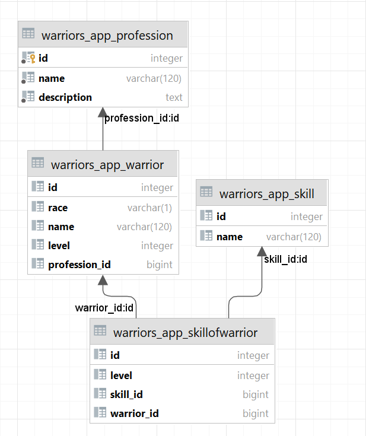

# Practical Work 3
Simple Django REST Framework about warriors.

## DB Diagram



## Set up the environment
Install node Django, Django Rest Framework, Swagger.
```
$ pip install django
$ pip install djangorestframework
$ pip install drf_yasg
```

## Start the server
```
$ python ./manage.py runserver
```

## Routes
### Warrior

```
$ /war/warriors/
$ /war/warriors/{id}/
```
### Skill
```
$ /war/skill/
$ /war/skill/create/
```
### Profession
```
$ /war/profession/create
```