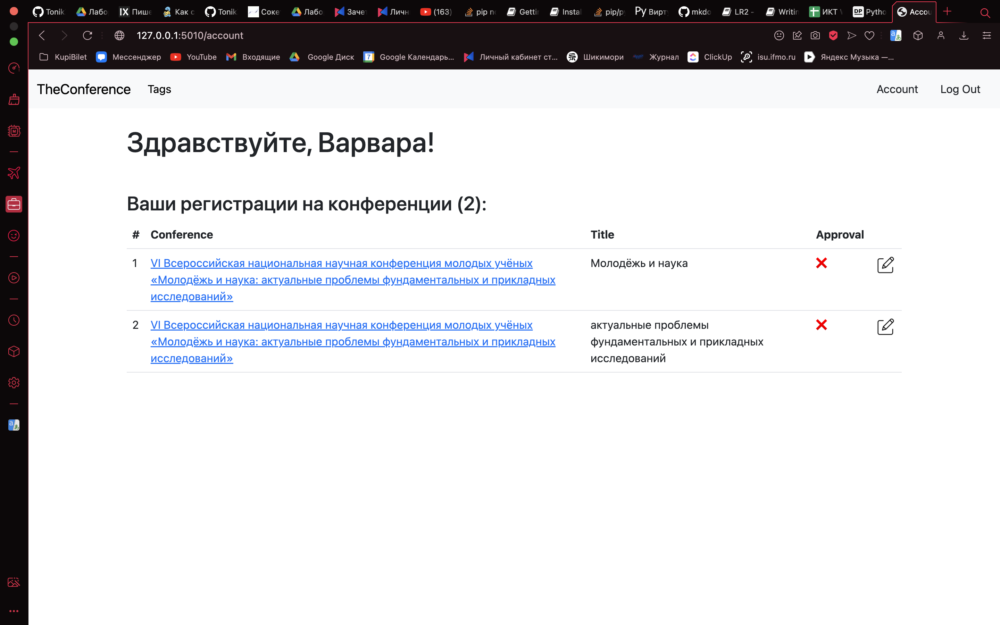

# Лабораторная №2

## Список научных конференций

### Главная страница:

### Список тегов:

### Список конференций по тегу:

### Карточка конференции:

### Таблица участников:

### Регистрация на мероприятие:

### Обновленная таблица участников:

### Комментарии:

### Регистрация:

### Логин:

### Личный кабинет (с регистрациями на конференции):

### Редактирование выступления:

### Список выступлений после редактирования:

### Модели
#### Конференция
```
class Conference(models.Model):
    name = models.CharField(max_length=300)
    topics = models.ManyToManyField('Tag', blank=True, related_name='confs')
    place = models.CharField(max_length=50)
    date = models.DateTimeField(blank=True)
    participants = models.ManyToManyField('Participant', through='Performance')
    conf_description = models.CharField(max_length=1000)
    place_description = models.CharField(max_length=150)
    terms_of_participation = models.CharField(max_length=500)

    def get_absolute_url(self):
        return reverse('conf_registration_url', kwargs={'name': self.name})

    def get_absolute_reg_url(self):
        return reverse('registration_url', kwargs={'name': self.name})

    def __str__(self):
        return self.name
```
#### Пользователь (участник)
```
class Participant(AbstractUser):
    username = models.CharField(max_length=30, unique=True)
    password = models.CharField(max_length=30)
    first_name = models.CharField(max_length=30)
    last_name = models.CharField(max_length=30)
    is_superuser = models.BooleanField(default=True)

    def __str__(self):
        return f"{self.first_name} {self.last_name}"
```
#### Выступление участника на конференции
```
class Performance(models.Model):
    title = models.CharField(max_length=300)
    description = models.TextField()
    is_recommended = models.BooleanField(default=False)
    author = models.ForeignKey(Participant, on_delete=models.CASCADE)
    conference = models.ForeignKey(Conference, on_delete=models.CASCADE)

    def __str__(self) -> str:
        return f"{self.title} by {self.author.first_name} {self.author.last_name} at {self.conference.name}"
```
#### Темы конференции
```
class Tag(models.Model):
    title = models.CharField(max_length=50)

    def get_absolute_url(self):
        return reverse('tags_detail_url', kwargs={'title': self.title})

    def __str__(self):
        return self.title
```
#### Отзыв
```
class Comment(models.Model):
    post = models.ForeignKey(Conference, on_delete=models.CASCADE, related_name='comments')
    author = models.ForeignKey(Participant, on_delete=models.CASCADE)
    rating = models.IntegerField(
        default=1,
        validators=[
            MaxValueValidator(10),
            MinValueValidator(1)
        ]
    )
    body = models.TextField()
    created_on = models.DateTimeField(auto_now_add=True)

    def __str__(self):
        return f"Comment {self.body} by {self.author.username}"
```
### Ссылки
```
urlpatterns = [
    path('login', views.LoginView.as_view(), name='login_url'),
    path('logout', views.LogoutView.as_view(), name='logout_url'),
    path('registration', user_registration, name='user_registration_url'),
    path('', conf_list, name='conf_list_url'),
    path('conf/<str:name>/', conf_registration, name='conf_registration_url'),
    path('tags/', tags_list, name='tags_list_url'),
    path('tag/<str:title>', tags_detail, name='tags_detail_url'),
    path('account', account, name='account_url'),
    path('conf/<str:name>/registration', registration, name='registration_url'),
    path('<str:pk>/editing', performance_edit, name='performance_edit_url'),
    path('<str:pk>/delete', performance_delete, name='performance_delete_url'),
]
```
### Формы 
#### Форма регистрации пользователя
```
class RegisterForm(forms.ModelForm):
	class Meta:
		model = Participant
		help_texts = {
			'username': None,
		}
		fields = [
			'username',
			'last_name',
			'first_name',
			'password',
		]
		labels = {
			'username': 'Логин',
			'last_name': 'Фамилия',
			'first_name': 'Имя',
			'password': 'Пароль'
		}
```
#### Форма регистрации на конференцию
```
class ConferenceRegisterForm(forms.ModelForm):
	class Meta:
		model = Performance
		fields = [
			'title',
			'description',
		]
		labels = {
			'title': 'Тема',
			'description': 'Описание'
		}
```
#### Форма отзыва
```
class CommentForm(forms.ModelForm):
	class Meta:
		model = Comment
		fields = [
			'body',
			'rating'
		]
		widgets = {
			'body': forms.Textarea(attrs={'rows': 3, 'cols': 40}),
		}
		labels = {
			'rating': 'Оценка',
			'body': 'Текст комментария'
		}
```
### Views
```
def conf_list(request):
    confs = Conference.objects.all()
    return render(request, 'TheConference/index.html', context={'confs': confs})


def conf_registration(request, name):
    try:
        conf = get_object_or_404(Conference, name__iexact=name)
        perfs = Performance.objects.filter(conference=conf)
        comments = Comment.objects.filter(post=conf)
        context = {
            'conf': conf,
            'perfs': perfs,
            'comments': comments
        }

        form = CommentForm(request.POST or None)
        context['form'] = form

        if form.is_valid():
            comment = form.save(commit=False)
            comment.author = Participant.objects.get(pk=request.user.id)
            comment.post = conf
            comment.save()

    except Conference.DoesNotExist:
        raise Http404("Conference does not exist")
    return render(request, 'TheConference/registration.html', context)


def registration(request, name):
    conf = get_object_or_404(Conference, name__iexact=name)
    context = {'conf': conf}
    if not request.user.is_authenticated:
        return redirect('/login')
    form = ConferenceRegisterForm(request.POST or None)

    if form.is_valid():
        performance = form.save(commit=False)
        performance.author = Participant.objects.get(id=request.user.id)
        performance.conference = Conference.objects.get(name=name)
        performance.save()
        return redirect(f'/conf/{name}')
    context['form'] = form
    return render(request, 'TheConference/conf_registration.html', context)


def user_registration(request):
    if request.method == 'POST':
        form = RegisterForm(request.POST)
        if form.is_valid():
            form.save()
            username = form.cleaned_data.get('username')
            raw_password = form.cleaned_data.get('password')
            user = form.save()
            # user = authenticate(username=username, password=raw_password)
            login(request, user, backend='django.contrib.auth.backends.ModelBackend')
            return redirect('/')
    else:
        form = RegisterForm()
    return render(request, 'TheConference/registration/user_registration.html', {'form': form})


@login_required
def profile(request):
    return render(request, 'TheConference/registration/login.html')


def account(request):
    perfs = Performance.objects.filter(author=request.user)
    return render(request, 'TheConference/account.html', context={'perfs': perfs})


def performance_edit(request, pk):
    context = {}
    instance = get_object_or_404(Performance, id=pk, author=request.user.id)
    form = ConferenceRegisterForm(request.POST or None, instance=instance)

    if form.is_valid():
        form.save()
        return redirect('/account')
    context['form'] = form
    context['pk'] = pk
    return render(request, 'TheConference/edit_performance.html', context)


def performance_delete(request, pk):
    if not request.user.is_authenticated:
        return redirect('/login')

    instance = get_object_or_404(Performance, id=pk, author=request.user.id)
    print(instance)
    instance.delete()
    return redirect('/account')


def tags_list(request):
    tags = Tag.objects.all()
    return render(request, 'TheConference/tags_list.html', context={'tags': tags})


def tags_detail(request, title):
    tag = get_object_or_404(Tag, title__iexact=title)
    return render(request, 'TheConference/tags_detail.html', context={'tag': tag})
```