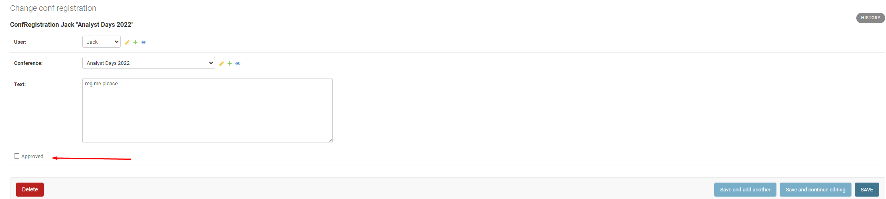

# Лабораторная работа №2

## **Задание**

### **Список научных конференций**

Интерфейс описывает названия конференций, список тематик, место проведения,
период проведения, описание конференций, описание место проведения, условия участия.
Необходимо реализовать следующий функционал:

* Регистрация новых пользователей.
* Просмотр конференций и регистрацию авторов для выступлений.
  Пользователь должен иметь возможность редактирования и удаления своих
  регистраций.
* Написание отзывов к конференциям. При добавлении комментариев,
  должны сохраняться даты конференции, текст комментария, рейтинг (1-10),
  информация о комментаторе.
* Администратор должен иметь возможность указания результатов
  выступления (рекомендован к публикации или нет) средствами Django-
  admin.
* В клиентской части должна формироваться таблица, отображающая всех
  участников по конференциям.

<br>
<hr>

## Models

`models.py`

```python
from django.db import models
from datetime import datetime

from users_app.models import User


class Conference(models.Model):
    name = models.TextField()
    topics = models.TextField(default=None)
    location = models.TextField(default=None)
    start_at = models.DateTimeField(default=datetime.now())
    end_at = models.DateTimeField(default=datetime.now())
    rules = models.TextField(default=None)

    def __str__(self):
        return self.name


class ConfRegistration(models.Model):
    user = models.ForeignKey(User, on_delete=models.CASCADE)
    conference = models.ForeignKey(Conference, on_delete=models.CASCADE)
    text = models.TextField()
    approved = models.BooleanField(default=False)

    def __str__(self):
        return f"ConfRegistration {self.user} \"{self.conference}\""


class ConfComment(models.Model):
    user = models.ForeignKey(User, on_delete=models.CASCADE)
    conference = models.ForeignKey(Conference, on_delete=models.CASCADE)
    text = models.TextField()
    rate = models.IntegerField()

    def __str__(self):
        return f"Comment {self.user} \"{self.conference}\" text={{ {self.text} }} rate={self.rate} conf_dates={{ {self.conference.start_at} - {self.conference.end_at} }}"
```

<br>

## URLs

`urls.py`

```python
from django.contrib import admin
from django.urls import path

from conference_app.views import ConferencesList, ConferenceView, RegistrationsView, RegistrationView
from users_app.views import RegisterTemplateView, MyLoginView

urlpatterns = [
    path("admin/", admin.site.urls),
    path("register/", RegisterTemplateView.as_view()),
    path("login/", MyLoginView.as_view(), name='login'),
    path("conferences/", ConferencesList.as_view()),
    path("conferences/<int:id>", ConferenceView.as_view()),
    path("registrations/", RegistrationsView.as_view()),
    path("registration/<int:id>", RegistrationView.as_view()),
]
```

<br>

## Forms

`forms.py`

```python
from django import forms


class RegForm(forms.Form):
    text = forms.CharField()


class ChangeRegForm(forms.Form):
    new_text = forms.CharField()


class DeleteRegForm(forms.Form):
    is_delete = forms.BooleanField()


class AddComment(forms.Form):
    rate = forms.IntegerField(min_value=1, max_value=10)
    comment = forms.CharField()
```

<br>

## Views

`views.py`

```python
from typing import Optional

from django.contrib.auth.models import AbstractUser
from django.core.exceptions import ValidationError
from django.http import HttpRequest
from django.shortcuts import redirect
from django.views.generic import TemplateView

from conference_app.forms import *
from conference_app.models import *


class ConferencesList(TemplateView):
    template_name = "conferences.html"

    """
    
    Добавляем в контекст данные для отображения
    
    """

    def get_context_data(self, **kwargs):
        return super().get_context_data(conferences=Conference.objects.all(), **kwargs)


class ConferenceView(TemplateView):
    template_name = "conference.html"

    def get_context_data(self, **kwargs):
        return super().get_context_data(conference=Conference.objects.get(id=kwargs["id"]),
                                        regestrations=ConfRegistration.objects.filter(conference_id=kwargs["id"]),
                                        comments=ConfComment.objects.filter(conference_id=kwargs['id']),
                                        reg_form=RegForm(prefix="reg"),
                                        comment_form=AddComment(prefix="com"),
                                        **kwargs)

    """
    
    Принимаем форм запросы и пытаемся распарсить форм дату
    
    """

    def post(self, request: HttpRequest, **kwargs):
        user: Optional[AbstractUser] = request.user
        form_data = RegForm(request.POST, prefix="reg")
        if form_data.is_valid():
            if user is not None and user.is_authenticated:
                res = ConfRegistration(user_id=user.pk, conference_id=kwargs["id"], text=form_data.cleaned_data["text"])
                res.save()
            return redirect("/registrations/")
        form_data = AddComment(request.POST, prefix="com")
        if not form_data.is_valid():
            raise ValidationError("")
        if user is not None and user.is_authenticated:
            res = ConfComment(user_id=user.pk, conference_id=kwargs["id"], text=form_data.cleaned_data["comment"],
                              rate=form_data.cleaned_data["rate"])
            res.save()
        return redirect(f"/conferences/{kwargs['id']}")


class RegistrationsView(TemplateView):
    template_name = "registrations.html"

    def get_context_data(self, **kwargs):
        user: Optional[AbstractUser] = self.request.user
        return super().get_context_data(regestrations=ConfRegistration.objects.filter(user_id=user.id),
                                        **kwargs)


class RegistrationView(TemplateView):
    template_name = "registration.html"

    def get_context_data(self, **kwargs):
        return super().get_context_data(regestration=ConfRegistration.objects.get(id=kwargs['id']),
                                        del_form=DeleteRegForm(prefix='del'),
                                        ch_form=ChangeRegForm(prefix='ch'),
                                        **kwargs)

    def post(self, request: HttpRequest, **kwargs):
        user: Optional[AbstractUser] = request.user
        form_data = DeleteRegForm(request.POST, prefix="del")
        if form_data.is_valid():
            if user is not None and user.is_authenticated and form_data['is_delete']:
                res = ConfRegistration.objects.get(user_id=user.pk, id=kwargs['id'])
                res.delete()
            return redirect("/registrations/")
        form_data = ChangeRegForm(request.POST, prefix="ch")
        if not form_data.is_valid():
            raise ValidationError("")
        if user is not None and user.is_authenticated:
            res = ConfRegistration.objects.get(user_id=user.pk, id=kwargs['id'])
            res.text = form_data.cleaned_data['new_text']
            res.save()
        return redirect(f"/registration/{kwargs['id']}")

```
<br>
<hr>

## Регистрация новых пользователей

* Url - `register/`


<br>

## Просмотр конференций

* Url - `conferences/`


<br>

## Регистрация авторов для выступления и оставление комментария с таблицей участников и комментариев

* Url - `conferences/3`, где 3 - id конференции


<br>

## Лист конференций на которые зарегистрирован пользователь

* Url - `registrations/`


<br>

## Изменение и удаление регистрации

* Url - `registration/12`, где 12 - id регистрации


<br>

## Рекомендация к публикации в админке

