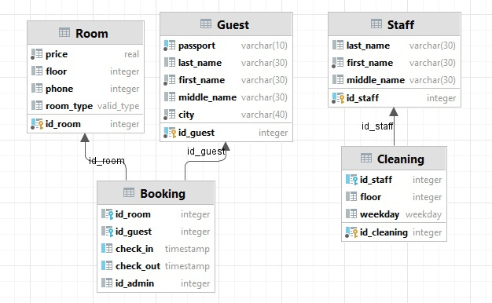
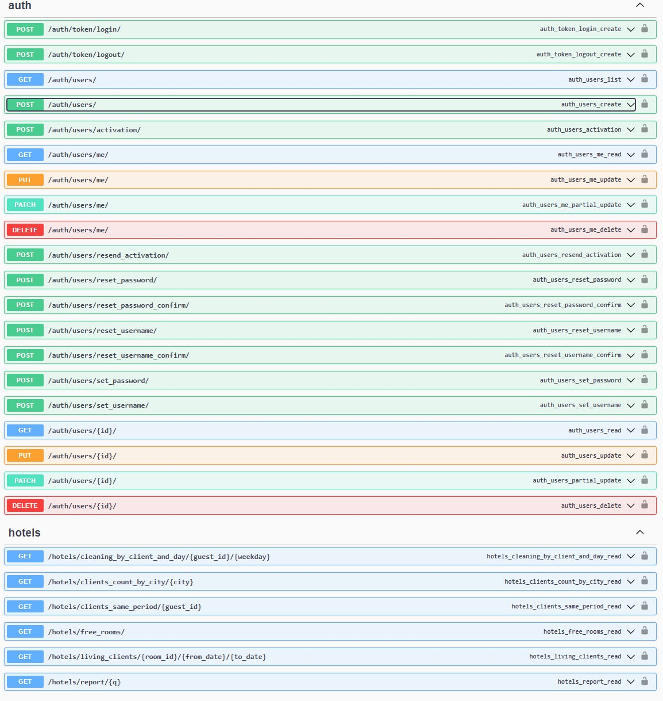

# Лабораторная работа 3. Реализация серверной части на django rest. Документирование API.

<br>

## **Описание работы**

### **Вариант 1**

Создать программную систему, предназначенную для администратора гостиницы.

Такая система должна обеспечивать хранение сведений об имеющихся в гостинице номерах, о проживающих в гостинице клиентах
и о служащих, убирающихся в номерах. Количество номеров в гостинице известно, и имеются номера трех типов: одноместный,
двухместный и трехместный, отличающиеся стоимостью проживания в сутки. В каждом номере есть телефон.

О каждом проживающем должна храниться следующая информация: номер паспорта, фамилия, имя, отчество, город, из которого
он прибыл, дата поселения в гостинице, выделенный гостиничный номер.

О служащих гостиницы должна быть известна информация следующего содержания: фамилия, имя, отчество, где (этаж) и когда (
день недели) он убирает. Служащий гостиницы убирает все номера на одном этаже в определенные дни недели, при этом в
разные дни он может убирать разные этажи.

Работа с системой предполагает получение следующей информации:

* о клиентах, проживавших в заданном номере, в заданный период времени;
* о количестве клиентов, прибывших из заданного города,
* о том, кто из служащих убирал номер указанного клиента в заданный день недели,
* сколько в гостинице свободных номеров;
* список клиентов с указанием места жительства, которые проживали в те же дни, что и заданный клиент, в определенный
  период времени.

Администратор должен иметь возможность выполнить следующие операции:

* принять на работу или уволить служащего гостиницы;
* изменить расписание работы служащего;
* поселить или выселить клиента.


Необходимо предусмотреть также возможность автоматической выдачи отчета о работе гостиницы за указанный квартал текущего года. Такой отчет должен содержать следующие сведения:

* число клиентов за указанный период в каждом номере;
* количество номеров не каждом этаже;
* общая сумма дохода за каждый номер;
* суммарный доход по всей гостинице.

<br>
<hr>

## **Модель БД**




## **Models**

``models.py``

```python
class Guest(models.Model):
    first_name = models.TextField()
    middle_name = models.TextField()
    last_name = models.TextField()
    city = models.TextField()
    passport = models.TextField()


class CleaningStaff(models.Model):
    first_name = models.TextField()
    middle_name = models.TextField()
    last_name = models.TextField()


class Room(models.Model):
    ROOM_TYPES = (
        ("SINGLE", "Single"),
        ("DOUBLE", "Double"),
        ("TRIPLE", "Triple"),
    )

    number = models.TextField(default="")
    price = models.FloatField()
    floor = models.IntegerField()
    phone = models.IntegerField()
    room_type = models.TextField(choices=ROOM_TYPES)


class Booking(models.Model):
    room = models.ForeignKey(Room, related_name="bookings", on_delete=models.CASCADE)
    guest = models.ForeignKey(Guest, related_name="bookings", on_delete=models.CASCADE)
    check_in = models.DateTimeField()
    check_out = models.DateTimeField()
    admin = models.ForeignKey(User, related_name="bookings", on_delete=models.CASCADE)


class Cleaning(models.Model):
    WEEK_DAYS = (
        ("SUNDAY", "Sunday"),
        ("MONDAY", "Monday"),
        ("TUESDAY", "Tuesday"),
        ("WEDNESDAY", "Wednesday"),
        ("THURSDAY", "Thursday"),
        ("FRIDAY", "Friday"),
        ("SATURDAY", "Saturday"),
    )

    staff = models.ForeignKey(CleaningStaff, related_name="cleaning", on_delete=models.CASCADE)
    floor = models.IntegerField()
    week_day = models.TextField(choices=WEEK_DAYS)
```

<br>

## **Views**

``views.py``

```python
class AbstractCountView(RetrieveAPIView):
    serializer_class = CountSerializer

    def filtered_queryset(self, *args, **kwargs):
        return self.queryset.filter(**{self.lookup_field: kwargs[self.lookup_field]})

    def retrieve(self, request, *args, **kwargs):
        serializer = self.serializer_class(
            CountObj(self.filtered_queryset(*args, **kwargs).count())
        )
        return Response(serializer.data)


class LivingClients(ListAPIView):
    queryset = Booking.objects.all()
    serializer_class = LivingClientsBookingSerializer

    def get_queryset(self):
        return self.queryset.filter(
            Q(
                Q(check_out__gte=self.kwargs["from_date"]) | Q(check_out__gte=self.kwargs["to_date"]),
                check_in__lte=self.kwargs["from_date"]
            ) |
            Q(
                Q(check_out__lte=self.kwargs["to_date"]) | Q(check_out__gte=self.kwargs["to_date"]),
                check_in__gte=self.kwargs["from_date"]
            ),
            room_id=self.kwargs["room_id"]
        )


class ClientsByCity(AbstractCountView):
    lookup_field = "city"
    queryset = Guest.objects.all()


class GetCleaningStaffByClientAndDay(APIView):
    serializer_class = StaffByCleaningSerializer

    def get(self, *args, **kwargs):
        staff = Cleaning.objects.filter(week_day=kwargs["weekday"],
                                        floor__in=Room.objects.filter(bookings__guest=kwargs["guest_id"]).values(
                                            "floor"))

        return Response(self.serializer_class(staff, many=True).data)


class FreeRoomsCount(AbstractCountView):
    queryset = Room.objects.all()

    def filtered_queryset(self):
        return self.queryset.filter(Q(bookings__check_in__gt=datetime.datetime.now()) |
                                    Q(bookings__check_out__lt=datetime.datetime.now()) | Q(
            bookings__isnull=True))


class GetClientsSamePeriods(APIView):
    serializer_class = GuestWithBookingSerializer

    def get(self, *args, **kwargs):
        result = []

        for booking in Guest.objects.get(id=kwargs["guest_id"]).bookings.all():
            result += [b.guest for b in
                       Booking.objects.filter(
                           Q(
                               Q(check_out__gte=booking.check_in) | Q(check_out__gte=booking.check_out),
                               check_in__te=booking.check_in
                           ) |
                           Q(
                               Q(check_out__lte=booking.check_out) | Q(check_out__gte=booking.check_out),
                               check_in__lte=booking.check_in
                           )
                       ).exclude(guest_id=kwargs["guest_id"])
                       ]

            return Response(self.serializer_class(result, many=True).data)


class QReport(APIView):
    def get(self, *args, **kwargs):
        if kwargs["q"] == 1:
            q_filter = Q(check_in__gte=datetime.date(datetime.date.today().year, 1, 1),
                         check_in__lt=datetime.date(datetime.date.today().year, 3, 31))
        elif kwargs["q"] == 2:
            q_filter = Q(check_in__gte=datetime.date(datetime.date.today().year, 4, 1),
                         check_in__lt=datetime.date(datetime.date.today().year, 6, 31))
        elif kwargs["q"] == 3:
            q_filter = Q(check_in__gte=datetime.date(datetime.date.today().year, 7, 1),
                         check_in__lt=datetime.date(datetime.date.today().year, 9, 31))
        elif kwargs["q"] == 4:
            q_filter = Q(check_in__gte=datetime.date(datetime.date.today().year, 10, 1),
                         check_in__lt=datetime.date(datetime.date.today().year, 12, 31))

        floors = []
        for f in Room.objects.values("floor").annotate(Count("id")):
            floors.append({"floor": f["floor"], "count": f["id__count"]})

        rooms = []
        for room in Room.objects.all():
            days = 0
            counter = 0
            for booking in room.bookings.filter(q_filter):
                days += (booking.check_out - booking.check_in).days
                counter += 1
            rooms.append(
                {
                    "name": room.number,
                    "count": counter,
                    "profit": room.price * days
                }
            )

        return render(
            self.request,
            "report.html",
            {"rooms": rooms, "floors": floors, "profit": sum(r["profit"] for r in rooms)}
        )
```

<br>

## **Serializers**

``serializers.py``

```python
class CountObj:
    def __init__(self, count):
        self.count = count


class CountSerializer(serializers.Serializer):
    count = serializers.IntegerField()


class GuestSerializer(serializers.ModelSerializer):
    class Meta:
        model = Guest
        fields = ("first_name", "middle_name", "last_name", "passport", "city")


class LivingClientsBookingSerializer(serializers.ModelSerializer):
    guest = GuestSerializer()

    class Meta:
        model = Booking
        fields = ("guest",)


class StaffSerializer(serializers.ModelSerializer):
    class Meta:
        model = CleaningStaff
        fields = ("first_name", "middle_name", "last_name")


class StaffByCleaningSerializer(serializers.ModelSerializer):
    staff = StaffSerializer()

    class Meta:
        model = Cleaning
        fields = ("staff",)


class BookingSerializer(serializers.ModelSerializer):
    class Meta:
        model = Booking
        fields = "__all__"


class GuestWithBookingSerializer(serializers.ModelSerializer):
    bookings = BookingSerializer(many=True)

    class Meta:
        model = Guest
        fields = ("first_name", "middle_name", "last_name", "passport", "city", "bookings")
```

<br>

## **URLs**

``urls.py``

```python
urlpatterns = [
    path("living_clients/<int:room_id>/<str:from_date>/<str:to_date>", LivingClients.as_view()),
    path("clients_count_by_city/<str:city>", ClientsByCity.as_view()),
    path("cleaning_by_client_and_day/<int:guest_id>/<str:weekday>", GetCleaningStaffByClientAndDay.as_view()),
    path("free_rooms/", FreeRoomsCount.as_view()),
    path("clients_same_period/<int:guest_id>", GetClientsSamePeriods.as_view()),
    path("report/<int:q>", QReport.as_view())
]
```

<br>
<hr>

## **API**



