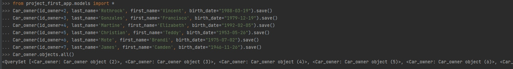
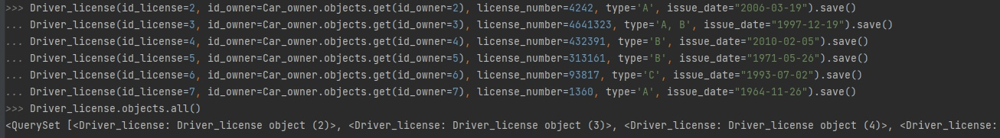
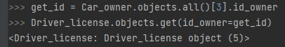
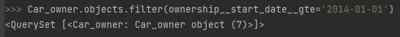
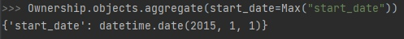
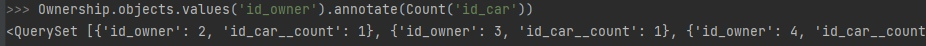
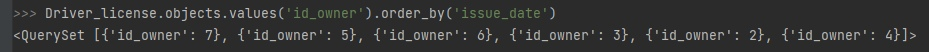

# Практическая работа №3.1

## **Практическое задание 1**

Напишите запрос на создание 6-7 новых автовладельцев и 5-6 автомобилей, каждому автовладельцу назначьте удостоверение и
от 1 до 3 автомобилей.

``models.py`` - Модель БД

```python
class Car_owner(models.Model):
    id_owner = models.IntegerField(primary_key=True)
    last_name = models.CharField(max_length=30, null=False)
    first_name = models.CharField(max_length=30, null=False)
    birth_date = models.DateField(null=True)


class Car(models.Model):
    id_car = models.IntegerField(primary_key=True)
    number_plate = models.CharField(max_length=15, null=False)
    brand = models.CharField(max_length=20, null=False)
    model = models.CharField(max_length=20, null=False)
    color = models.CharField(max_length=30, null=True)


class Ownership(models.Model):
    id_owner_car = models.IntegerField(primary_key=True)
    id_owner = models.ForeignKey(Car_owner, on_delete=models.CASCADE)
    id_car = models.ForeignKey(Car, on_delete=models.CASCADE)
    start_date = models.DateField()
    end_date = models.DateField(null=True)


class Driver_license(models.Model):
    id_license = models.IntegerField(primary_key=True)
    id_owner = models.ForeignKey(Car_owner, on_delete=models.CASCADE)
    license_number = models.CharField(max_length=10, null=False)
    type = models.CharField(max_length=10, null=False)
    issue_date = models.DateField()
```

<br>
<hr>

### **Создание сущностей**

<br>

**Создание автовладельцев**



**Создание автомобилей**


**Создание водительских удостоверений**



**Создание связи владения**


<br>
<hr>

## **Практическое задание 2**

**По созданным в пр.1 данным написать следующие запросы на фильтрацию:**

* Выведете все машины марки “Toyota” (или любой другой марки, которая у вас есть):


* Найти всех водителей с именем “Олег” (или любым другим именем на ваше усмотрение):


* Взяв любого случайного владельца получить его id, и по этому id получить экземпляр удостоверения в виде объекта
  модели (можно в 2 запроса):



* Вывести всех владельцев красных машин (или любого другого цвета, который у вас присутствует):


* Найти всех владельцев, чей год владения машиной начинается с 2010 (или любой другой год, который присутствует у вас в
  базе):



<br>
<hr>

## **Практическое задание 3**

**Необходимо реализовать следующие запросы:**

* Вывод даты выдачи самого старшего водительского удостоверения


* Укажите самую позднюю дату владения машиной, имеющую какую-то из существующих моделей в вашей базе



* Выведите количество машин для каждого водителя



* Подсчитайте количество машин каждой марки


* Отсортируйте всех автовладельцев по дате выдачи удостоверения (Примечание: чтобы не выводить несколько раз одни и те
  же таблицы воспользуйтесь методом .distinct()

