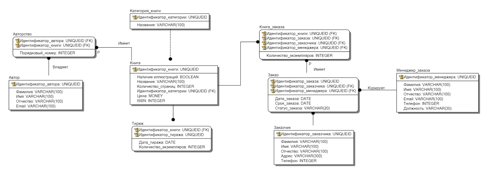

## Лабораторная работы №3

### Выбор модели базы данных

Для выполнения лабораторной работы была выбрала модель базы данных литературного издательства
из курса "Базы данных".

Схема модели в Erwin Data Model:



Схема модели в pgAdmin:


### Реализация модели базы данных

Модель базы данных была реализована средствами Django ORM:

* `models.py`
```python
from django.db import models
from django.contrib.auth.models import AbstractUser


class BookCategory(models.Model):
    name = models.CharField(max_length=100)

    def __str__(self):
        return self.name


class Book(models.Model):
    book_category = models.ForeignKey(BookCategory, on_delete=models.PROTECT)
    title = models.CharField(max_length=100)
    isbn = models.BigIntegerField()
    page_count = models.IntegerField()
    price = models.IntegerField()
    has_illustrations = models.BooleanField(null=True, blank=True)

    def __str__(self):
        return self.title


class Author(models.Model):
    books = models.ManyToManyField(Book, through='Authorship', related_name='author')
    last_name = models.CharField(max_length=100)
    first_name = models.CharField(max_length=100)
    patronymic = models.CharField(max_length=100, null=True, blank=True)
    email = models.CharField(max_length=100, null=True, blank=True)

    def __str__(self):
        return self.last_name + ' ' + self.first_name


class Authorship(models.Model):
    author = models.ForeignKey(Author, on_delete=models.PROTECT)
    book = models.ForeignKey(Book, on_delete=models.PROTECT)
    order_number = models.IntegerField(null=True, blank=True)

    def __str__(self):
        return str(self.author) + ' ' + str(self.book) + ' ' + str(self.order_number)


class Edition(models.Model):
    book = models.ForeignKey(Book, on_delete=models.PROTECT)
    date_created = models.DateTimeField()
    volume = models.IntegerField()

    def __str__(self):
        return str(self.book) + ' ' + str(self.id)


class OrderManager(AbstractUser):
    last_name = models.CharField(max_length=100)
    first_name = models.CharField(max_length=100)
    phone = models.BigIntegerField()
    position = models.CharField(max_length=30)
    email = models.CharField(max_length=100)
    patronymic = models.CharField(max_length=100, null=True, blank=True)
    REQUIRED_FIELDS = ['last_name', 'first_name', 'phone', 'position', 'patronymic', 'email']


class Customer(models.Model):
    orders = models.ManyToManyField(OrderManager, through='BooksOrder', related_name='customer')
    last_name = models.CharField(max_length=100)
    first_name = models.CharField(max_length=100)
    phone = models.BigIntegerField()
    address = models.CharField(max_length=300)
    patronymic = models.CharField(max_length=100, null=True, blank=True)

    def __str__(self):
        return str(self.last_name) + ' ' + str(self.first_name)


class BooksOrder(models.Model):
    books = models.ManyToManyField(Book, through='OrderBook', related_name='books_order')
    customer = models.ForeignKey(Customer, on_delete=models.PROTECT)
    order_manager = models.ForeignKey(OrderManager, on_delete=models.PROTECT)
    date_created = models.DateTimeField()
    date_until = models.DateTimeField()
    status = models.CharField(max_length=20)


class OrderBook(models.Model):
    books_order = models.ForeignKey(BooksOrder, on_delete=models.PROTECT)
    book = models.ForeignKey(Book, on_delete=models.PROTECT)
    volume = models.IntegerField()
```

### Реализовать API средствами Django REST Framework

* `serializers.py`
```python
from rest_framework import serializers
from .models import *


class BookCategorySerializer(serializers.ModelSerializer):
    class Meta:
        model = BookCategory
        fields = "__all__"


class AuthorListSerializer(serializers.ModelSerializer):
    class Meta:
        model = Author
        fields = ("id", "first_name", "last_name", "patronymic", "email")


class BookListSerializer(serializers.ModelSerializer):
    class Meta:
        model = Book
        fields = "__all__"


class BookSerializer(serializers.ModelSerializer):
    book_category = BookCategorySerializer()

    class Meta:
        model = Book
        fields = "__all__"


class AuthorSerializer(serializers.ModelSerializer):
    books = BookSerializer(many=True)

    class Meta:
        model = Author
        fields = "__all__"


class AuthorshipListSerializer(serializers.ModelSerializer):
    class Meta:
        model = Authorship
        fields = "__all__"


class AuthorshipSerializer(serializers.ModelSerializer):
    author = AuthorListSerializer()
    book = BookSerializer()

    class Meta:
        model = Authorship
        fields = "__all__"


class EditionListSerializer(serializers.ModelSerializer):
    class Meta:
        model = Edition
        fields = "__all__"


class EditionSerializer(serializers.ModelSerializer):
    book = BookSerializer()

    class Meta:
        model = Edition
        fields = "__all__"
        depth = 1


class OrderManagerListSerializer(serializers.ModelSerializer):
    class Meta:
        model = OrderManager
        fields = "__all__"


class OrderManagerSerializer(serializers.ModelSerializer):
    class Meta:
        model = OrderManager
        fields = "__all__"


class CustomerListSerializer(serializers.ModelSerializer):
    class Meta:
        model = Customer
        fields = "__all__"


class BooksOrderListSerializer(serializers.ModelSerializer):
    class Meta:
        model = BooksOrder
        fields = "__all__"


class BooksOrderSerializer(serializers.ModelSerializer):
    class Meta:
        model = BooksOrder
        fields = "__all__"


class CustomerSerializer(serializers.ModelSerializer):
    class Meta:
        model = Customer
        fields = "__all__"


class OrderBookListSerializer(serializers.ModelSerializer):
    class Meta:
        model = OrderBook
        fields = "__all__"


class OrderBookSerializer(serializers.ModelSerializer):
    class Meta:
        model = OrderBook
        fields = "__all__"
```

* `views.py`
```python
from django.shortcuts import render
from rest_framework import generics, permissions
from .serializers import *
from .models import *
from drf_yasg.views import get_schema_view
from drf_yasg import openapi

class BookCategoryListAPIView(generics.ListAPIView):
    serializer_class = BookCategorySerializer
    queryset = BookCategory.objects.all()

class BookCategoryRetrieveAPIView(generics.RetrieveAPIView):
    serializer_class = BookCategorySerializer
    queryset = BookCategory.objects.all()

class BookCategoryUpdateAPIView(generics.UpdateAPIView):
    serializer_class = BookCategorySerializer
    queryset = BookCategory.objects.all()

class BookCategoryDestroyAPIView(generics.DestroyAPIView):
    serializer_class = BookCategorySerializer
    queryset = BookCategory.objects.all()

class AuthorListAPIView(generics.ListAPIView):
    serializer_class = AuthorListSerializer
    queryset = Author.objects.all()

class AuthorRetrieveAPIView(generics.RetrieveAPIView):
    serializer_class = AuthorSerializer
    queryset = Author.objects.all()

class AuthorUpdateAPIView(generics.UpdateAPIView):
    serializer_class = AuthorListSerializer
    queryset = Author.objects.all()

class AuthorDestroyAPIView(generics.DestroyAPIView):
    serializer_class = AuthorListSerializer
    queryset = Author.objects.all()

class BookListAPIView(generics.ListAPIView):
    serializer_class = BookListSerializer
    queryset = Book.objects.all()

class BookRetrieveAPIView(generics.RetrieveAPIView):
    serializer_class = BookSerializer
    queryset = Book.objects.all()

class BookUpdateAPIView(generics.UpdateAPIView):
    serializer_class = BookListSerializer
    queryset = Book.objects.all()

class BookDestroyAPIView(generics.DestroyAPIView):
    serializer_class = BookListSerializer
    queryset = Book.objects.all()

class AuthorshipListAPIView(generics.ListAPIView):
    serializer_class = AuthorshipListSerializer
    queryset = Authorship.objects.all()

class AuthorshipRetrieveAPIView(generics.RetrieveAPIView):
    serializer_class = AuthorshipSerializer
    queryset = Authorship.objects.all()

class AuthorshipUpdateAPIView(generics.UpdateAPIView):
    serializer_class = AuthorshipListSerializer
    queryset = Authorship.objects.all()

class AuthorshipDestroyAPIView(generics.DestroyAPIView):
    serializer_class = AuthorshipListSerializer
    queryset = Authorship.objects.all()

class EditionListAPIView(generics.ListAPIView):
    serializer_class = EditionListSerializer
    queryset = Edition.objects.all()

class EditionRetrieveAPIView(generics.RetrieveAPIView):
    serializer_class = EditionSerializer
    queryset = Edition.objects.all()

class EditionUpdateAPIView(generics.UpdateAPIView):
    serializer_class = EditionListSerializer
    queryset = Edition.objects.all()

class EditionDestroyAPIView(generics.DestroyAPIView):
    serializer_class = EditionListSerializer
    queryset = Edition.objects.all()

class OrderManagerListAPIView(generics.ListAPIView):
    serializer_class = OrderManagerListSerializer
    queryset = OrderManager.objects.all()

class OrderManagerRetrieveAPIView(generics.RetrieveAPIView):
    serializer_class = OrderManagerSerializer
    queryset = OrderManager.objects.all()

class OrderManagerUpdateAPIView(generics.UpdateAPIView):
    serializer_class = OrderManagerListSerializer
    queryset = OrderManager.objects.all()

class OrderManagerDestroyAPIView(generics.DestroyAPIView):
    serializer_class = OrderManagerListSerializer
    queryset = OrderManager.objects.all()

class CustomerListAPIView(generics.ListAPIView):
    serializer_class = CustomerListSerializer
    queryset = Customer.objects.all()

class CustomerRetrieveAPIView(generics.RetrieveAPIView):
    serializer_class = CustomerSerializer
    queryset = Customer.objects.all()

class CustomerUpdateAPIView(generics.UpdateAPIView):
    serializer_class = CustomerListSerializer
    queryset = Customer.objects.all()

class CustomerDestroyAPIView(generics.DestroyAPIView):
    serializer_class = CustomerListSerializer
    queryset = Customer.objects.all()

class BooksOrderListAPIView(generics.ListAPIView):
    serializer_class = BooksOrderListSerializer
    queryset = BooksOrder.objects.all()

class BooksOrderRetrieveAPIView(generics.RetrieveAPIView):
    serializer_class = BooksOrderSerializer
    queryset = BooksOrder.objects.all()

class BooksOrderUpdateAPIView(generics.UpdateAPIView):
    serializer_class = BooksOrderListSerializer
    queryset = BooksOrder.objects.all()

class BooksOrderDestroyAPIView(generics.DestroyAPIView):
    serializer_class = BooksOrderListSerializer
    queryset = BooksOrder.objects.all()

class OrderBookListAPIView(generics.ListAPIView):
    serializer_class = OrderBookListSerializer
    queryset = OrderBook.objects.all()

class OrderBookRetrieveAPIView(generics.RetrieveAPIView):
    serializer_class = OrderBookSerializer
    queryset = OrderBook.objects.all()

class OrderBookUpdateAPIView(generics.UpdateAPIView):
    serializer_class = OrderBookListSerializer
    queryset = OrderBook.objects.all()

class OrderBookDestroyAPIView(generics.DestroyAPIView):
    serializer_class = OrderBookListSerializer
    queryset = OrderBook.objects.all()
```

* `rest/urls.py`
```python
from django.urls import path
from .views import *

urlpatterns = [
    path('book-category', BookCategoryListAPIView.as_view()),
    path('book-category/<int:pk>', BookCategoryRetrieveAPIView.as_view()),
    path('book-category/<int:pk>/remove', BookCategoryDestroyAPIView.as_view()),
    path('book-category/<int:pk>/edit', BookCategoryUpdateAPIView.as_view()),

    path('author', AuthorListAPIView.as_view()),
    path('author/<int:pk>', AuthorRetrieveAPIView.as_view()),
    path('author/<int:pk>/remove', AuthorDestroyAPIView.as_view()),
    path('author/<int:pk>/edit', AuthorUpdateAPIView.as_view()),

    path('book', BookListAPIView.as_view()),
    path('book/<int:pk>', BookRetrieveAPIView.as_view()),
    path('book/<int:pk>/remove', BookDestroyAPIView.as_view()),
    path('book/<int:pk>/edit', BookUpdateAPIView.as_view()),

    path('authorship', AuthorshipListAPIView.as_view()),
    path('authorship/<int:pk>', AuthorshipRetrieveAPIView.as_view()),
    path('authorship/<int:pk>/remove', AuthorshipDestroyAPIView.as_view()),
    path('authorship/<int:pk>/edit', AuthorshipUpdateAPIView.as_view()),

    path('edition', EditionListAPIView.as_view()),
    path('edition/<int:pk>', EditionRetrieveAPIView.as_view()),
    path('edition/<int:pk>/remove', EditionDestroyAPIView.as_view()),
    path('edition/<int:pk>/edit', EditionUpdateAPIView.as_view()),

    path('order-manager', OrderManagerListAPIView.as_view()),
    path('order-manager/<int:pk>', OrderManagerRetrieveAPIView.as_view()),
    path('order-manager/<int:pk>/remove', OrderManagerDestroyAPIView.as_view()),
    path('order-manager/<int:pk>/edit', OrderManagerUpdateAPIView.as_view()),

    path('customer', CustomerListAPIView.as_view()),
    path('customer/<int:pk>', CustomerRetrieveAPIView.as_view()),
    path('customer/<int:pk>/remove', CustomerDestroyAPIView.as_view()),
    path('customer/<int:pk>/edit', CustomerUpdateAPIView.as_view()),

    path('books-order', BooksOrderListAPIView.as_view()),
    path('books-order/<int:pk>', BooksOrderRetrieveAPIView.as_view()),
    path('books-order/<int:pk>/remove', BooksOrderDestroyAPIView.as_view()),
    path('books-order/<int:pk>/edit', BooksOrderUpdateAPIView.as_view()),

    path('order-book', OrderBookListAPIView.as_view()),
    path('order-book/<int:pk>', OrderBookRetrieveAPIView.as_view()),
    path('order-book/<int:pk>/remove', OrderBookDestroyAPIView.as_view()),
    path('order-book/<int:pk>/edit', OrderBookUpdateAPIView.as_view()),

    path('doc/swagger/', schema_view.with_ui('swagger', cache_timeout=0), name='schema-swagger-ui'),
    path('doc/redoc', schema_view.with_ui('redoc', cache_timeout=0), name='schema-redoc')
]
```

### Подключение регистрации / авторизации по токенам / вывода информации о текущем пользователе средствами Djoser

* `settings.py`
```python
...

INSTALLED_APPS = [
    "django.contrib.admin",
    "django.contrib.auth",
    "django.contrib.contenttypes",
    "django.contrib.sessions",
    "django.contrib.messages",
    "django.contrib.staticfiles",
    "rest_framework",
    "rest_framework.authtoken",
    "rest",
    "drf_yasg",
    "djoser"
]

...
```

* `publisher/urls.py`
```python
...

urlpatterns = [
    path("admin/", admin.site.urls),
    path("api/v1/", include('rest.urls')),
    path("auth/", include('djoser.urls')),
    re_path(r'^auth/', include('djoser.urls.authtoken')),
]
```