# Лабораторная работа №3 

## Вариант к фронту: 
Платформа с проходящими в Санкт-Петербурге мероприятиями, адаптированная под англоязычных пользователей.

На сайте возможно зарегистрироваться, авторизоваться, посмотреть список мероприятий, а также отфильтровать их по типу и месту проведения.

На странице мероприятия можно посмотреть полную информацию о мероприятии и записаться на него. Также можно оставить комментарий о мероприятии и просмотреть существующие комментарии.

В личном кабинете можно посмотреть информацию о пользователе, изменить ее и увидеть записанные мероприятия.

Таким образом в моделе есть следующие сущности: User, Event, Comment, UserEnrolledEvent (связь между юзером и мероприятием):

`models.py`

```python
from django.db import models
from django.contrib.auth.models import AbstractUser


# Create your models here.
class Event(models.Model):
    id = models.IntegerField(primary_key=True)
    title = models.CharField(max_length=30, null=False, unique=True)
    address = models.CharField(max_length=100, null=False)
    district = models.CharField(max_length=30, null=False)
    type = models.CharField(max_length=30, null=False)
    date = models.DateTimeField(null=False)
    short_description = models.CharField(max_length=200, null=False)
    full_description = models.CharField(max_length=1000, null=False)
    website = models.CharField(max_length=100, null=False)

    def __str__(self):
        return self.title.__str__()


class User(AbstractUser):
    id = models.IntegerField(primary_key=True)
    img_url = models.CharField(max_length=100, null=True, default='default_user.png')
    email = models.CharField(max_length=30, null=False, unique=True)
    user_info = models.CharField(max_length=200, null=True)

    REQUIRED_FIELDS = ["img_url", "user_info", "email", "first_name", "last_name"]

    def __str__(self):
        return self.username.__str__()


class UserEnrolledEvent(models.Model):
    id = models.IntegerField(primary_key=True)
    event = models.ForeignKey(Event, on_delete=models.CASCADE, to_field="title")
    user = models.ForeignKey(User, on_delete=models.CASCADE, to_field="username")

    def __str__(self):
        return self.id.__str__()


class Comment(models.Model):
    id = models.IntegerField(primary_key=True)
    user = models.ForeignKey(User, on_delete=models.CASCADE, to_field="username")
    text = models.CharField(max_length=1000, null=True)
    event = models.ForeignKey(Event, on_delete=models.CASCADE, to_field="title")

    def __str__(self):
        return self.id.__str__()
```

В функциях get_queryset(self) обрабатываются параметры адресной строки.

`views.py`

```python
from .serializers import *
from rest_framework.generics import RetrieveUpdateAPIView, ListAPIView, CreateAPIView, RetrieveAPIView, \
    DestroyAPIView
from .models import *


# Create your views here.
class EventListAPIView(ListAPIView):
    serializer_class = EventSerializer
    queryset = Event.objects.all()


class EventCreateAPIView(CreateAPIView):
    serializer_class = EventSerializer
    queryset = Event.objects.all()


class UserDestroyAPIView(DestroyAPIView):
    serializer_class = UserListSerializer
    queryset = User.objects.all()


class UserCreateAPIView(CreateAPIView):
    serializer_class = UserListSerializer
    queryset = User.objects.all()


class UserListAPIView(ListAPIView):
    serializer_class = UserListSerializer
    queryset = User.objects.all()


class EventRetrieveAPIView(RetrieveAPIView):
    serializer_class = EventSerializer
    queryset = Event.objects.all()


class UserRetrieveAPIView(RetrieveAPIView):
    serializer_class = UserRetrieveSerializer
    queryset = User.objects.all()


class UserUpdateAPIView(RetrieveUpdateAPIView):
    serializer_class = UserUpdateSerializer
    queryset = User.objects.all()


class EnrollCreateAPIView(CreateAPIView):
    serializer_class = UsersEventSerializer
    queryset = UserEnrolledEvent.objects.all()


class UserEnrolledEventAPIView(ListAPIView):
    serializer_class = UserEventsSerializer

    def get_queryset(self):
        user_id = self.kwargs['user_id']
        return Comment.objects.filter(user__id=user_id)


class EventCommentsAPIView(ListAPIView):
    serializer_class = EventCommentSerializer

    def get_queryset(self):
        event_id = self.kwargs['event_id']
        return Comment.objects.filter(event__id=event_id)


class EnrollListAPIView(ListAPIView):
    serializer_class = UsersEventSerializer
    queryset = UserEnrolledEvent.objects.all()


class DeleteEnrolledEventAPIView(DestroyAPIView):
    serializer_class = UsersEventSerializer
    queryset = UserEnrolledEvent.objects.all()


class CommentCreateAPIView(CreateAPIView):
    serializer_class = CommentSerializer
    queryset = Comment.objects.all()


class CommentListAPIView(ListAPIView):
    serializer_class = CommentSerializer
    queryset = Comment.objects.all()


class CommentRetrieveAPIView(RetrieveAPIView):
    serializer_class = CommentSerializer
    queryset = Comment.objects.all()


class EventsFilterAPIView(ListAPIView):
    serializer_class = EventSerializer

    def get_queryset(self):
        type = self.kwargs['type']
        district = self.kwargs['district']
        if type == "all" and district != "all":
            return Event.objects.filter(district=district)
        elif district == "all" and type != "all":
            return Event.objects.filter(type=type)
        elif district == "all" and type == "all":
            return Event.objects.all()
        else:
            return Event.objects.filter(type=type, district=district)
```

`serializers.py`

```python
from rest_framework import serializers
from .models import *


class EventSerializer(serializers.ModelSerializer):
    class Meta:
        model = Event
        fields = "__all__"


class UserListSerializer(serializers.ModelSerializer):
    class Meta:
        model = User
        fields = "__all__"


class UserRetrieveSerializer(serializers.ModelSerializer):
    class Meta:
        model = User
        fields = ["id", "first_name", "last_name", "email", "username", "user_info", "img_url"]


class UserUpdateSerializer(serializers.ModelSerializer):
    class Meta:
        model = User
        fields = ["password", "first_name", "last_name", "email", "img_url", "username", "user_info"]


class UserEventsSerializer(serializers.ModelSerializer):
    class Meta:
        model = UserEnrolledEvent
        fields = ["user", "event"]


class UsersEventSerializer(serializers.ModelSerializer):
    class Meta:
        model = UserEnrolledEvent
        fields = "__all__"


class CommentSerializer(serializers.ModelSerializer):
    class Meta:
        model = Comment
        fields = "__all__"


class EventCommentSerializer(serializers.ModelSerializer):
    class Meta:
        model = Comment
        fields = ["text", "user", "event"]
```

В юрлах используется re_path для фильтрации, а также для обращения к мероприятиям каждого из пользоваталей и комментариям каждого из мероприятий (с использованием параметров адресной строки).

`urls.py`

```python
from django.urls import path, re_path
from .views import *

app_name = "lr3app"

urlpatterns = [
    path('events/list/', EventListAPIView.as_view()),
    path('event/<int:pk>/', EventRetrieveAPIView.as_view()),
    path('event/create/', EventCreateAPIView.as_view()),
    path('users/list/', UserListAPIView.as_view()),
    path('user/<int:pk>/', UserRetrieveAPIView.as_view()),
    path('user/create/', UserCreateAPIView.as_view()),
    path('user/delete/<int:pk>/', UserDestroyAPIView.as_view()),
    path('user/edit/<int:pk>/', UserUpdateAPIView.as_view()),
    path('enroll/create/', EnrollCreateAPIView.as_view()),
    path('enroll/delete/<int:pk>/', DeleteEnrolledEventAPIView.as_view()),
    path('enroll/list/', EnrollListAPIView.as_view()),
    path('comments/list/', CommentListAPIView.as_view()),
    path('comment/create/', CommentCreateAPIView.as_view()),
    path('comment/<int:pk>/', CommentRetrieveAPIView.as_view()),
    re_path(r'event/comments/(?P<event_id>[0-9]+)/$', EventCommentsAPIView.as_view()),
    re_path(r'user/events/(?P<user_id>[0-9]+)/$', UserEnrolledEventAPIView.as_view()),
    re_path(r'events/filter/(?P<type>\w*)/(?P<district>\w*)/$', EventsFilterAPIView.as_view())
]

```

* Основные эндпоинты:

Получение конкретного пользователя:
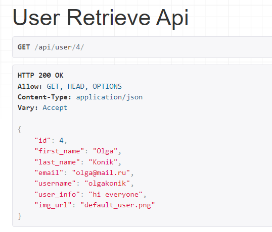

Список всех пользователей:
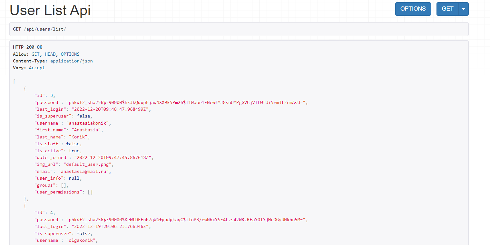

Получение конкретного мероприятия:
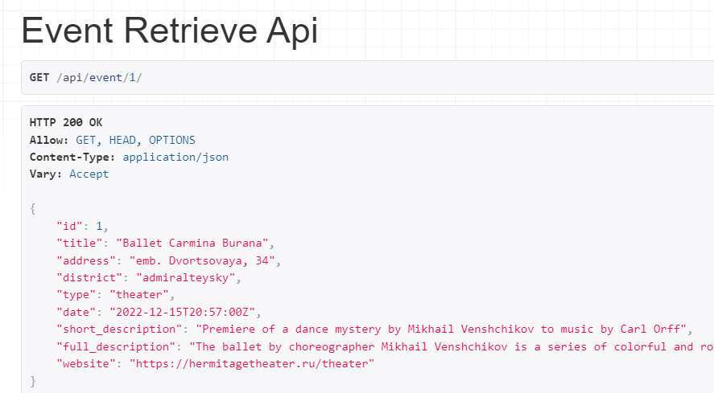

Список всех мероприятий:
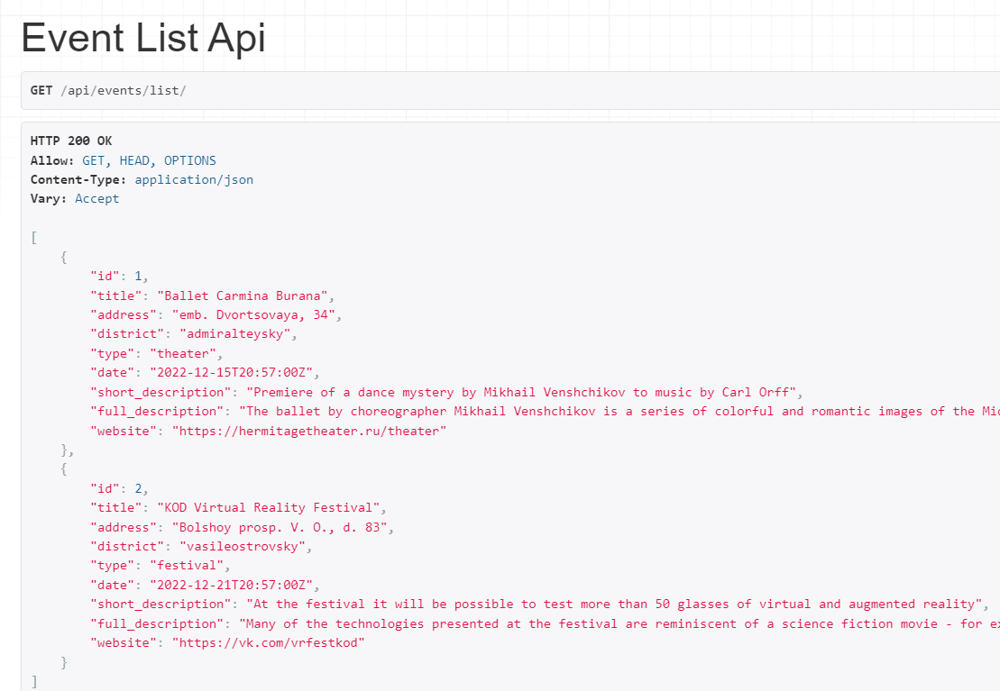

Все записи пользователей:

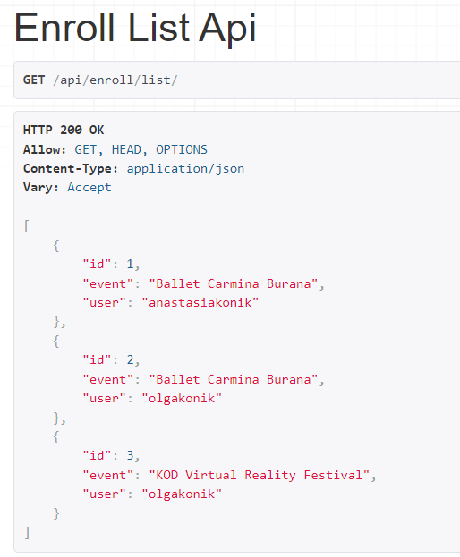

Запись конкретного пользователя:

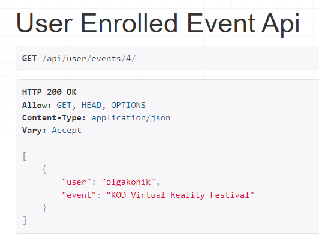

Комментарий к конкретному мероприятию:
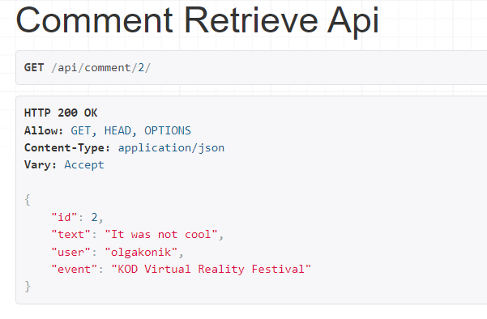

Все комментарии:

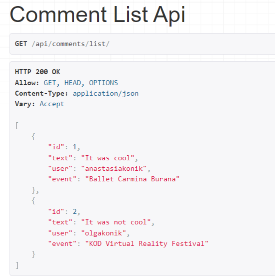

Фильтрация:
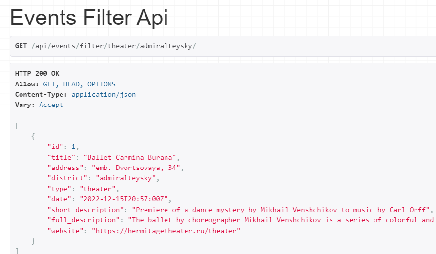

Регистрация и авторизация происходит средствами Djoser с помощью Postman. Также методом Patch в Postman можно изменять информацию о пользователе.

`пример`

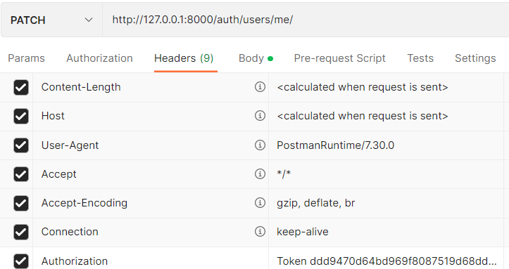
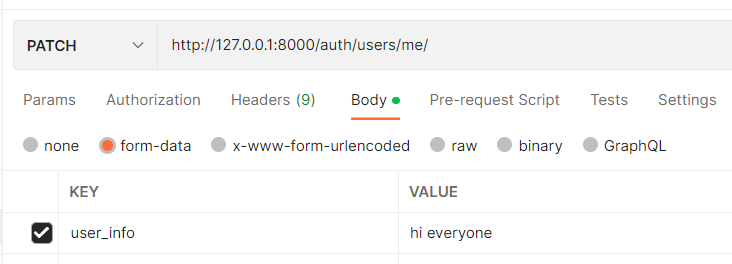

В проект подключен swagger.

`пример` 

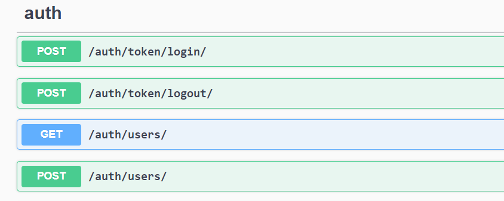