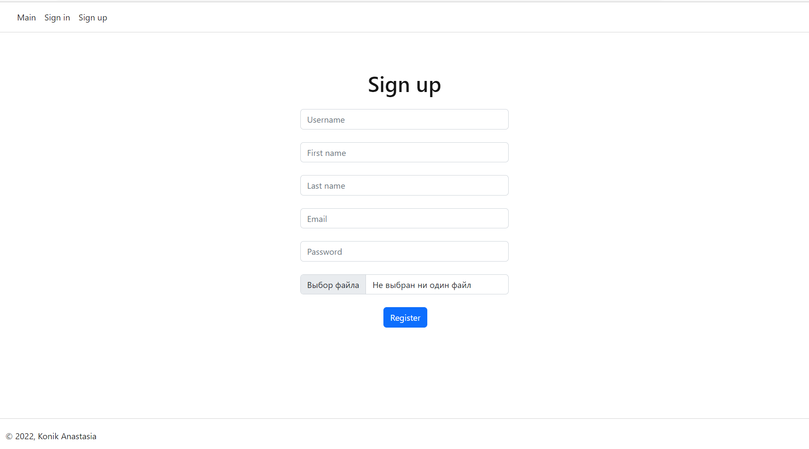
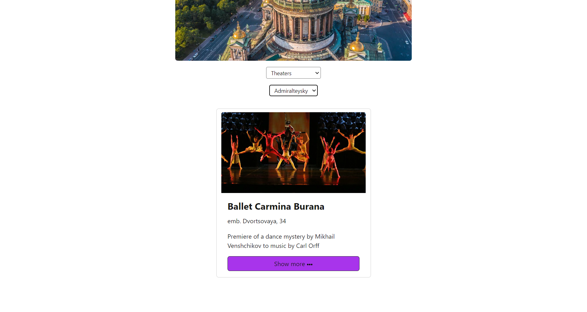
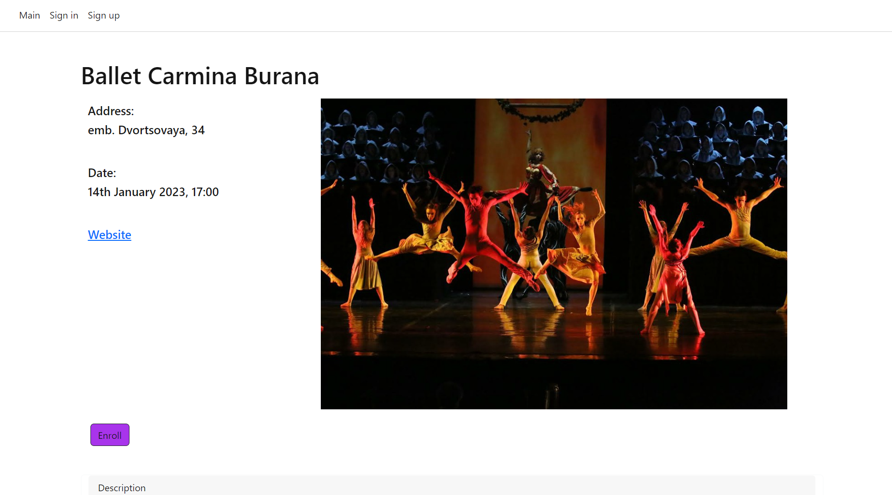
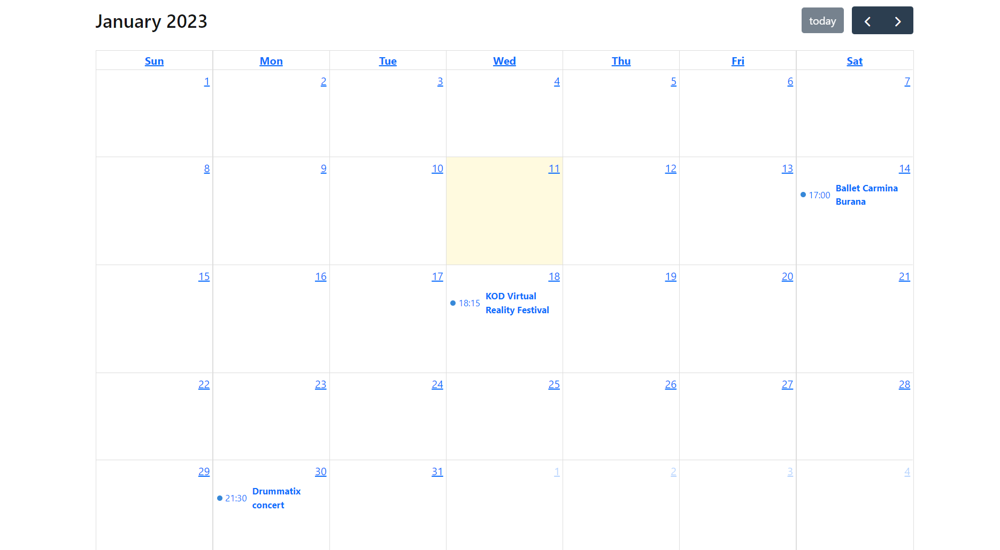

# Лабораторная работа №4

## Мигрировать ранее написанный сайт на фреймворк Vue.JS.

Минимальные требования:

* Должен быть подключён роутер
* Должна быть реализована работа с внешним API
* Разумное деление на компоненты


Основные файлы проекта:

`router`

*index.js*
```javascript
import {createRouter, createWebHistory} from 'vue-router'
import MainPage from "@/views/MainPage.vue";
import EventPage from "@/views/EventPage.vue";
import SignUpPage from "@/views/SignUpPage.vue";
import SignInPage from "@/views/SignInPage.vue";
import ProfilePage from "@/views/ProfilePage.vue";
import CalendarPage from "@/views/CalendarPage.vue";

// массив с роутами
const routes = [
    {path: "/main", component: MainPage},
    {path: "/event/:id", component: EventPage},
    {path: "/signup", component: SignUpPage},
    {path: "/signin", component: SignInPage},
    {path: "/profile", component: ProfilePage},
    {path: "/calendar", component: CalendarPage}
]

const router = createRouter({
    history: createWebHistory(import.meta.env.BASE_URL),
    routes
})

// экспортируем сконфигурированный роутер
export default router
```

`stores`

*index.js*

```javascript
import { persist } from 'pinia-persists'
import { createPinia } from 'pinia'

const pinia = createPinia()

pinia.use(persist())

export default pinia
```

*cards.js*

Хранилище карточек мероприятий, с действиями загрузить все карточки и загрузить одну.

```javascript
import {defineStore} from 'pinia'
import {cardApi} from '@/api'

const useCardsStore = defineStore('cards', {
        state: () => ({
            cards: [],
        }),

        actions: {
            async loadCards() {
                const response = await cardApi.getAll();

                this.cards = response.data;

                return response;
            },

            async loadOneCard(eventId) {
                return await cardApi.getOne(eventId)
            },

        }
    }
)
export default useCardsStore
```

*users.js*

Хранилище пользвателей: хранится текущий юзер, его токен и его карточки. Действия на регистрацию и авторизацию, получение информации о юзере, добавление карточки и получение карточек юзера, а также выход из системы.
```javascript
import {defineStore} from 'pinia'
import {userEventsApi, usersApi} from "@/api";


const useUsersStore = defineStore('users', {
    state: () => ({
        user: {},
        token: null,
        userEvents: []
    }),

    actions: {
        async CurrentUser() {
            let response = null

            if (this.token) {
                response = await usersApi.fetchCurrentUser(this.token)
                this.user = response.data?.username ? response.data : {}
                console.log(this.user)
            }
            return this.user
        },
        async login(credentials) {
            const response = await usersApi.login(credentials)

            this.token = response?.data?.auth_token || null
            if (this.token) {
                window.localStorage.setItem('user_token', this.token)
            }

            return this.token
        },
        async signUp(user) {
            return await usersApi.signUp(user)
        },
        async logout() {
            let response = null

            if (this.token) {
                response = await usersApi.logout(this.token)
                if (response.status === 204) {
                    window.localStorage.removeItem('user_token')
                    this.token = ''
                    this.user = {}
                    this.userEvents = []
                }
            }

            return response
        },

        async getUserEvents() {
            const response = await userEventsApi.getByUserId(this.user.id)

            this.userEvents = response.data
            console.log(this.userEvents)

            return response
        },

        async addUserEvent(data) {

            return await userEventsApi.enrollUser(data)
        }
    }
})

export default useUsersStore
```

`api`

*index.js*
```javascript
import instance from "@/api/instance"
import CardApi from "@/api/cards"
import UsersApi from "@/api/users"
import UserEventsApi from "@/api/userEvents"

const cardApi = new CardApi(instance)
const usersApi = new UsersApi(instance)

const userEventsApi = new UserEventsApi(instance)

export {
    cardApi,
    usersApi,
    userEventsApi
}
```

*instance.js*
```javascript
import axios from 'axios'

const apiURL = 'http://localhost:8000'

const instance = axios.create({
 baseURL: apiURL
})

export default instance

```

*cards.js*

Обращение к серверу для получения списка мероприятий и мероприятия по id
```javascript
class CardApi {
    constructor(instance) {
        this.API = instance
    }

    getAll = async () => {
        return this.API({
            url: '/api/events/list/'
        })
    }

    getOne = async (eventId) => {
        return this.API({
            url: `/api/event/${eventId}/`
        })
    }
}

export default CardApi
```

*users.js*

Обращение к серверу для регистрации, входа, выхода, получения информации и текущем юзере
```javascript
class UsersApi {
  constructor(instance) {
    this.API = instance
  }

  signUp = async (data) => {
    return this.API({
      method: 'POST',
      url: '/auth/users/',
      data,
      headers: {
        'Content-Type': 'multipart/form-data'
      }
    })
  }

  login = async (data) => {
    return this.API({
      method: 'POST',
      url: '/auth/token/login/',
      data,
      headers: {
        'Content-Type': 'application/json'
      }
    })
  }

  logout = async (token) => {
    return this.API({
      method: 'POST',
      url: '/auth/token/logout/',
      headers: {
        'Authorization': `Token ${token}`
      }
    })
  }

  fetchCurrentUser = async (token) => {
    return this.API({
      url: '/auth/users/me/',
      headers: {
        'Authorization': `Token ${token}`
      }
    })
  }
}

export default UsersApi
```

*userEvents.js*

Обращение к серверу для получения мероприятий пользователя и для записи пользователя на мероприятие
```javascript
class UserEventsApi {
    constructor(instance) {
        this.API = instance
    }

    getByUserId = async (userId) => {
        return this.API({
            url: `/api/user/events/${userId}/`
        })
    }

    enrollUser = async (data) => {
        return this.API({
            url: '/api/enroll/create/',
            method: 'POST',
            data,
            headers: {
                'Content-Type': 'application/json'
            }
        })
    }
}

export default UserEventsApi
```

`components`

*Card.vue*

```vue
<template>
  <svg xmlns="http://www.w3.org/2000/svg" xmlns:xlink="http://www.w3.org/1999/xlink" display="none">
    <symbol id="ShowMore" viewBox="0 0 16 16">
      <path
          d="M3 9.5a1.5 1.5 0 1 1 0-3 1.5 1.5 0 0 1 0 3zm5 0a1.5 1.5 0 1 1 0-3 1.5 1.5 0 0 1 0 3zm5 0a1.5 1.5 0 1 1 0-3 1.5 1.5 0 0 1 0 3z"/>
    </symbol>
  </svg>
  
  <div class="card-body d-flex flex-column">
    <p class="card-title" style="font-size:18pt"><b>{{ title }}</b></p>
    <p class="card-text">{{ address }}</p>
    <p class="card-text">{{ short_description }}</p>
    <button :id="'event_showmore_'+ id" aria-pressed="true" @click="goToEvent(id)"
            class="btn mt-auto btn-dark purple_button event_showmore_btn">Show more
      <svg class="icon">
        <use xlink:href="#ShowMore"></use>
      </svg>
    </button>
  </div>
</template>

<script>

export default {
  name: 'Event',
  props: {
    title: {
      type: String,
      required: true
    },
    address: {
      type: String,
      required: true
    },
    img_src: {
      type: String,
      required: true
    },
    short_description: {
      type: String,
      required: true
    },
    id: {
      type: Number,
      required: true
    }
  },
  methods: {
    goToEvent(event_id) {
      this.$router.push(`/event/${event_id}`)
    },
  },
}
</script>

<style scoped>

</style>
```

*Event.vue*

```vue
<template>
  <main class="container-xl p-5 mb-5">
    <section class="row d-flex" id="event_page">
      <h1 class="row mb-3 ">{{ title }}</h1>
      <div class="row d-flex col-lg-4 col-md-4 col-sm-4">
        <ul>
          <h5 class="text mt-2">Address:</h5>
          <h5 class="text mt-2">{{ address }}</h5>
          <h5 class="text mt-5">Date:</h5>
          <h5 class="text mt-2" id="date"></h5>
          <h5 class="text mt-5"><a :href="website">Website</a></h5>
        </ul>
      </div>
      <div class="row d-flex col-lg-8 col-md-8 col-sm-8">
        
      </div>
      <div class="mx-1 mb-5 mt-4">
        <button :id="'event_enroll'+ id" class="btn mt-auto btn-dark purple_button" :disabled="!isActive"
                @click="enroll(this.id)" aria-pressed="true">Enroll
        </button>
      </div>
      <div class="card border-light mb-3 mx-auto">
        <div class="card-header">Description</div>
        <div class="card-body">
          <h5 class="card-title">{{ short_description }}</h5>
          <p class="card-text">{{ full_description }}</p>
        </div>
      </div>
    </section>
  </main>
</template>

<script>

import {mapActions, mapState} from "pinia";
import useUsersStore from "@/stores/users";
import moment from "moment";

export default {
  name: "EventBlock",
  props: {
    title: {
      type: String,
      required: true
    },
    address: {
      type: String,
      required: true
    },
    website: {
      type: String,
      required: true
    },
    img_src: {
      type: String,
      required: true
    },
    date: {
      type: String,
      required: true
    },
    full_description: {
      type: String,
      required: true
    },
    short_description: {
      type: String,
      required: true
    },
    id: {
      type: Number,
      required: true
    }
  },
  data() {
    return {
      isActive: true,
    }
  },
  computed: {
    ...mapState(useUsersStore, ['user', 'token']),
  },
  mounted() {
    this.convertDate()
  },
  methods: {
    ...mapActions(useUsersStore, ['addUserEvent']),
    async enroll(id) {
      const userEvent = {
        "event": id,
        "user": this.user.username
      }
      console.log(userEvent)
      const response = await this.addUserEvent(userEvent);
      console.log(response)
      this.isActive = false
    },
    convertDate() {
      let form_date = moment(this.date).utc().format('Do MMMM YYYY, HH:mm')
      console.log(form_date)
      document.getElementById('date').innerHTML=form_date
      return form_date
    },
  }
}
</script>

<style scoped>

</style>
```

*Main.vue*

```vue
<template>
  <main class="container-xl p-5 mb-5">
    <h1 class="row mb-3 justify-content-center">Events in Saint-Petersburg</h1>
    <div class="text-center">
      
    </div>
    <section class="filtration" @change="filter">
      <div class="form text-center col-sm-6 col-lg-4 col-xl-3 mt-3 mx-auto">
        <select class="filter form-select-sm" aria-label=".form-select-sm example" id="filter_by_type">
          <option selected>Event type</option>
          <option value="theater">Theaters</option>
          <option value="concert">Concerts</option>
          <option value="exhibition">Exhibitions</option>
          <option value="activity">Outdoor activities</option>
          <option value="festival">Festivals</option>
        </select>
      </div>
      <div class="form text-center col-sm-6 col-lg-4 col-xl-3 mt-3 mx-auto">
        <select class="filter form-select-sm" aria-label=".form-select-sm example" id="filter_by_place">
          <option selected>Choose district</option>
          <option value="admiralteysky">Admiralteysky</option>
          <option value="petrogradsky">Petrogradsky</option>
          <option value="moskovsky">Moskovsky</option>
          <option value="tsentralny">Tsentralny</option>
          <option value="vasileostrovsky">Vasileostrovsky</option>
        </select>
      </div>
    </section>
    <section id="event_cards" class="container justify-content-center row mx-auto mt-3">
      <div class="card event col-xl-4 col-lg-4 col-md-4 col-sm-6 card mx-3 mt-3" :class="[card.district, card.type]"
           v-for="card in Cards" :key="card.id">
        <card :title="card.title" :address="card.address" :img_src="card.img_src"
              :short_description="card.short_description" :id="card.id"></card>
      </div>
    </section>
  </main>
</template>

<script>
import {mapActions, mapState} from "pinia";
import Card from "@/components/Card.vue"
import useCardsStore from "@/stores/cards.js";

export default {
  name: "MainBlock",
  components: {Card},
  computed: {
    ...mapState(useCardsStore, ['cards']),
    Cards() {
      return this.cards
    }
  },
  methods: {
    ...mapActions(useCardsStore, ['loadCards']),
    async filter() {
      let selectedPlace = document.getElementById("filter_by_place").value;
      let selectedType = document.getElementById("filter_by_type").value;
      const cards = document.getElementsByClassName("event");
      console.log(cards)
      for (let i = 0; i < cards.length; i++) {
        if ((cards[i].classList.contains(selectedPlace) || selectedPlace === "Choose district") &&
            (cards[i].classList.contains(selectedType) || selectedType === "Event type")) {
          cards[i].classList.remove("d-none");
        } else {
          cards[i].classList.add("d-none");
        }
      }
      console.log(cards)
    }
  },
  mounted() {
    this.loadCards();
  }
}
</script>

<style scoped>

</style>
```

*Profile.vue*

```vue
<template>
  <svg xmlns="http://www.w3.org/2000/svg" xmlns:xlink="http://www.w3.org/1999/xlink" display="none">
    <symbol id="Edit" viewBox="0 0 16 16">
      <path
          d="M15.502 1.94a.5.5 0 0 1 0 .706L14.459 3.69l-2-2L13.502.646a.5.5 0 0 1 .707 0l1.293 1.293zm-1.75 2.456-2-2L4.939 9.21a.5.5 0 0 0-.121.196l-.805 2.414a.25.25 0 0 0 .316.316l2.414-.805a.5.5 0 0 0 .196-.12l6.813-6.814z"/>
      <path
          d="M1 13.5A1.5 1.5 0 0 0 2.5 15h11a1.5 1.5 0 0 0 1.5-1.5v-6a.5.5 0 0 0-1 0v6a.5.5 0 0 1-.5.5h-11a.5.5 0 0 1-.5-.5v-11a.5.5 0 0 1 .5-.5H9a.5.5 0 0 0 0-1H2.5A1.5 1.5 0 0 0 1 2.5v11z"/>
    </symbol>
    <symbol id="Done" viewBox="0 0 16 16">
      <path
          d="M2.5 8a5.5 5.5 0 0 1 8.25-4.764.5.5 0 0 0 .5-.866A6.5 6.5 0 1 0 14.5 8a.5.5 0 0 0-1 0 5.5 5.5 0 1 1-11 0z"/>
      <path d="M15.354 3.354a.5.5 0 0 0-.708-.708L8 9.293 5.354 6.646a.5.5 0 1 0-.708.708l3 3a.5.5 0 0 0 .708 0l7-7z"/>
    </symbol>
  </svg>
  <main class="container p-5 mb-5">
    <section id="user_profile" class="container row mx-auto">
      <section>
        <div class="row d-flex col-md-5 col-lg-4 col-xl-4 col-sm-8" style="float: left; margin-right: 10px">
          
          <input v-show="upload_input" type="file" id="user_image" accept="image/*" @change="handleUpload"
                 ref="user_photo">
        </div>
        <div class="row d-flex col-xl-6 col-lg-8 col-md-8 col-sm-12" style="float: none">
          <h1 id="user_name" class="text">{{ user.first_name }} {{ user.last_name }}</h1>
          <p id="user_login" class="text" style="font-size: 14pt">{{ user.email }}</p>
          <p v-if="user.user_info === null" id="user_info" ref="info" class="info text placeholder_text mt-1">Tell
            something
            about yourself</p>
          <p v-else id="user_info" ref="info" class="info text placeholder_text">{{ user.user_info }}</p>
        </div>
      </section>
      <div>
        <button class="btn btn-primary mx-1 mt-3" type="button" @click="edit" id="edit-button" ref="edit_btn"
                aria-pressed="true" :disabled="!isActive">Edit
          profile
          <svg class="icon">
            <use xlink:href="#Edit"></use>
          </svg>
        </button>
        <button class="btn btn-success invisible mt-3" type="button" @click="done" ref="done_btn" id="done-button"
                aria-pressed="true">Done
          <svg class="icon">
            <use xlink:href="#Done"></use>
          </svg>
        </button>
      </div>
      <div>
        <button class="btn btn-secondary mt-3 mx-1" @click="logout_btn" type="button" aria-pressed="true">Logout
        </button>
      </div>
    </section>
    <section id="user_events" class="container row mx-auto justify-content-center">
      <p class="text mt-4" style="font-size: 20pt"><b>Your events:</b></p>
      <div class="card event col-xl-4 col-lg-4 col-md-4 col-sm-6 card mx-3 mt-3"
           v-for="event in Events" :key="event.id">
        <card :title="event.title" :address="event.address" :img_src="event.img_src"
              :short_description="event.short_description" :id="event.id"></card>
      </div>
    </section>
  </main>
</template>

<script>
import {mapActions, mapState} from "pinia";
import useUsersStore from "@/stores/users";
import Card from "@/components/Card.vue";

export default {
  name: "Profile",
  components: {Card},
  data() {
    return {
      isActive: true,
      upload_input: false,
    }
  },
  computed: {
    ...mapState(useUsersStore, ['user', 'token', 'userEvents']),
    Events() {
      return this.userEvents
    }
  },
  methods: {
    ...mapActions(useUsersStore, ['logout', 'CurrentUser', 'getUserEvents']),


    async logout_btn() {
      // window.localStorage.removeItem('user_token')
      await this.logout()
      this.$router.push('/signin')
    },

    edit() {
      this.$refs["info"].innerHTML = ''
      this.$refs["info"].contentEditable = 'true'
      this.$refs["done_btn"].classList.replace('invisible', 'visible')
      this.isActive = false
      this.upload_input = true
    },

    async done() {
      this.$refs["info"].contentEditable = 'false'
      this.$refs["info"].classList.remove('placeholder_text')
      this.$refs["done_btn"].classList.replace('visible', 'invisible')
      let user_input = this.$refs["info"].innerHTML
      let image_input = this.$refs.user_photo.files[0]
      this.isActive = true
      this.upload_input = false

      if (image_input !== undefined) {
        let data = new FormData()
        data.append('image_url', image_input)

        const response = await fetch(`http://localhost:8000/api/user/edit/${this.user.id}/`, {
          method: "PUT",
          body: data,
          headers: {
            'Content-Type': 'multipart/form-data'
          }
        })
        console.log(response)
        console.log(this.user)
      }

      if (user_input === '') {
      } else {
        let user_input_send = {'user_info': `${user_input}`}

        const response = await fetch(`http://localhost:8000/api/user/edit/${this.user.id}/`, {
          method: "PUT",
          body: JSON.stringify(user_input_send),
          headers: {
            'Content-Type': 'application/json'
          }
        })
        console.log(response)
      }
    },
  },
  mounted() {
    this.CurrentUser().then(result => {
      if (!result?.username) {
        this.$router.replace({path: '/main'})
      }
      this.getUserEvents()
    })
  }
}
</script>

<style scoped>

</style>
```

*FullCalendar.vue*

```vue
<template>
  <div class="container p-5 mb-5">
    <full-calendar :options="calendarOptions"/>
  </div>
</template>

<script>
import FullCalendar from '@fullcalendar/vue3'
import dayGridPlugin from '@fullcalendar/daygrid'
import interactionPlugin from '@fullcalendar/interaction'

const DEFAULT_OPTIONS = {
  plugins: [dayGridPlugin, interactionPlugin],
  initialView: 'dayGridMonth',
  editable: true,
  timeZone: 'UTC',
  eventTimeFormat: {
    hour: '2-digit',
    minute: '2-digit',
    meridiem: false,
    hour12: false,
  }
}


export default {
  components: {
    FullCalendar
  },

  props: {
    options: {
      type: Object,
      default: DEFAULT_OPTIONS,
    }
  },

  computed: {
    calendarOptions() {
      return {...DEFAULT_OPTIONS, ...this.options}
    }
  }
}
</script>

<style>
.fc-event-title {
  white-space: normal;
  margin-left: 5px;
}
</style>
```

*Signin.vue*

```vue
<template>
  <main class="container-xl p-5 mb-5">
    <h1 class="row mb-4 mt-4 justify-content-center">Sign in</h1>
    <form>
      <div class="form-floating">
        <div class="row mt-3 justify-content-center">
          <div class="col-sm-3 col-md-4">
            <input
                v-model="username"
                type="text"
                class="form-control"
                name="username"
                placeholder="Username"
                id="floatingUsername"
                required>
            <label for="floatingUsername"></label>
          </div>
        </div>
      </div>
      <div class="form-floating">
        <div class="row justify-content-center">
          <div class="col-sm-3 col-md-4 text-center">
            <input
                v-model="password"
                type="password"
                class="form-control"
                name="password"
                id="floatingPassword"
                placeholder="Password"
                required>
            <label for="floatingPassword"></label>
          </div>
        </div>
      </div>
      <p
          v-if="err"
          class="login-error text-danger text-center">
        <strong>{{ err }}</strong>
      </p>
      <div class="row justify-content-center">
        <div class="col-xl-1 col-lg-1 col-md-2 col-sm-2 text-center">
          <button type="button" @click="signin" class="btn btn-primary" aria-pressed="true" id="register">Login</button>
        </div>
      </div>
    </form>
    <div class="row mt-3">
      <router-link to="/signup">Register</router-link>
    </div>

  </main>

</template>

<script>
import {mapActions} from "pinia";
import useUsersStore from "@/stores/users";

export default {
  name: "Signin",
  data() {
    return {
      username: "",
      password: "",
      err: ""
    };
  },
  methods: {
    ...mapActions(useUsersStore, ['login']),
    async signin() {
      this.err = ''
      if (!this.username || !this.password) {
        this.err = 'Error! Enter username and password!'
        return
      }
      try {
        await this.login({
          username: this.username,
          password: this.password
        })
      } catch (e) {
        this.err = 'Wrong password or username! Try again!'
        return
      }
      this.$router.push('/main')
    }
  }
}
</script>

<style scoped>

</style>
```

*Signup.vue*

```vue
<template>
  <main class="container-xl p-5 mb-5">
    <h1 class="row mb-4 mt-4 justify-content-center">Sign up</h1>
    <form class="signup-form" action="http://localhost:8000/api/users/list" method="POST">
      <div class="form-floating">
        <div class="row mt-3 justify-content-center">
          <div class="col-sm-3 col-md-4">
            <input
                v-model="username"
                type="text"
                class="form-control"
                name="username"
                placeholder="Username"
                id="floatingUsername"
                required>
            <label for="floatingUsername"></label>
          </div>
        </div>
      </div>
      <div class="form-floating">
        <div class="row justify-content-center">
          <div class="col-sm-3 col-md-4">
            <input
                v-model="first_name"
                type="text"
                class="form-control"
                name="first_name"
                placeholder="First name"
                id="floatingName"
                required>
            <label for="floatingName"></label>
          </div>
        </div>
      </div>
      <div class="form-floating">
        <div class="row justify-content-center">
          <div class="col-sm-3 col-md-4">
            <input
                v-model="last_name"
                type="text"
                class="form-control"
                name="last_name"
                placeholder="Last name"
                id="floatingLastname"
                required>
            <label for="floatingLastname"></label>
          </div>
        </div>
      </div>
      <div class="form-floating">
        <div class="row justify-content-center">
          <div class="col-sm-3 col-md-4">
            <input
                v-model="email"
                type="text"
                class="form-control"
                name="email"
                placeholder="Email"
                id="floatingEmail"
                required>
            <label for="floatingEmail"></label>
          </div>
        </div>
      </div>
      <div class="form-floating">
        <div class="row justify-content-center">
          <div class="col-sm-3 col-md-4 text-center">
            <input
                v-model="password"
                type="password"
                class="form-control"
                name="password"
                id="floatingPassword"
                placeholder="Password"
                required>
            <label for="floatingPassword"></label>
          </div>
        </div>
      </div>
      <div class="form-floating">
        <div class="row justify-content-center">
          <div class="col-sm-3 col-md-4">
            <input
                @change="uploadFile"
                ref="file"
                type="file"
                class="form-control"
                name="img_url"
                placeholder="Place your profile image url"
                id="floatingImage">
            <label for="floatingImage"></label>
          </div>
        </div>
      </div>
      <p
          v-if="err"
          class="login-error text-danger text-center">
        <strong>{{ err }}</strong>
      </p>
      <div class="row justify-content-center">
        <div class="col-xl-1 col-lg-1 col-md-2 col-sm-2 text-center">
          <button type="button" @click="signup" class="btn btn-primary" aria-pressed="true" id="register">Register</button>
        </div>
      </div>
    </form>
  </main>
</template>

<script>
import useUsersStore from "@/stores/users";
import {mapActions} from "pinia";

export default {
  name: "Signup",
  data() {
    return {
      username: "",
      password: "",
      first_name: "",
      last_name: "",
      email: "",
      img_url: null,
      err: ""
    };
  },
  methods: {
    ...mapActions(useUsersStore, ['signUp', 'login']),
    uploadFile() {
      this.img_url = this.$refs.file.files[0];
    },
    async signup() {
      this.err = ''
      if (!this.email || !this.password || !this.username || !this.first_name || !this.last_name) {
        this.err = 'Error! Fill in required fields!'
        return
      }
      let result = null
      try {
        result = await this.signUp({
          username: this.username,
          first_name: this.first_name,
          last_name: this.last_name,
          email: this.email,
          password: this.password,
          img_url: this.img_url
        })
      } catch (e) {
        this.err = 'Error!'
        return
      }

      if (result?.status === 201) {
        await this.login({
          username: this.username,
          password: this.password
        })
        this.$router.push('/main')
      }
    }
  }
}
</script>

<style scoped>

</style>
```

*Header.vue*

```vue
<template>
  <header class="container-fluid">
    <nav class="navbar navbar-expand-md">
      <div class="container-fluid">
        <button class="navbar-toggler" data-bs-toggle="collapse" data-bs-target="#navbar" id="Menu_btn"
                aria-label="Menu">
          <span class="navbar-toggler-icon"></span>
        </button>
        <div class="collapse navbar-collapse" id="navbar">
          <ul class="navbar-nav">
            <li class="nav-item">
              <router-link class="nav-link active" to="/main">Main</router-link>
            </li>
            <li class="nav-item signinup_link">
              <router-link class="nav-link active" to="/signin">Sign in</router-link>
            </li>
            <li class="nav-item signinup_link">
              <router-link class="nav-link active" to="/signup">Sign up</router-link>
            </li>
            <li class="nav-item profile_link">
              <router-link class="nav-link active" to="/profile">Profile</router-link>
            </li>
            <li class="nav-item profile_link">
              <router-link class="nav-link active" to="/calendar">Calendar</router-link>
            </li>
          </ul>
        </div>
      </div>
    </nav>
  </header>
</template>

<script>
export default {
  name: "HeaderBlock",
  methods: {
    show_menu() {
      let token = localStorage.getItem('user_token')
      console.log(token)
      if (token !== null) {
        let menu_items = document.getElementsByClassName("signinup_link")
        while (menu_items.length > 0) {
          menu_items.item(0).parentNode.removeChild(menu_items.item(0))
        }
      } else {
        let menu_items = document.getElementsByClassName("profile_link")
        while (menu_items.length > 0) {
          menu_items.item(0).parentNode.removeChild(menu_items.item(0))
        }
      }
    }
  },
  mounted() {
    this.show_menu()
  }
}
</script>

<style scoped>

</style>
```

*Footer.vue*

```vue
<template>
  <footer>
    <p>&copy 2022, Konik Anastasia</p>
  </footer>
</template>

<script>
export default {
  name: "FooterBlock"
}
</script>

<style scoped>

</style>
```

`views`

*MainPage.vue*

```vue
<template>
	<header-block />
	<main-block />
	<footer-block />
</template>

<script>
import { mapActions, mapState } from 'pinia'
import useCardsStore from '@/stores/cards'
import HeaderBlock from '@/components/Header.vue'
import MainBlock from '@/components/Main.vue'
import FooterBlock from '@/components/Footer.vue'

export default{
	name: 'MainPage',
	components: { HeaderBlock, MainBlock, FooterBlock },
  computed: {
    ...mapState(useCardsStore, ['cards'])
  },
  methods: {
    ...mapActions(useCardsStore, ['loadCards']),
  },
}
</script>
```

*EventPage.vue*

```vue
<template>
  <header-block/>
  <event-block
      :address="cards[parseInt($route.params.id) - 1].address"
      :date="cards[parseInt($route.params.id) -1].date"
      :full_description="cards[parseInt($route.params.id) - 1].full_description"
      :id="cards[parseInt($route.params.id) - 1].id"
      :img_src="cards[parseInt($route.params.id) - 1 ].img_src"
      :short_description="cards[parseInt($route.params.id)- 1].short_description"
      :title="cards[parseInt($route.params.id) - 1].title"
      :website="cards[parseInt($route.params.id) - 1].website"/>
  <footer-block/>
</template>

<script>
import {mapActions, mapState} from 'pinia'
import HeaderBlock from '../components/Header.vue'
import EventBlock from '../components/Event.vue'
import FooterBlock from '../components/Footer.vue'
import {useRoute} from "vue-router";
import useUsersStore from "@/stores/users";
import useCardsStore from "@/stores/cards";

export default {
  name: 'EventPage',
  components: {HeaderBlock, EventBlock, FooterBlock},
  computed: {
    ...mapState(useUsersStore, ['user', 'token']),
    ...mapState(useCardsStore, ["cards"]),
    EventId() {
      const route = useRoute();
      return parseInt(route.params.id)
    }
  },
  methods: {
    ...mapActions(useUsersStore, ['addUserEvent']),
    ...mapActions(useCardsStore, ['loadOneCard']),
  },
  mounted() {
    this.loadOneCard(this.EventId);
  }
}
</script>
```

*ProfilePage.vue*

```vue
<template>
  <header-block/>
  <user-block/>
  <footer-block/>
</template>

<script>
import HeaderBlock from "@/components/Header.vue";
import FooterBlock from "@/components/Footer.vue";
import UserBlock from "@/components/Profile.vue";
import useUsersStore from "@/stores/users";
import {mapActions, mapState} from "pinia";

export default {
  name: "ProfilePage",
  components: {FooterBlock, UserBlock, HeaderBlock},
  computed: {
   ...mapState(useUsersStore, ['user', 'token', 'userEvents']),
  },
  methods: {
    ...mapActions(useUsersStore, ['logout', 'CurrentUser']),
  }
}
</script>

<style scoped>

</style>
```

*SignInPage.vue*
        
```vue
<template>
  <header-block/>
  <signin-block/>
  <footer-block/>
</template>

<script>
import HeaderBlock from "@/components/Header.vue";
import SigninBlock from "@/components/Signin.vue";
import FooterBlock from "@/components/Footer.vue";
import {mapActions, mapState} from "pinia";
import useUsersStore from "@/stores/users";


export default {
  name: "SignInPage",
  components: {HeaderBlock, SigninBlock, FooterBlock},
  computed: {
    ...mapState(useUsersStore, ['user'])
  },
  methods: {
    ...mapActions(useUsersStore, ['login'])
  }
}
</script>

<style scoped>

</style>
```

*SignupPage.vue*

```vue
<template>
  <header-block/>
  <signup-block/>
  <footer-block/>
</template>

<script>
import HeaderBlock from "@/components/Header.vue";
import FooterBlock from "@/components/Footer.vue";
import SignupBlock from "@/components/Signup.vue";
import {mapActions, mapState} from "pinia";
import useUsersStore from "@/stores/users";

export default {
  name: "SignUpPage",
  components: {HeaderBlock, SignupBlock, FooterBlock},
  computed: {
    ...mapState(useUsersStore, ['user'])
  },
  methods: {
    ...mapActions(useUsersStore, ['login, signUp'])
  }
}
</script>

<style scoped>

</style>
```

*CalendarPage.vue*

```vue
<template>
  <header-block/>
  <full-calendar
      :options="{
    events: userEvents,
  }"
  />
  <footer-block/>
</template>

<script>
import HeaderBlock from "@/components/Header.vue";
import FullCalendar from "@/components/FullCalendar.vue";
import FooterBlock from "@/components/Footer.vue";
import useUsersStore from "@/stores/users";
import {mapActions, mapState} from "pinia";

export default {
  name: "CalendarPage",
  components: {FooterBlock, FullCalendar, HeaderBlock},
  computed: {
    ...mapState(useUsersStore, ['userEvents'])
  },
  methods: {
    ...mapActions(useUsersStore, ['getUserEvents'])
  },
  mounted() {
    this.getUserEvents()
  }
}
</script>

<style scoped>

</style>
```

*Примеры из сайта:*










