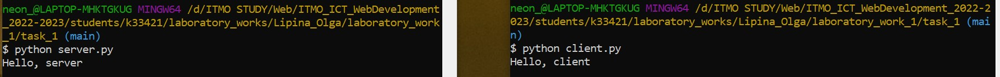
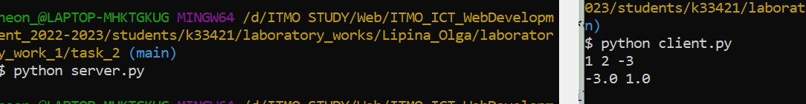
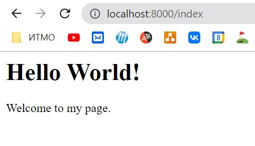
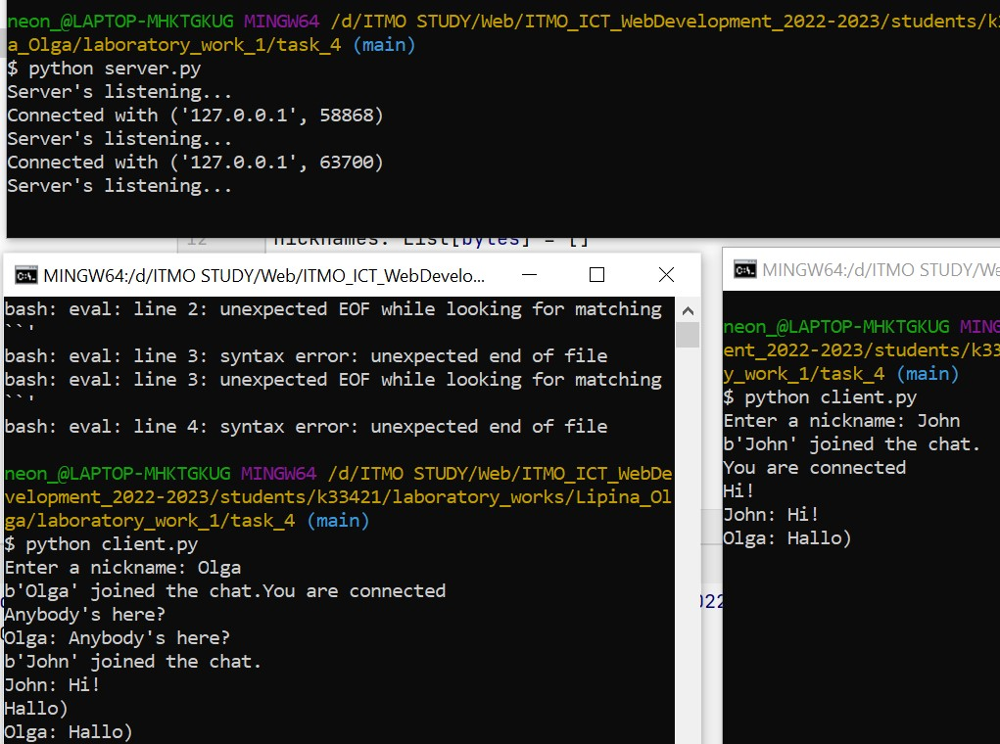
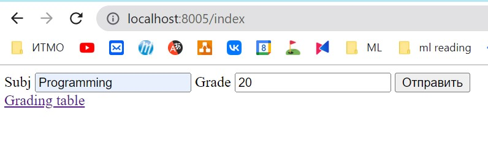
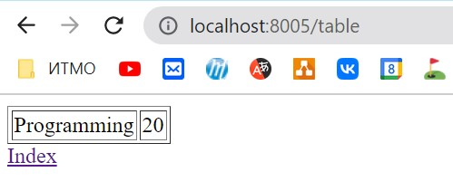

# Лабораторная работа №1

## Задача №1

* `server.py`
```python
import socket
udp_sock = socket.socket(family=socket.AF_INET, type=socket.SOCK_DGRAM)

udp_sock.bind(('', 9090))

# Listen for incoming datagrams
while (True):
    client_msg, address = udp_sock.recvfrom(1024)
    print(client_msg.decode())
    udp_sock.sendto(b"Hello, client", address)

```
* `client.py`
```python
import socket

udp_sock = socket.socket(family=socket.AF_INET, type=socket.SOCK_DGRAM)
udp_sock.sendto(b'Hello, server', ("localhost", 9090))

data, port_address = udp_sock.recvfrom(1024)
print(data.decode())


```



## Задача №2. Решение кв. уравнения.
* `server.py`
```python
import socket
from math import sqrt

def solve_eq(a: float, b: float, c: float):
    d = b**2 - 4*a*c
    return (-b-sqrt(d)) / (2*a), (-b+sqrt(d)) / (2*a)

if __name__ == "__main__":
    sock = socket.socket(family=socket.AF_INET, type=socket.SOCK_STREAM)
    sock.bind(('', 9090))
    sock.listen(1)
    conn, addr = sock.accept() # new socket, client address

    while True:
        data = conn.recv(1024)
        if not data:
            break
        a, b,c = map(float, data.decode().split())
        result = solve_eq(a,b,c)
        msg = f'{result[0]} {result[1]}'.encode()
        conn.send(msg)

    conn.close()
```

* `client.py`
```python
import socket

if __name__ == "__main__":
    sock = socket.socket(family=socket.AF_INET, type=socket.SOCK_STREAM)
    sock.connect(('localhost', 9090))
    abc = input().encode()
    sock.send(abc)

    data = sock.recv(1024)
    print(data.decode())
    sock.close()
```


## Задача №3
* `server.py`
```python
import socket

s = socket.socket(socket.AF_INET, socket.SOCK_STREAM)
s.bind(('localhost', 8002))
s.listen(1)

while True:
    conn, addr = s.accept()
    html_page = open('index.html')
    html_content = html_page.read()
    html_page.close()

    html_response = 'HTTP/1.0 200 OK\n' + html_content 

    conn.sendall(html_response.encode('utf-8'))
    conn.close()
#sock.close()
```

* `client.py`
```python
import socket 

s = socket.socket(socket.AF_INET, socket.SOCK_STREAM)

s.connect(('localhost',8002))
data = s.recv(1024) #получаем сообщение из сокета.
print(data.decode('utf-8'))
s.close()
```


* `index.html`
```html
<html>
<head>
    <title>Hello World</title>
</head>
<body>
    <h1>Hello World!</h1>
    <p>Welcome to my page.</p>
</body>
</html>
```


## Задача №4
* `server.py`
```python
import threading
import socket

from typing import List

host ='localhost'
port = 8000
server = socket.socket(socket.AF_INET, socket.SOCK_STREAM)
server.bind((host, port))
server.listen()
clients: List[socket.socket] = []
nicknames: List[bytes] = []


def broadcast(message: bytes):
    for client in clients:
        client.send(message)


def handle_client(client):
    """Getting client message and sending it to chat.
    In case of error (client disconnect) delete client from chat."""
    while True:
        try:
            message = client.recv(1024)
            broadcast(message)
        except: # any connection error or value error
            idx = clients.index(client)
            clients.remove(idx)
            broadcast(f"{nicknames[idx]} has left the chat.".encode())
            nicknames.remove(idx)
            client.close()
            break

def recieve_cons():
    while True:
        print("Server's listening...")
        client, address = server.accept()
        print(f"Connected with {address}")
        client.send("Send a nickname".encode())
        nickname = client.recv(1024)
        nicknames.append(nickname)
        clients.append(client)
        broadcast(f"{nickname} joined the chat.".encode())
        client.send("You are connected".encode())
        thread = threading.Thread(target=handle_client, args=(client, ))
        thread.start()

if __name__ == "__main__":
    recieve_cons()


```

* `client.py`
```python
import threading
import socket

nickname = input('Enter a nickname: ')
client = socket.socket(socket.AF_INET, socket.SOCK_STREAM)
client.connect(('localhost', 8000))

def recieve_mes():
    while True:
        try:
            message = client.recv(1024).decode()
            if message == "Send a nickname":
                client.send(nickname.encode())
            else:
                print(message)
        except:
            print('Error occurred. Disconnect.')
            client.close()
            break

def send_mes():
    while True:
        message = f"{nickname}: {input('')}".encode()
        client.send(message)


thread_recieve = threading.Thread(target=recieve_mes)
thread_recieve.start()
thread_send = threading.Thread(target=send_mes)
thread_send.start()

```

## Задача №5

* `server.py`
```python
import socket
import sys
from typing import Dict, Tuple, List


class MyHTTPServer:
    def __init__(self, host, port):
        """ Initializing HTTP server. Creating
        database for saving records of grades.
        :param host: Host address.
        :param port: Free port for server.
        """
        self.host = host
        self.port = port
        self.database: List[Tuple[str, str]] = []
        # tcp connection
        self._conn = socket.socket(socket.AF_INET, socket.SOCK_STREAM)


    def run_server(self):
        """Activates HTTP server."""
        self._conn.bind((self.host, self.port))
        # listen to 1 client.
        self._conn.listen(1)
        while True:
            client, address = self._conn.accept()
            print(f"Connected at {address}")
            self.client_dialogue(client)

    def client_dialogue(self, client: socket.socket):
        """Handling client request and sending response. """
        data = client.recv(4096).decode()
        if data is None:
            return None
        response = self.handle_request(data)
        client.send(response.encode())

    @staticmethod
    def parse_request(data: str) -> Tuple[str, str]:
        """Get request info."""
        data = data.replace("\r", "")
        try:
            # get request from first line
            req = data[:data.index("\n")]
        except ValueError:
            # when we don't send anything
            return data, ""

        if "\n\n" in data:
            body = data[data.index("\n") + 1:].split("\n\n")[1]
        else:
            body = ""
        return req, body

    @staticmethod
    def parse_body(body: str) -> Dict[str, str]:
        """
        Parse body args.
        :param body: body of request
        :return: Dict of args.
        """
        body_dict: Dict[str,str] = {}
        for elem in body.split('&'):
            head_name = elem[:elem.index('=')]
            value = elem[elem.index('=') + 1:].replace('+', ' ')
            body_dict[head_name] = value
        return body_dict

    def handle_request(self, data: str) -> str:
        """Handling user's request and send a page.
        """
        req, body = self.parse_request(data)
        method, url, smt = req.split()
        response = f"{smt} 200 OK\n\n"

        if method == 'GET' and url == '/index':
            with open('index.html') as f:
                response += f.read()

        elif method == 'GET' and url == '/table':
            with open('grading.html') as f:
                lines = f.readlines()
            table = [f"<tr><td>{s}</td><td>{g}</td></tr>" for s, g in self.database]
            response += '\n'.join(lines[:8]) + '\n'.join(table) + '\n'.join(lines[8:])

        elif method == 'POST' and url == '/send':
            parsed_body = self.parse_body(body)
            self.database.append((parsed_body['subject'], parsed_body['grade']))
            return response

        else:
            return f"{smt} 400\n\nBad request\n\n"

        return response


if __name__ == '__main__':
    host = "localhost"
    port = 8005
    serv = MyHTTPServer(host, port)
    serv.run_server()
```

* `grading.html`
```html
<!DOCTYPE html>
<html lang="en">
<head>
    <meta charset="UTF-8">
    <title>Task 5</title>
</head>
<body>
<table border="1">
</table>
<a href="/index">Index</a>
</body>
</html>
```

* `index.html`
```html
<!DOCTYPE html>
<html lang="en">
<head>
    <meta charset="UTF-8">
    <title>Task 5</title>
    <script>
        function submitForm() {
            let http = new XMLHttpRequest();
            http.open("POST", "http://127.0.0.1:8005/send", true);
            http.setRequestHeader("Content-type","application/x-www-form-urlencoded");
            let args = "grade=" + document.getElementById("grade").value + "&subject=" + document.getElementById("subject").value;
            http.send(args);
        }
    </script>
</head>
<body>
<form method="post" action="#" onsubmit="submitForm();return false;">
    <label for="subject">Subj</label>
    <input type="text" name="subject" id="subject"/>
    <label for="grade">Grade</label>
    <input type="number" name="grade" id="grade"/>
    <input type="submit">
</form>
<a href="/table">Grading table</a>
</body>
</html>
```


