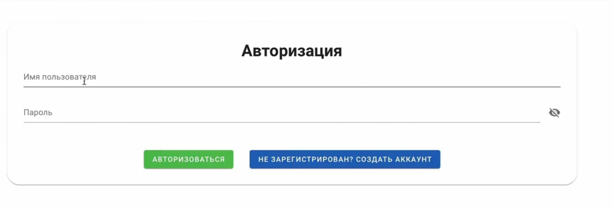
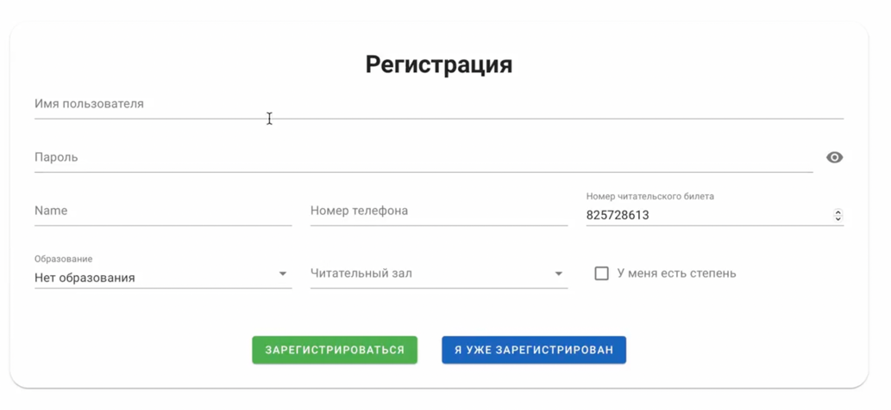
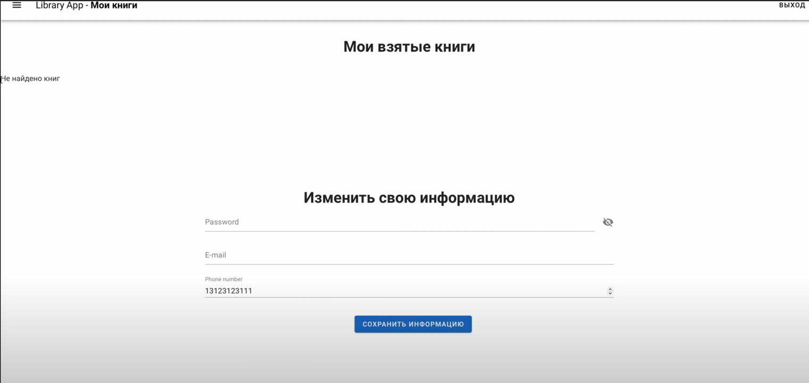
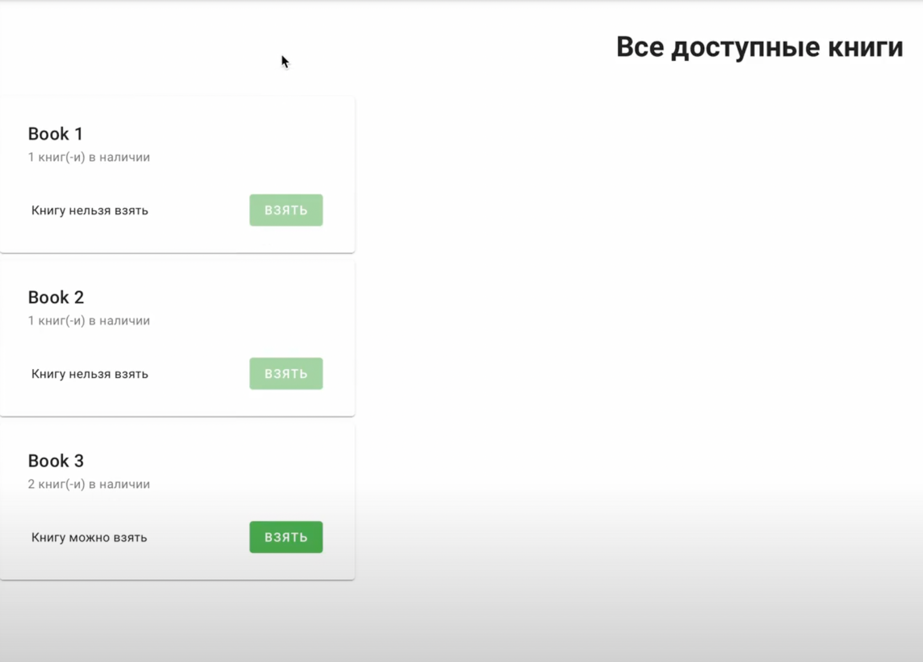
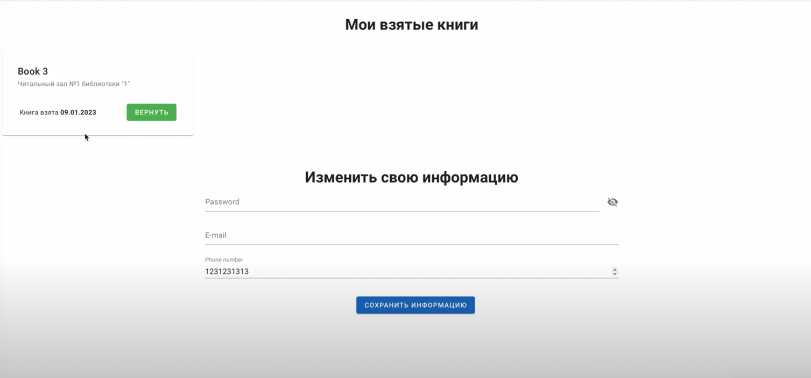

# Лабораторная работа №4

* `"Экран авторизации"`

* `"Экран регистрации"`

* `"Главный экран"` \
Взятые книги. 
Возможность изменить информацию.

* `"Доступные книги в библиотеке"`

* `"Отображение книг на главном экране"`

