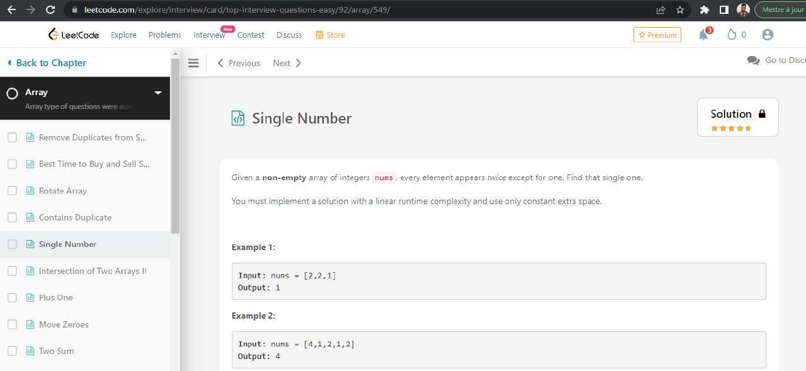

# Лабораторная работа 4.

### Вариант 1: Са**йт администратора отеля**

### **Описание работы** <a href="#_1" id="_1"></a>

* Настроить для серверной части, реализованной в лабораторной работе №3 CORS (Cross-origin resource sharing) в соответствии с Практической работой 4.3
* Утвердить с одним из преподавателей список интерфейсов для взаимодействия с серверной частью в соответствии с вашей предметной областью
* Реализовать интерфейсы авторизации, регистрации и изменения учётных данных и настроить взаимодействие с серверной частью
* Реализовать клиентские интерфейсы и настроить взаимодействие с серверной частью (интерфейсы из пункта 4)
* Подключить vuetify или аналогичную библиотеку
* Реализовать документацию, описывающую работу разработанных интерфейсов средствами MkDocs.

### Основные файлы с кодом

* App.vue

```javascript
<template>
  <div class="app">
    <!-- Nav component -->
    <Nav class="nav-component fixed-top" />

    <!-- If data fetching is not complete, we are showing a div with loading text-->
    <div v-if="!data">Loading...</div>

    <!-- If data fetching is successful and we have the data then we are showing the main component -->
    <main v-else class="main">
      <router-view
        @setGuestData="getGuestData"
        @sendGuestInfo="getGuestInfo"
        :hotelsData="data"
        :guestData="guestData"
        :allGuestInfo="allGuestInfo"
      />
    </main>
  </div>
</template>

<script>
import Nav from "./components/Nav.vue";

export default {
  data() {
    return {
      data: null,
      guestData: null,
      allGuestInfo: null,
    };
  },
  components: {
    Nav,
  },
  methods: {
    //Takes guest data (adult/children guest number, checkin/checkout date, how many days to stay, location)
    getGuestData(val) {
      this.guestData = val;
    },
    //Getting all form data for each guest from child component when all forms are completed by guests
    getGuestInfo(val) {
      this.allGuestInfo = val;
    },
  },
  created() {
    //Fetch data when app component is created
    fetch("data.json")
      .then((res) => res.json())
      .then((res) => (this.data = res));
  },
  mounted() {
    //Add guest data to localStorage and get it back from localStrorage if it exists
    if (localStorage.getItem("guestData")) {
      try {
        this.guestData = JSON.parse(localStorage.getItem("guestData"));
      } catch (e) {
        localStorage.removeItem("guestData");
      }
    }
  },
  watch: {
    //Wathcing changes in guest data to add it to localStorage when it is changed
    guestData(newData) {
      const parsed = JSON.stringify(newData);
      localStorage.setItem("guestData", parsed);
    },
  },
};
</script>

<style scoped>
.app {
  width: 100%;
  max-width: 1280px;
  margin: 0 auto;
}
.nav-component {
  max-width: 1280px;
  margin: 0 auto;
}
</style>

```

* main.js

```javascript
import Vue from "vue";
import App from "./App.vue";
import router from "./router";
import Vuelidate from "vuelidate";
import html2pdf from "html2pdf.js";

Vue.use(Vuelidate);
Vue.use(html2pdf);

Vue.config.productionTip = false;

new Vue({
  router,
  render: (h) => h(App),
}).$mount("#app");

```

#### Mixins

* filters.js

```javascript
export default {
  //This filter is used to transform prices to locale string with $ sign(example 3457 => $ 3,457)
  filters: {
    dollarSign(value) {
      return `$ ${value.toLocaleString("en-US")}`;
    },
  },
};

```

* formvalidation.js

```javascript
import { required, minLength, minValue, email } from "vuelidate/lib/validators";


//HES Code checking algorithm for validation
function hesCheck(val) {
  let reg = /^[A-Z][0-9][A-Z][0-9]-[0-9][0-9][0-9][0-9]-[0-9][0-9]$/g;
  return reg.test(val);
}

//Phone format checking algorithm (format => 5557778899)
function phoneCheck(val) {
  let reg = /^\d{10}$/;
  if (val === "") return true;
  else return reg.test(val);
}

export const FormValidation = {
  validations: {
    fname: {
      required,
      minLength: minLength(3),
    },
    lname: {
      required,
      minLength: minLength(3),
    },
    age: {
      required,
      minValue: minValue(6),
    },
    email: {
      required,
      email,
    },
    sex: {
      required,
    },
    hes: {
      required,
      hesCheck,
    },
    phone: {
      required,
      phoneCheck,
    },
  },
};

```

#### router

* index.js

```javascript
import Vue from "vue";
import VueRouter from "vue-router";
import Home from "../views/Home.vue";

Vue.use(VueRouter);

const routes = [
  {
    path: "/",
    name: "Home",
    props: true,
    component: Home,
  },
  {
    path: "/hotels",
    name: "HotelResults",
    props: true,
    component: () =>
      import(/* webpackChunkName: "Hotels" */ "../views/HotelResults.vue"),
  },
  {
    path: "/hotels/:name",
    name: "HotelDetails",
    props: true,
    component: () =>
      import(/* webpackChunkName: "Hotels" */ "../views/HotelDetails.vue"),
  },
  {
    path: "/reservation",
    name: "Reservation",
    props: true,
    component: () =>
      import(/* webpackChunkName: "Reservation" */ "../views/Reservation.vue"),
  },
  {
    path: "/payment",
    name: "Payment",
    props: true,
    component: () =>
      import(/* webpackChunkName: "Reservation" */ "../views/Payment.vue"),
  },
];

const router = new VueRouter({
  mode: "history",
  routes,
});

export default router;

```

### Components

* nav.vue

```
<template>
  <nav class="navbar navbar-expand-lg navbar-dark">
    <div class="container-fluid">
      <!--Clickable company logo routing to the home page-->
      <router-link class="navbar-brand me-5" :to="{ name: 'Home' }"
        ></router-link>
      <button
        class="navbar-toggler"
        type="button"
        data-bs-toggle="collapse"
        data-bs-target="#navbarSupportedContent"
        aria-controls="navbarSupportedContent"
        aria-expanded="false"
        aria-label="Toggle navigation"
      >
        <span class="navbar-toggler-icon"></span>
      </button>
      <!--Navigation links all routing to the home page-->
      <div class="collapse navbar-collapse" id="navbarSupportedContent">
        <ul class="navbar-nav mb-2 mb-lg-0">
          <li class="nav-item">
            <router-link class="nav-link active" :to="{ name: 'Home' }"
              ><i class="fa fa-bed me-2" aria-hidden="true"></i
              >Stays</router-link
            >
          </li>
          <li class="nav-item">
            <router-link class="nav-link" :to="{ name: 'Home' }"
              ><i class="fa fa-plane me-2" aria-hidden="true"></i
              >Flights</router-link
            >
          </li>
          <li class="nav-item">
            <router-link class="nav-link" :to="{ name: 'Home' }"
              ><i class="fa fa-car me-2" aria-hidden="true"></i>Car
              Rentals</router-link
            >
          </li>
        </ul>
      </div>
    </div>
  </nav>
</template>

<script>
export default {
  name: "Nav",
};
</script>

<style scoped>
.navbar {
  background-color: #043580;
  color: white;
  padding: 20px 50px;
}

.navbar-brand {
  width: 150px;
}

.navbar-nav {
  font-size: 14px;
  font-weight: 600;
  text-decoration: none;
}

.nav-item {
  font-size: 14px;
  font-weight: 500;
  width: 120px;
  height: 40px;
  text-align: center;
}

.nav-item:first-child {
  border: 1px solid white;
  border-radius: 30px;
  background-color: #1a4a8d;
}
</style>

```

* Resform.vue

```
<template>
  <div class="testbox d-flex flex-column">
    <form>
      <fieldset>
        <legend class="rounded">Guest - {{ num }}</legend>
        <div class="columns">
          <!-- Name input area and validations -->
          <div class="item">
            <div
              class="form-group"
              :class="{ 'form-group--error': $v.fname.$error }"
            ></div>
            <label class="form__label" for="fname"
              >First Name<span>*</span></label
            >
            <input
              class="form__input"
              v-model.trim="$v.fname.$model"
              id="fname"
              type="text"
              name="fname"
              placeholder="Fatih"
              ref="input"
            />
            <div class="error" v-if="!$v.fname.required && $v.fname.$dirty">
              Name is required
            </div>
            <div class="error" v-if="!$v.fname.minLength">
              Name must have at least
              {{ $v.fname.$params.minLength.min }} letters.
            </div>
          </div>
          <!-- Last name input area and validations -->
          <div class="item">
            <div
              class="form-group"
              :class="{ 'form-group--error': $v.lname.$error }"
            ></div>
            <label class="form__label" for="lname">
              Last Name<span>*</span></label
            >
            <input
              class="form__input"
              v-model.trim="$v.lname.$model"
              id="lname"
              type="text"
              name="lname"
              placeholder="Ozoglu"
            />
            <div class="error" v-if="!$v.lname.required && $v.lname.$dirty">
              Last name is required
            </div>
            <div class="error" v-if="!$v.lname.minLength">
              Name must have at least
              {{ $v.lname.$params.minLength.min }} letters.
            </div>
          </div>
          <!-- Age input area and validations -->
          <div class="item">
            <div
              class="form-group"
              :class="{ 'form-group--error': $v.age.$error }"
            >
              <label class="form__label" for="age">Age<span>*</span></label>
              <input
                class="form__input"
                id="age"
                type="number"
                name="age"
                v-model.trim="$v.age.$model"
                placeholder="Must be older than 6"
              />
            </div>
            <div class="error" v-if="!$v.age.required && $v.age.$dirty">
              Age is required
            </div>
            <div class="error" v-if="!$v.age.minValue">
              Must be older than {{ $v.age.$params.minValue.min }}
            </div>
          </div>
          <!-- Sex input area and validations -->
          <div class="item">
            <div
              class="form-group"
              :class="{ 'form-group--error': $v.sex.$error }"
            ></div>
            <label class="d-block mb-1" for="sex">Sex<span>*</span></label>
            <select v-model.trim="$v.sex.$model" name="sex" id="sex">
              <option value="" disabled selected>Select Your Sex</option>
              <option value="male">Male</option>
              <option value="female">Female</option>
              <option value="other">Other</option>
            </select>

            <div class="error" v-if="!$v.sex.required && $v.sex.$dirty">
              Please enter your sex
            </div>
          </div>
          <!-- T.C. Identity No. input area and validations -->
          <!-- HES Code input area and validations -->
          <div class="item">
            <div
              class="form-group"
              :class="{ 'form-group--error': $v.hes.$error }"
            ></div>
            <label for="hes">HES Code<span>*</span></label>
            <input
              v-model.trim="$v.hes.$model"
              id="hes"
              type="text"
              name="hes"
              placeholder="C5V9-4567-24"
            />
            <div class="error" v-if="!$v.hes.required && $v.hes.$dirty">
              Please enter your HES Code
            </div>
            <div
              class="error"
              v-if="$v.hes.$model !== '' && !$v.hes.hesCheck && $v.hes.$dirty"
            >
              Please enter a valid HES Code
            </div>
          </div>
          <!-- E-mail input area and validations -->
          <div class="item">
            <div
              class="form-group"
              :class="{ 'form-group--error': $v.email.$error }"
            ></div>
            <label class="form__label" for="email"
              >Email Address<span>*</span></label
            >
            <input
              class="form__input"
              v-model.trim="$v.email.$model"
              id="email"
              type="email"
              name="email"
              placeholder="fatihozoglu@yahoo.com"
            />
            <div class="error" v-if="!$v.email.required && $v.email.$dirty">
              Email is required
            </div>
            <div class="error" v-if="!$v.email.email">
              Please enter a valid e-mail adress
            </div>
          </div>
          <!-- Phone input area and validations -->
          <div class="item">
            <div
              class="form-group"
              :class="{ 'form-group--error': $v.phone.$error }"
            ></div>
            <label for="phone">Phone<span>*</span></label>
            <input
              v-model.trim="$v.phone.$model"
              id="phone"
              type="tel"
              name="phone"
              placeholder="5395845151"
            />
            <div class="error" v-if="!$v.phone.required && $v.phone.$dirty">
              Phone number is required
            </div>
            <div class="error" v-if="!$v.phone.phoneCheck && $v.phone.$dirty">
              Please enter a valid phone number
            </div>
          </div>
        </div>
      </fieldset>
      <br />
      <!-- Showing "Next Guest" button for forms except the last form item-->
      <button v-if="id !== totalGuests - 1" @click.prevent="checkCompletion">
        Next Guest
      </button>
      <!-- Showing "Go to Payment" button for the last form item to route to /payment Payment view component -->
      <button v-else @click.prevent="goPayment">Go to Payment</button>
    </form>
  </div>
</template>

<script>
import { FormValidation } from "../mixins/FormValidation";

export default {
  name: "ResForm",
  mixins: [FormValidation],
  data() {
    return {
      fname: "",
      lname: "",
      age: "",
      email: "",
      sex: "",
      hes: "",
      phone: "",
    };
  },
  props: {
    num: Number,
    form: String,
    id: Number,
    totalGuests: Number,
    allGuestInfo: Array,
    selectedHotel: Object,
  },
  methods: {
    focus() {
      this.$refs.input.focus();
    },
    //Checking the form if it is completed and there is no error, if it is complete focusing next form else giving validation error
    checkCompletion() {
      if (this.$v.$dirty && !this.$v.$invalid) {
        this.$emit("formCompleted", {
          formId: this.id,
          fname: this.fname,
          lname: this.lname,
          age: this.age,
          email: this.email,
          sex: this.sex,
          hes: this.hes,
          phone: this.phone,
        });
      } else {
        this.$v.$touch();
      }
    },
    //Checking if all forms are complete and if they are, routing to /payment route
    goPayment() {
      this.checkCompletion();
      if (this.allGuestInfo.length === this.totalGuests) {
        this.$emit("goPayment");
        this.$router.push({
          name: "Payment",
          params: { selectedHotel: this.selectedHotel },
        });
      }
    },
  },
};
</script>

<style scoped>
div,
form,
input,
select,
textarea,
label {
  padding: 0;
  margin: 0;
  outline: none;
  font-family: Roboto, Arial, sans-serif;
  font-size: 14px;
  color: #666;
  line-height: 22px;
}
h1 {
  position: absolute;
  margin: 0;
  font-size: 50px;
  color: #fff;
  z-index: 2;
  line-height: 83px;
}
legend {
  padding: 10px;
  font-family: Roboto, Arial, sans-serif;
  font-size: 18px;
  color: #fff;
  background-color: #1a4a8d;
}
textarea {
  width: calc(100% - 12px);
  padding: 5px;
}
.testbox {
  display: flex;
  justify-content: center;
  align-items: center;
  height: inherit;
  padding: 20px;
}
form {
  width: 100%;
  padding: 20px;
  border-radius: 6px;
  background: #fff;
  box-shadow: 0 0 8px #1a4a8d;
}
input,
select,
textarea {
  margin-bottom: 10px;
  border: 1px solid #ccc;
  border-radius: 3px;
}
input {
  width: calc(100% - 10px);
  padding: 5px;
}
input[type="date"] {
  padding: 4px 5px;
}
textarea {
  width: calc(100% - 12px);
  padding: 5px;
}
select {
  height: 30px;
}
.item:hover p,
.item:hover i,
.item input:hover,
.item select:hover,
.item textarea:hover {
  border: 1px solid transparent;
  box-shadow: 0 0 3px 0 #1a4a8d;
  color: #1a4a8d;
}
.item {
  position: relative;
  margin: 10px 0;
}
.item span {
  color: red;
}
.item i {
  right: 1%;
  top: 30px;
  z-index: 1;
}
.columns {
  display: flex;
  justify-content: space-between;
  flex-direction: row;
  flex-wrap: wrap;
}
.columns div {
  width: 48%;
}
.btn-block {
  margin-top: 10px;
  text-align: center;
}
button {
  width: 100%;
  padding: 10px;
  border: none;
  border-radius: 5px;
  background: #1a4a8d;
  font-size: 16px;
  color: #fff;
  cursor: pointer;
}
button:hover {
  background: #14396d;
}
.error {
  color: red;
}
@media (min-width: 568px) {
  .name-item,
  .city-item {
    display: flex;
    flex-wrap: wrap;
    justify-content: space-between;
  }
  .name-item input,
  .name-item div {
    width: calc(50% - 20px);
  }
  .name-item div input {
    width: 97%;
  }
  .name-item div label {
    display: block;
    padding-bottom: 5px;
  }
}
</style>

```

### Views

* home.vue

<figure><figcaption><p>home page</p></figcaption></figure>

```
<template>
  <main class="home">
    <h1 class="home-heading mb-0">
      Find deals on hotels, homes, and much more...
    </h1>
    <p class="home-text mb-5">
      From Brazzaville country homes to Saint-Petersbourg city apartments
    </p>
    <!-- All inputs are enclosed into input-container -->
    <div class="input-container">
      <input
        v-model="location"
        class="location-input"
        type="text"
        placeholder="Where are you going?"
      />
      <!-- Date inputs starts here-->
      <div class="date-input-container">
        <span style="width: 45%; text-align: center">{{ checkinDate }}</span>
        <span style="width: 10%">-</span>
        <span style="width: 45%; text-align: start">{{ checkoutDate }}</span>
        <input v-model="checkinDate" class="datepicker-input" type="date" />
        <input
          v-model="checkoutDate"
          class="datepicker-input checkout"
          type="date"
        />
      </div>
      <!-- Date inputs ends here-->

      <!-- Toggling guest input number selection when mouse enters and leaves the input area-->
      <div
        class="guest-input"
        @mouseenter="isSelectionOpen = true"
        @mouseleave="isSelectionOpen = false"
      >
        <div class="guest-input-header">
          <span class="me-2">{{ adultNum }} Adults</span
          ><span class="me-2">-</span
          ><span class="me-2">{{ childrenNum }} Children</span
          ><span class="me-2">-</span>
          <span>{{ roomNum }} Room</span>
        </div>
        <div v-show="isSelectionOpen" class="guest-input-body w-100">
          <div class="d-flex align-items-center w-100 mb-3">
            <span class="w-50">Adult</span>
            <div class="d-flex align-items-center w-50">
              <button
                @click="adultNum === 1 ? null : adultNum--"
                class="guest-btn"
              >
                -</button
              ><span class="count-span ms-3 me-3">{{ adultNum }}</span
              ><button
                @click="adultNum === 10 ? null : adultNum++"
                class="guest-btn"
              >
                +
              </button>
            </div>
          </div>
          <div class="d-flex align-items-center w-100 mb-3">
            <span class="w-50">Children</span>
            <div class="d-flex align-items-center w-50">
              <button
                @click="childrenNum === 0 ? null : childrenNum--"
                class="guest-btn"
              >
                -</button
              ><span class="count-span ms-3 me-3">{{ childrenNum }}</span
              ><button
                @click="childrenNum === 10 ? null : childrenNum++"
                class="guest-btn"
              >
                +
              </button>
            </div>
          </div>
          <div class="d-flex align-items-center w-100">
            <span class="w-50">Room</span>
            <div class="d-flex align-items-center w-50">
              <button
                @click="roomNum === 1 ? null : roomNum--"
                class="guest-btn"
              >
                -</button
              ><span class="count-span ms-3 me-3">{{ roomNum }}</span
              ><button
                @click="roomNum === 10 ? null : roomNum++"
                class="guest-btn"
              >
                +
              </button>
            </div>
          </div>
        </div>
      </div>
      <!--Accomodation information is sent to parent(App) component and goes to HotelResults route-->
      <router-link class="search-button" :to="{ name: 'HotelResults' }"
        ><button @click="setGuestData">Search</button></router-link
      >
    </div>

    <!-- Some city photos and names for decoration -->
    <h2>Destination Ideas</h2>
    <div class="destination-ideas">
      <div class="destination1">
        <p class="dest-name">Saint Petersbourg</p>
      </div>
      <div class="destination2">
        <p class="dest-name">Moscou</p>
      </div>
      <div class="destination3">
        <p class="dest-name">Brazzaville</p>
      </div>
    </div>
  </main>
</template>

<script>
export default {
  name: "Home",
  data() {
    return {
      isSelectionOpen: false,
      location: "Petersbourg",
      checkinDate: null,
      checkoutDate: null,
      adultNum: 1,
      childrenNum: 0,
      roomNum: 1,
    };
  },
  methods: {
    //When inputs are filled by the guest and search button clicked, emits setGuestData event and sends data to parent(App) component
    setGuestData() {
      this.$emit("setGuestData", {
        location: this.location,
        adult: this.adultNum,
        children: this.childrenNum,
        room: this.roomNum,
        days: this.calculateDays,
        checkinDate: this.checkinDate,
        checkoutDate: this.checkoutDate,
      });
    },
    // Getting current date and giving it as initial value to checkinDate
    today() {
      let today = new Date();
      today = `${today.getFullYear()}-${today.getMonth() + 1}-${
        today.getDate().length === 2 ? today.getDate() : "0" + today.getDate()
      }`;
      this.checkinDate = today;
    },
    //Getting tomorrow date and giving it as initial value to checkoutDate
    tomorrow() {
      let today = Date.now();
      let tomorrow = new Date(today + 86400000);
      tomorrow = `${tomorrow.getFullYear()}-${tomorrow.getMonth() + 1}-${
        tomorrow.getDate().length === 2
          ? tomorrow.getDate()
          : "0" + tomorrow.getDate()
      }`;
      this.checkoutDate = tomorrow;
    },
  },
  computed: {
    //Calculates the accommodation days based on checkin and checkout dates
    calculateDays() {
      let checkin = new Date(this.checkinDate);
      let checkout = new Date(this.checkoutDate);
      if (checkin >= checkout) {
        this.today();
        this.tomorrow();
        return 1;
      } else {
        let difference = checkout.getTime() - checkin.getTime();
        return difference / (1000 * 3600 * 24);
      }
    },
  },
  mounted() {
    // Set checkin and checkout dates as today and tomorrow when the component is mounted
    this.today();
    this.tomorrow();
  },
};
</script>

<style scoped>
.home {
  min-height: 100vh;
  padding: 130px 60px 30px 60px;
  background-color: #f5f5f5;
  color: rgb(51, 51, 51);
}
.home-heading {
  font-size: 24px;
  font-weight: 600;
}
.home-text {
  font-size: 14px;
  font-weight: 400;
}
.input-container {
  width: 100%;
  border: 4px solid #fcbb01;
  border-radius: 5px;
  display: grid;
  grid-template-columns: repeat(7, 1fr);
  margin-bottom: 50px;
}
.location-input,
.date-input-container {
  height: 52px;
  outline: none;
  border: none;
  padding-left: 50px;
  display: flex;
  align-items: center;
}
.location-input {
  grid-column-start: 1;
  grid-column-end: 3;
  background-image: url("https://cf.bstatic.com/static/img/cross_product_index/accommodation/07ca5cacc9d77a7b50ca3c424ecd606114d9be75.svg");
  background-repeat: no-repeat;
  background-position-x: 15px;
  background-position-y: center;
  border-right: 4px solid #fcbb01;
}
.date-input-container {
  font-size: 16px;
  position: relative;
  grid-column-start: 3;
  grid-column-end: 5;
  background-color: white;
  background-image: url("https://cdn2.iconfinder.com/data/icons/web/512/Calendar-512.png");
  background-size: 20px;
  background-repeat: no-repeat;
  background-position-x: 15px;
  background-position-y: center;
  border-right: 4px solid #fcbb01;
}
.datepicker-input {
  position: absolute;
  left: 0;
  top: 0;
  width: 50%;
  height: 100%;
  opacity: 0;
  cursor: pointer;
  box-sizing: border-box;
}
.datepicker-input::-webkit-calendar-picker-indicator {
  position: absolute;
  left: 0;
  top: 0;
  width: 100%;
  height: 100%;
  margin: 0;
  padding: 0;
  cursor: pointer;
}
.checkout {
  position: absolute;
  left: 50%;
  top: 0;
  width: 50%;
}
.guest-input {
  position: relative;
  height: 52px;
  grid-column-start: 5;
  grid-column-end: 7;
  padding-left: 45px;
  background-color: white;
  background-image: url(//cf.bstatic.com/static/img/cross_product_index/guest/b2e5f2aa32b71ca0fc66aa671e4e958bcd69b7d0.svg);
  background-size: 16px;
  background-repeat: no-repeat;
  background-position-x: 15px;
  background-position-y: center;
  display: flex;
  align-items: center;
  cursor: pointer;
  border-right: 4px solid #fcbb01;
}
.guest-input-body {
  padding: 20px;
  background-color: white;
  position: absolute;
  top: 52px;
  left: 0;
}
.guest-btn {
  width: 40px;
  height: 40px;
  background-color: white;
  color: #005999;
  border: 1px solid #005999;
  border-radius: 3px;
}
.guest-btn:hover {
  color: white;
}
.search-button {
  grid-column-start: 7;
  grid-column-end: 8;
}
.count-span {
  width: 20%;
  text-align: center;
}
button {
  font-size: 20px;
  font-weight: 500;
  border: none;
  outline: none;
  color: white;
  background-color: #1471c2;
  height: 100%;
  width: 100%;
}
button:hover {
  background-color: #005999;
}
h2 {
  font-size: 24px;
  font-weight: 600;
  color: black;
}
.destination-ideas {
  width: 100%;
  min-height: 250px;
  display: grid;
  grid-template-columns: 1fr 1fr 1fr;
  column-gap: 20px;
}
.destination1 {
  background: url(https://cf.bstatic.com/xdata/images/city/540x270/689394.webp?k=23b0050a839e18850cc6b64186787bdd846385ae280f2bdff2ced0a438f72112&o=)
    no-repeat center center;
  background-size: cover;
}
.destination2 {
  background: url(https://cf.bstatic.com/xdata/images/city/540x270/856674.webp?k=70a9589c2f7d2fc175c3ac02c55702c2e433f588866756a394cddfe215170f38&o=)
    no-repeat center center;
  background-size: cover;
}
.destination3 {
  background: url(https://cf.bstatic.com/xdata/images/city/540x270/689373.webp?k=653f4e64198a8728a4ca792a53cc44103b1c1ab8ab3a0328033fb253383ea13e&o=)
    no-repeat center center;
  background-size: cover;
}
.dest-name {
  background: linear-gradient(
    0deg,
    rgba(255, 255, 255, 0) 0%,
    rgba(38, 38, 38, 1) 100%
  );
  padding: 10px 20px;
  font-size: 30px;
  font-weight: 600;
  color: rgb(241, 241, 241);
  text-shadow: 1px 1px #030303;
}
.error {
  color: red;
}

@media only screen and (max-width: 1000px) {
  .input-container {
    grid-template-columns: 1fr;
  }
  .location-input,
  .date-input-container,
  .guest-input {
    grid-column-start: 1;
    grid-column-end: 2;
    border-right: none;
    border-bottom: 4px solid #fcbb01;
  }
  .search-button {
    grid-column-start: 1;
    grid-column-end: 2;
    height: 52px;
  }
}
@media only screen and (max-width: 800px) {
  .destination-ideas {
    grid-template-columns: 1fr;
    gap: 20px;
  }
  .destination1,
  .destination2,
  .destination3 {
    height: 250px;
  }
}
</style>

```

* HomeDetails.vue

<figure><figcaption><p>Booking details</p></figcaption></figure>

```
<template>
  <main class="main">
    <!-- Hotel details information is shown here(name, stars, adress)-->
    <div class="d-flex">
      <h4 class="hotel-name m-0 me-2">{{ selectedHotel.name }}</h4>
      <Star class="m-0" :num="selectedHotel.star" />
    </div>
    <p class="hotel-location">
      <i
        style="color: #1677cc; font-size: 20px"
        class="fa fa-map-marker me-2"
        aria-hidden="true"
      ></i
      >{{ selectedHotel.adress }}
    </p>
    <div class="d-flex gap-5">
      <!-- Carousel for showing selected hotel's detail photos -->
      <div
        id="carouselExampleFade"
        class="carousel slide carousel-fade w-50"
        data-bs-ride="carousel"
      >
        <div class="carousel-inner">
          <div
            v-for="(item, index) in selectedHotel.detailPhotos"
            :key="index"
            class="carousel-item"
            :class="[index === 1 ? 'active' : '']"
          >
            
          </div>
        </div>
        <button
          class="carousel-control-prev"
          type="button"
          data-bs-target="#carouselExampleFade"
          data-bs-slide="prev"
        >
          <span class="carousel-control-prev-icon" aria-hidden="true"></span>
          <span class="visually-hidden">Previous</span>
        </button>
        <button
          class="carousel-control-next"
          type="button"
          data-bs-target="#carouselExampleFade"
          data-bs-slide="next"
        >
          <span class="carousel-control-next-icon" aria-hidden="true"></span>
          <span class="visually-hidden">Next</span>
        </button>
      </div>
      <!-- Carousel ends here -->

      <!-- Shows the booking details(checkin date, checkout date, days, room number, price) -->
      <div class="w-50">
        <h2 class="heading">Booking Details</h2>
        <div
          class="
            booking-details
            w-100
            p-3
            d-flex
            align-items-start
            justify-content-between
            mb-3
          "
        >
          <div>
            <p class="m-0 details-heading">Check-in Date</p>
            <p class="m-0 details-body">{{ guestData.checkinDate }}</p>
            <small class="m-0">From 02:00 PM</small>
          </div>
          <div>
            <p class="m-0 details-heading">Check-out Date</p>
            <p class="m-0 details-body">{{ guestData.checkoutDate }}</p>
            <small class="m-0">{{ guestData.days }} night(s) stay</small>
          </div>
          <div>
            <p class="m-0 details-heading">Guests</p>
            <p class="m-0 details-body">{{ guestData.adult }} Adult(s)</p>
            <p class="m-0 details-body" v-if="guestData.children !== 0">
              {{ guestData.children }} Children
            </p>
          </div>
        </div>
        <div
          class="
            booking-details
            w-100
            p-3
            d-flex
            align-items-start
            justify-content-between
            mb-4
          "
        >
          <div>
            <p class="m-0 details-heading">Rooms</p>
            <p class="m-0 details-body">{{ guestData.room }} Room(s)</p>
          </div>
          <div>
            <p class="m-0 details-heading">Room Price</p>
            <p class="m-0 details-body">
              {{
                (selectedHotel.price * guestData.room * guestData.days)
                  | dollarSign
              }}
            </p>
          </div>
          <div>
            <p class="m-0 details-heading">Taxes</p>
            <p class="m-0 details-body">
              {{
                ((selectedHotel.price * guestData.room * guestData.days * 18) /
                  100)
                  | dollarSign
              }}
            </p>
          </div>
          <div>
            <p class="m-0 details-heading">Total Price</p>
            <p class="m-0 details-body">
              {{
                (selectedHotel.price * guestData.room * guestData.days +
                  (selectedHotel.price * guestData.room * guestData.days * 18) /
                    100)
                  | dollarSign
              }}
            </p>
          </div>
        </div>

        <!-- Route for going reservation page and sending selected hotel information to the reservation page -->
        <router-link
          :to="{
            name: 'Reservation',
            params: { selectedHotel: selectedHotel },
          }"
          ><button class="book-btn rounded w-100">Book Now</button></router-link
        >
      </div>
    </div>
  </main>
</template>

<script>
import Star from "../components/Star.vue";
import dollarSign from "../mixins/Filters";

export default {
  name: "HotelDetails",
  data() {
    return {
      selectedHotel: null,
    };
  },
  mixins: [dollarSign],
  props: {
    hotelsData: {
      type: Array,
      required: true,
    },
    name: {
      type: String,
      required: true,
    },
    guestData: { type: Object, required: true },
  },
  components: {
    Star,
  },
  // Shows the selected hotel based on the name parameter coming from router in hotels/hotel-name-here format
  created() {
    this.selectedHotel = this.hotelsData.find(
      (item) => item.name.split(" ").join("-") === this.name
    );
  },
};
</script>

<style scoped>
.main {
  background-color: #f5f5f5;
  padding: 120px 50px 50px 50px;
  min-height: 100vh;
}
.carousel {
  width: 50%;
}
.book-btn {
  text-decoration: none;
  padding: 20px 100px;
  color: white;
  background-color: #1a4a8d;
  border: none;
}
.book-btn:hover {
  background-color: #043580;
}
.hotel-name {
  font-size: 25px;
  font-weight: 700;
}
.hotel-location {
  font-size: 14px;
  font-weight: 400;
}
.booking-details {
  border: 1px solid rgb(197, 197, 197);
  border-radius: 3px;
}
.heading {
  font-size: 24px;
  font-weight: 600;
  color: rgb(51, 51, 51);
}
.details-heading {
  font-size: 14px;
  font-weight: 700;
}
.details-body {
  font-size: 16px;
  font-weight: 700;
  color: rgb(0, 113, 194);
}
small {
  font-size: 14px;
  font-weight: 400;
  color: #6b6b6b;
}
</style>

```

* HotelResults.vue

<figure><figcaption><p>Results</p></figcaption></figure>

```
<template>
  <div class="main">
    <!-- This part shows the guest preferences based on inputs in home page -->
    <div class="search-area">
      <h2>Search</h2>
      <div class="w-100 mb-1">
        <label> Destination/Property Name: </label>
        <div class="search-input d-flex align-items-center ps-2">
          <svg
            aria-hidden="true"
            fill="#333333"
            focusable="false"
            height="20"
            role="presentation"
            width="20"
            viewBox="0 0 24 24"
          >
            <path
              d="M17.464 6.56a8.313 8.313 0 1 1-15.302 6.504A8.313 8.313 0 0 1 17.464 6.56zm1.38-.586C16.724.986 10.963-1.339 5.974.781.988 2.9-1.337 8.662.783 13.65c2.12 4.987 7.881 7.312 12.87 5.192 4.987-2.12 7.312-7.881 5.192-12.87zM15.691 16.75l7.029 7.03a.75.75 0 0 0 1.06-1.06l-7.029-7.03a.75.75 0 0 0-1.06 1.06z"
            ></path>
          </svg>
          <div class="result ms-3">{{ guestData.location }}</div>
        </div>
      </div>
      <div class="w-100 mb-1">
        <label> Check-in date </label>
        <div class="search-input d-flex align-items-center ps-2">
          <svg
            aria-hidden="true"
            fill="#333333"
            focusable="false"
            height="20"
            role="presentation"
            width="20"
            viewBox="0 0 24 24"
          >
            <path
              d="M22.502 13.5v8.25a.75.75 0 0 1-.75.75h-19.5a.75.75 0 0 1-.75-.75V5.25a.75.75 0 0 1 .75-.75h19.5a.75.75 0 0 1 .75.75v8.25zm1.5 0V5.25A2.25 2.25 0 0 0 21.752 3h-19.5a2.25 2.25 0 0 0-2.25 2.25v16.5A2.25 2.25 0 0 0 2.252 24h19.5a2.25 2.25 0 0 0 2.25-2.25V13.5zm-23.25-3h22.5a.75.75 0 0 0 0-1.5H.752a.75.75 0 0 0 0 1.5zM7.502 6V.75a.75.75 0 0 0-1.5 0V6a.75.75 0 0 0 1.5 0zm10.5 0V.75a.75.75 0 0 0-1.5 0V6a.75.75 0 0 0 1.5 0z"
            ></path>
          </svg>
          <div class="result ms-3">{{ guestData.checkinDate }}</div>
        </div>
      </div>
      <div class="w-100 mb-1">
        <label> Check-out date</label>
        <div class="search-input d-flex align-items-center ps-2 mb-1">
          <svg
            aria-hidden="true"
            fill="#333333"
            focusable="false"
            height="20"
            role="presentation"
            width="20"
            viewBox="0 0 24 24"
          >
            <path
              d="M22.502 13.5v8.25a.75.75 0 0 1-.75.75h-19.5a.75.75 0 0 1-.75-.75V5.25a.75.75 0 0 1 .75-.75h19.5a.75.75 0 0 1 .75.75v8.25zm1.5 0V5.25A2.25 2.25 0 0 0 21.752 3h-19.5a2.25 2.25 0 0 0-2.25 2.25v16.5A2.25 2.25 0 0 0 2.252 24h19.5a2.25 2.25 0 0 0 2.25-2.25V13.5zm-23.25-3h22.5a.75.75 0 0 0 0-1.5H.752a.75.75 0 0 0 0 1.5zM7.502 6V.75a.75.75 0 0 0-1.5 0V6a.75.75 0 0 0 1.5 0zm10.5 0V.75a.75.75 0 0 0-1.5 0V6a.75.75 0 0 0 1.5 0z"
            ></path>
          </svg>
          <div class="result ms-3">{{ guestData.checkoutDate }}</div>
        </div>
        <small class="d-block">{{ guestData.days }} night stay</small>
      </div>
      <div class="w-100 mb-2">
        <div class="result search-input d-flex align-items-center ps-2">
          {{ guestData.adult }} adults
        </div>
      </div>
      <div class="d-flex gap-2 w-100 mb-2">
        <div class="result search-input w-50 d-flex align-items-center ps-2">
          {{ guestData.children }} children
        </div>
        <div class="result search-input w-50 d-flex align-items-center ps-2">
          {{ guestData.room }} room
        </div>
      </div>
      <router-link :to="{ name: 'Home' }"
        ><button class="search-btn">Search</button></router-link
      >
    </div>
    <!-- Container for card components -->
    <div class="card-container" v-if="hotelsData">
      <h3 class="header mb-3">
        {{ guestData.location }}: {{ selectedLocationHotels.length }} properties
        found
        <!--Generating card components based on our hotels data-->
      </h3>
      <Card
        v-for="hotel in selectedLocationHotels"
        :key="hotel.id"
        :hotel="hotel"
        :guestData="guestData"
      />
    </div>
  </div>
</template>

<script>
import Card from "../components/Card.vue";

export default {
  name: "HotelResults",
  props: {
    hotelsData: {
      type: Array,
      required: true,
    },
    guestData: {
      type: Object,
    },
  },
  computed: {
    //Filters the results based on selected location by the guest
    selectedLocationHotels() {
      return this.hotelsData.filter(
        (item) => item.location === this.guestData.location
      );
    },
  },
  components: {
    Card,
  },
};
</script>

<style scoped>
.main {
  min-height: 100vh;
  display: grid;
  column-gap: 30px;
  grid-template-columns: repeat(4, 1fr);
  background-color: #f5f5f5;
  padding: 120px 70px 50px 70px;
}
.search-area {
  position: fixed;
  top: 120px;
  background-color: #fcbb01;
  width: 270px;
  padding: 20px 20px;
  border-radius: 3px;
}
.card-container {
  grid-column-start: 2;
  grid-column-end: 5;
}
.search-input {
  height: 36px;
  background-color: white;
  border-radius: 2px;
}
.search-btn {
  width: 100%;
  height: 50px;
  background-color: #1471c2;
  color: white;
  border: none;
  border-radius: 2px;
  outline: none;
}
label,
small {
  font-size: 12px;
  font-weight: 400;
}
h2 {
  font-size: 20px;
  font-weight: 600;
  color: rgb(51, 51, 51);
}
.result {
  font-size: 14px;
  font-weight: 400;
}
.header {
  font-size: 24px;
  font-weight: 700;
}

@media only screen and (max-width: 1200px) {
  .main {
    grid-template-columns: 1fr;
  }
  .search-area {
    display: none;
  }
  .card-container {
    grid-column-start: 1;
    grid-column-end: 2;
  }
}
</style>

```

* Payment.vue

<figure><figcaption><p>Payement verification</p></figcaption></figure>

<figure><figcaption></figcaption></figure>

```
<template>
  <main class="main" ref="content">
    <!-- Modal to show payment status -->
    <div
      v-if="isModalOpen"
      class="
        payment-verification
        d-flex
        flex-column
        justify-content-evenly
        align-items-center
      "
    >
      <div v-if="!success" class="spinner-border text-primary" role="status">
        <span class="sr-only">Loading...</span>
      </div>
      <div v-if="!success">Waiting For Payment Verification</div>
      <div
        v-if="success"
        class="d-flex flex-column justify-content-evenly align-items-center"
      >
        <div>
          <i
            style="color: green; font-size: 40px"
            class="fa fa-check-square-o mb-4"
            aria-hidden="true"
          ></i>
        </div>
        <div>Payment is successful</div>
      </div>
    </div>

    <!--When modal is closed, this area shows the booking and guests details-->
    <div v-if="!isModalOpen" class="booking-details">
      <!-- Button for downloading booking and guests detail as PDF (html2pdf.js)-->
      <button class="mb-3" @click="download">
        Download Your Booking Details
      </button>
      <!--Booking confirmation details with hotel and guest info-->
      <h1 class="h3">Booking Confirmation Details</h1>
      <div class="hotel-details mb-3">
        <p class="m-0 mb-1">Hotel Name: {{ selectedHotel.name }}</p>
        <p class="m-0 mb-1">Hotel Adress: {{ selectedHotel.adress }}</p>
        <p class="m-0 mb-1">Check-in Date: {{ guestData.checkinDate }}</p>
        <p class="m-0 mb-1">Check-out Date: {{ guestData.checkoutDate }}</p>
        <p class="m-0 mb-1">
          Guests: {{ guestData.adult }} Adult(s)
          <span v-if="guestData.children !== 0"
            >, {{ guestData.children }} Children</span
          >
        </p>
        <p class="m-0 mb-1">Rooms: {{ guestData.room }} Room(s)</p>
        <p class="m-0 mb-1">Total Price: $ {{ totalPrice }}</p>
      </div>
      <div class="guest-details d-flex gap-5 mb-4">
        <div v-for="(guest, index) in allGuestInfo" :key="index" class="guest">
          <h2 class="h5">Guest {{ index + 1 }}</h2>
          <p class="m-0 mb-1">Name: {{ guest.fname }}</p>
          <p class="m-0 mb-1">Last Name: {{ guest.lname }}</p>
          <p class="m-0 mb-1">
            <span class="me-4">Sex: {{ guest.sex }}</span>
            <span>Age: {{ guest.age }}</span>
          </p>
          <p class="m-0 mb-1">E-mail: {{ guest.email }}</p>
          <p class="m-0 mb-1">Phone: {{ guest.phone }}</p>
          <p class="m-0 mb-1">HES Code: {{ guest.hes }}</p>
        </div>
      </div>
    </div>
  </main>
</template>

<script>
import html2pdf from "html2pdf.js";

export default {
  name: "Reservation",
  data() {
    return {
      isModalOpen: true,
      success: false,
    };
  },
  props: {
    selectedHotel: Object,
    allGuestInfo: Array,
    guestData: Object,
  },
  methods: {
    closeModal() {
      setTimeout(() => (this.isModalOpen = false), 6000);
      setTimeout(() => (this.success = true), 3000);
    },
    download() {
      html2pdf(this.$refs.content);
    },
  },
  computed: {
    totalPrice() {
      return (
        this.selectedHotel.price * this.guestData.room * this.guestData.days +
        (this.selectedHotel.price * 18) / 100
      );
    },
  },
  mounted() {
    this.closeModal();
    console.log(this.selectedHotel);
  },
};
</script>

<style scoped>
.main {
  display: flex;
  padding: 120px 50px 50px 50px;
  background-color: #f5f5f5;
  min-height: 100vh;
}
.payment-verification {
  width: 40vw;
  height: 30vh;
  margin: 0 auto;
  background-color: white;
  border-radius: 10px;
  font-size: 24px;
  font-weight: 600;
}
.booking-details {
  width: 100vw;
  min-height: 100vh;
}
.guest-details {
  flex-wrap: wrap;
}
.guest {
  border: 1px solid rgb(177, 177, 177);
  border-radius: 5px;
  padding: 20px;
}
button {
  width: 100%;
  padding: 10px;
  border: none;
  border-radius: 5px;
  background: #1a4a8d;
  font-size: 16px;
  color: #fff;
  cursor: pointer;
}
button:hover {
  background: #14396d;
}
</style>

```

* Reservation.vue

<figure><figcaption></figcaption></figure>

<figure><figcaption><p>Reservation form</p></figcaption></figure>

```
<template>
  <main class="main">
    <!-- Generating form fo each guest based on the number of guests-->
    <ResForm
      v-for="(item, index) in totalGuests"
      :key="index"
      :num="item"
      :id="index"
      :totalGuests="totalGuests"
      :allGuestInfo="allGuestInfo"
      :selectedHotel="selectedHotel"
      ref="formArray"
      @formCompleted="nextForm"
      @goPayment="sendGuestInfo"
    />
  </main>
</template>

<script>
import ResForm from "../components/ResForm.vue";

export default {
  name: "Reservation",
  data() {
    return {
      allGuestInfo: [],
      count: 0,
    };
  },
  components: {
    ResForm,
  },
  props: {
    guestData: Object,
    selectedHotel: Object,
  },
  methods: {
    // If form is completed and there are no validation errors, saves guest data and focusesto the next form
    nextForm(personalInfo) {
      if (
        this.allGuestInfo.find((item) => item.formId === personalInfo.formId)
      ) {
        let sameFormIndex = this.allGuestInfo.findIndex(
          (item) => item.formId === personalInfo.formId
        );
        this.allGuestInfo.splice(sameFormIndex, 1);
      }
      this.allGuestInfo.push(personalInfo);
      if (personalInfo.formId + 1 !== this.totalGuests) {
        this.count = personalInfo.formId + 1;
        this.$refs.formArray[this.count].focus();
      }
    },
    // Sends guest info to parent component (App) to make it available in /payment route
    sendGuestInfo() {
      this.$emit("sendGuestInfo", this.allGuestInfo);
    },
  },
  computed: {
    //Calculate total number of guests (adults + children)
    totalGuests() {
      return this.guestData.adult + this.guestData.children;
    },
  },
  mounted() {
    //Focus on the first form when the component is mounted
    this.$refs.formArray[0].focus();
  },
};
</script>

<style scoped>
.main {
  background-color: #f5f5f5;
  padding: 100px 50px 20px 50px;
  min-height: 100vh;
}
.btn-block {
  margin-top: 10px;
  text-align: center;
}
button {
  width: 150px;
  padding: 10px;
  border: none;
  border-radius: 5px;
  background: #1a4a8d;
  font-size: 16px;
  color: #fff;
  cursor: pointer;
}
button:hover {
  background: #14396d;
}
</style>

```

### Data

* data.json

```json
[
  {
    "id": 1,
    "name": "Vdara Hotel & Spa",
    "photo": "vdara.webp",
    "star": 5,
    "price": 343,
    "location": "Petersbourg",
    "adress": "09 Lomonossova Street,NV 89109, Russia",
    "type": "Studio",
    "bed": "1 King Bed",
    "cancel": "FREE Cancellation",
    "rating": 8.5,
    "detailPhotos": [
      "vdara1.jpg",
      "vdara2.jpg",
      "vdara3.jpg",
      "vdara4.jpg",
      "vdara5.jpg",
      "vdara6.jpg",
      "vdara7.jpg",
      "vdara8.jpg",
      "vdara9.jpg",
      "vdara10.jpg"
    ]
  },
  {
    "id": 2,
    "name": "The Cromwell Hotel & Casino",
    "photo": "cromwell.webp",
    "star": 4,
    "price": 380,
    "location": "Petersbourg",
    "adress": "09 Lomonossova Street,NV 89109, Russia",
    "type": "Delux King Room - No Smoking",
    "bed": "1 King Bed",
    "cancel": "FREE Cancellation",
    "rating": 8.3,
    "detailPhotos": [
      "cwell1.jpg",
      "cwell2.jpg",
      "cwell3.jpg",
      "cwell4.jpg",
      "cwell5.jpg",
      "cwell6.jpg",
      "cwell7.jpg",
      "cwell8.jpg",
      "cwell9.jpg",
      "cwell10.jpg"
    ]
  },
  {
    "id": 3,
    "name": "NoMad Hotel",
    "photo": "nomad.webp",
    "star": 3,
    "price": 360,
    "location": "Petersbourg",
    "adress": "09 Lomonossova Street,NV 89109, Russia",
    "type": "Classic King with a King Bed",
    "bed": "1 King Bed",
    "cancel": "FREE Cancellation",
    "rating": 9.1,
    "detailPhotos": [
      "nomad1.jpg",
      "nomad2.jpg",
      "nomad3.jpg",
      "nomad4.jpg",
      "nomad5.jpg",
      "nomad6.jpg",
      "nomad7.jpg",
      "nomad8.jpg",
      "nomad9.jpg",
      "nomad10.jpg"
    ]
  },
  {
    "id": 4,
    "name": "Delano at Mandalay Bay",
    "photo": "delano.webp",
    "star": 5,
    "price": 384,
    "location": "Petersbourg",
    "adress": "09 Lomonossova Street,NV 89109, Russia",
    "type": "Delano King Suit",
    "bed": "1 King Bed",
    "cancel": "FREE Cancellation",
    "rating": 8.8,
    "detailPhotos": [
      "delano1.jpg",
      "delano2.jpg",
      "delano3.jpg",
      "delano4.jpg",
      "delano5.jpg",
      "delano6.jpg",
      "delano7.jpg",
      "delano8.jpg",
      "delano9.jpg",
      "delano10.jpg"
    ]
  }
]

```
